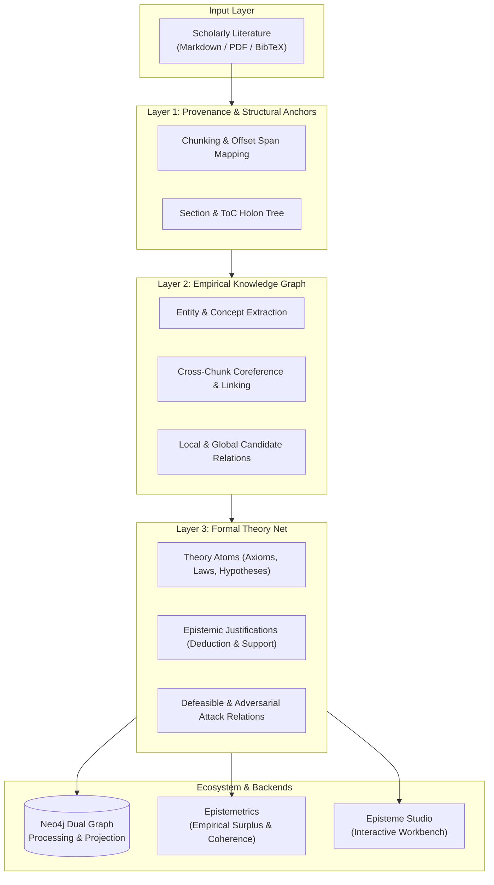

<div align="center">

# Episteme: Theory Graph Language Pipeline

**State-of-the-Art Neuro-Symbolic Theory Graph Construction & Evaluation for Scientific Literature**

[](LICENSE)
[](https://www.python.org/downloads/release/python-3130/)
[](https://github.com/astral-sh/uv)
[](docs/index.md)
[](https://github.com/astral-sh/ruff)

[Why Theory Graphs?](#why-theory-graphs) •
[Architecture](#architecture-overview) •
[Packages](#monorepo-packages) •
[Quickstart](#quickstart) •
[Workbench UI](#episteme-studio) •
[Evaluation](#theory-graph-evaluation-epistemetrics) •
[Citation](#citation)

</div>

---

## What is Episteme?

**Episteme** is an extensible, contract-driven neuro-symbolic framework for extracting, constructing, and formally evaluating **Theory Graphs** ($\mathcal{G}_{\text{TheoryNet}}$) from German and English scientific literature.

Traditional Knowledge Graphs flatten scientific epistemology into isolated factual triples (e.g., `(Einstein, BornIn, Ulm)`). In contrast, scientific discourse is fundamentally organized around **inferential, axiomatic, and argumentative structures**. 

Episteme recovers the underlying logic of science by jointly modeling core theoretical axioms, empirical observation statements, correspondence rules, epistemic justifications ($J$), and defeasible attack/support relations.

### Knowledge Graph vs. Theory Graph

| Capability | Traditional Knowledge Graph | Episteme Theory Graph |
| :--- | :--- | :--- |
| **Primary Primitives** | Entities & Static Attributes | Claims, Core Hypotheses, Axioms, Observations |
| **Relationship Semantics** | Factual Triples (`isA`, `partOf`) | Inferential Justifications (`deductive`, `defeasible`, `abductive`) |
| **Epistemic Dynamics** | Flat Graph Projection | Toulmin-style arguments, Dung attack semantics & coherence |
| **Formal Evaluation** | Triple completion, Link prediction | Structuralist Philosophy of Science (Schurz, Lakatos, Thagard) |
| **Provenance** | Coarse document-level URLs | Fine-grained character offsets & structural section holons |

---

## Architecture Overview

Episteme employs a layered, multi-phase architecture that progressively lifts raw document tokens into formal model-theoretic structures:



---

## Monorepo Packages

| Package | Description | Location |
| :--- | :--- | :--- |
| **`episteme-pipeline`** | Core 5-phase extraction engine, Pydantic contracts, Neo4j dual-graph store, and distributed Langfuse telemetry. | [`packages/episteme-pipeline/`](packages/episteme-pipeline/) |
| **`epistemetrics`** | Standalone formal theory evaluation library implementing structural and epistemological metrics (Schurz, Lakatos, Thagard, Dung). | [`packages/epistemetrics/`](packages/epistemetrics/) |
| **`episteme-studio`** | Interactive visual workbench featuring a FastAPI backend and React/TypeScript DAG inspector. | [`packages/episteme-studio/`](packages/episteme-studio/) |

---

## Quickstart

### Prerequisites

* Python **3.13+**
* [`uv`](https://docs.astral.sh/uv/) package manager
* *(Optional)* Running Neo4j 5.x+ instance with Graph Data Science (GDS) plugin

### 1. Installation

```bash
# Clone the repository
git clone https://github.com/maxoehm/episteme.git
cd episteme

# Sync workspace dependencies across all packages
uv sync
```

### 2. Configure Environment

Create a `.env` file in the project root:

```bash
# LLM / Embedding Providers (OpenAI, LiteLLM, Ollama, or vLLM)
OPENAI_API_KEY="your-api-key"
LLM_MODEL="openai/gpt-4o-mini"
EMBED_MODEL="openai/text-embedding-3-small"

# Neo4j Graph Store (Optional - defaults to local instance)
NEO4J_URL="neo4j://127.0.0.1:7687"
NEO4J_USERNAME="neo4j"
NEO4J_PASSWORD="neo4jdbpass"
NEO4J_DATABASE="neo4j"
```

### 3. Run Pipeline Example

Execute the end-to-end extraction pipeline on bundled research texts:

```bash
uv run python packages/episteme-pipeline/examples/pipeline_full_run.py
```

### 4. Python API Usage

The pipeline can be executed programmatically from Python:

```python
import asyncio
from episteme_pipeline.runtime.runner import run_pipeline

async def main():
    result = await run_pipeline(
        source_paths=["packages/episteme-pipeline/examples/text/teachers_expectancies.md"],
        metadata={"domain": "social_psychology", "language": "en"},
    )
    print(f"Pipeline executed successfully: Run ID {result.run_id}")

if __name__ == "__main__":
    asyncio.run(main())
```

---

## Episteme Studio

**Episteme Studio** provides a run-oriented workbench for inspecting pipeline execution DAGs, verifying cache invalidation states, and interactively navigating constructed Theory Graphs.

```bash
# Launch workbench server
uv run episteme-studio
```

Open `http://localhost:8000` to access the workbench.

---

## Theory Graph Evaluation (`epistemetrics`)

`epistemetrics` can be used completely independently of the extraction pipeline to quantitatively analyze formal graph structures and epistemic topologies:

```python
import networkx as nx
from epistemetrics import louvain_communities, page_rank

# Construct or load a theory graph
graph = nx.DiGraph()
graph.add_edge("Hypothesis_1", "Observation_A", weight=0.9)
graph.add_edge("Hypothesis_1", "Observation_B", weight=0.8)

# Compute central epistemic anchors and community partitions
pr_result = page_rank(graph)
communities = louvain_communities(graph)
print(f"Epistemic Centrality: {pr_result.scores}")
```

Key evaluation capabilities:
* **Schurzian Unification & Tacking Resistance**: Penalizes ad-hoc hypotheses and irrelevance tacking.
* **Lakatosian Progressive Problemshifts**: Evaluates whether theoretical modifications yield novel empirical content.
* **Dung Abstract Argumentation**: Computes grounded, preferred, and stable extensions under conflict.

---

## Development & Standards

* **Testing**:
  ```bash
  uv run pytest
  ```
* **Documentation**: Built with Zensical (MkDocs Material engine). Preview locally with:
  ```bash
  uv run zensical serve
  ```
* **Architecture Decisions**: Major technical trade-offs are documented as ADRs in `docs/adr/`.
* **Coding Standards**: Strict typing and NumPy-style docstrings are required across all modules.

---

## Citation & License

This project is licensed under the [MIT License](LICENSE).

If you use Episteme or Epistemetrics in your research, please cite:

```bibtex
@article{oehmichen2026episteme,
  title={Episteme: A Neuro-Symbolic Engine for Scientific Theory Graph Construction and Evaluation},
  author={Oehmichen, Max},
  year={2026},
  url={https://github.com/maxoehm/episteme}
}
```
