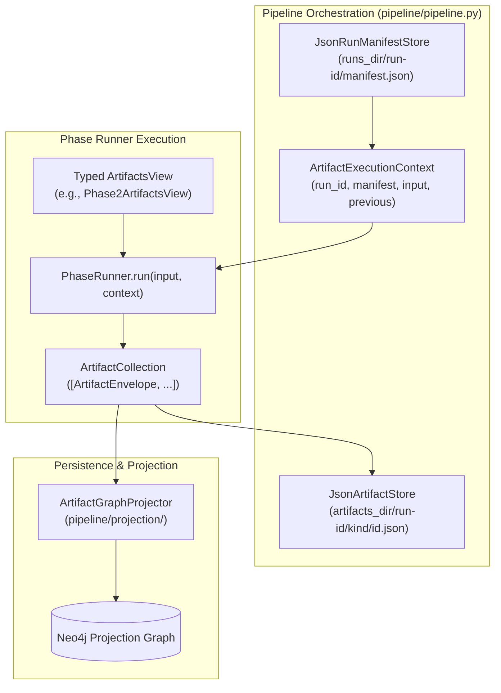

# Artifact and Run Model

This document defines the architecture of the **Artifact and Run Model** in Episteme.

The pipeline executes entirely on **durable, run-scoped research artifacts** and **first-class run manifests**, rather than ephemeral inter-phase execution values or graph-as-run-state.

---

## Purpose & Motivation

In earlier iterations of the pipeline, intermediate outputs were transient Python objects passed directly in memory, and the Neo4j database was overloaded as both execution state tracker and target knowledge graph.

The artifact and run model solves this by establishing two decoupled architectural foundations:

1. **Run Model** — Tracks what execution took place, with which configuration snapshot, input fingerprints, method fingerprints, and phase records.
2. **Artifact Model** — Tracks what was produced by each phase, with full provenance, stable identity keys, and content-addressed dependency fingerprints.

### Key Architectural Benefits

- **Graph-Independent Execution**: Intermediate outputs are evaluated, replayed, and inspected without querying Neo4j. Graph persistence is isolated to an explicit projection step.
- **Reproducibility & Lineage**: Every artifact carries provenance pointing back to source files, chunks, upstream artifact IDs, and run manifests.
- **Safe Resumption & Caching**: Downstream phases can hydrate upstream artifacts across a chain of parent runs without re-executing valid prior work.
- **Fine-Grained Invalidation**: Runs record deterministic fingerprints of inputs, configs, prompts, and model parameters to detect exactly which phases or artifacts require recomputation.

---

## Core Architecture



---

## The Run Model

Located in `pipeline/runs/models.py` and persisted via `pipeline/runs/persistence.py`.

### `RunManifest`

The `RunManifest` is the central execution record for a pipeline run:

- **`run_id`**: Unique run identifier (e.g., `run-<uuid4>`).
- **`parent_run_id`**: Identifier of the parent run when resuming or reusing prior phases.
- **`status`**: Current lifecycle status (`RunStatus.PLANNED`, `RUNNING`, `COMPLETED`, `FAILED`, `ABORTED`).
- **`schema_version`**: Active `SchemaConfig.version` tracking ontology/taxonomy versions.
- **`source_fingerprint` & `input_fingerprint`**: Deterministic hashes of source document paths, bibtex files, and structural anchors.
- **`config_snapshot`**: Full JSON-serialized snapshot of `PipelineConfig`.
- **`phase_config_fingerprints`**: Per-phase configuration hashes derived from serialized phase configs (including fine-grained nested leaf fingerprints).
- **`method_fingerprints`**: Fine-grained fingerprints of models, extractors, and prompts used by each phase (e.g., LLM parameters, embedding model dimensions, and prompt bundles).
- **`phase_records`**: List of `RunPhaseRecord` tracking execution status and artifact outputs per phase.

### `RunPhaseRecord`

Tracks execution state for an individual phase:

- `phase_name` and `phase_ordinal` (1-based index).
- `status`: `RunStatus` for this specific phase.
- `started_at` and `completed_at` timestamps.
- `input_artifact_ids`: IDs of artifacts consumed as input.
- `output_artifact_ids`: IDs of artifacts produced by this phase.
- `output_fingerprint`: Stable hash of the emitted artifact collection.
- `reused`: Boolean flag indicating whether the phase was reused from a prior run.

### `RunReport`

At run completion, a `RunReport` is generated summarizing:

- Overall status and execution durations.
- Counts of artifacts by `kind` and by `phase`.
- Breakdown of `new` vs. `reused` artifacts.
- Invalidation decisions and reasons.
- Full list of `ArtifactReportEntry` references.

---

## The Artifact Model

Located in `pipeline/artifacts/models.py` and persisted via `pipeline/artifacts/store.py`.

### `ArtifactEnvelope[T]`

Every artifact emitted by the pipeline is wrapped in a generic `ArtifactEnvelope[T]`:

```python
class ArtifactEnvelope(BaseModel, Generic[ArtifactPayloadT]):
    artifact_id: str
    identity_key: str | None = None
    kind: ArtifactKind
    run_id: str
    phase_name: str
    method: str
    method_version: str = "v1"
    config_fingerprint: str | None = None
    dependency_fingerprint: str | None = None
    created_at: datetime = Field(default_factory=utc_now)
    provenance: ArtifactProvenance = Field(default_factory=ArtifactProvenance)
    payload: ArtifactPayloadT
    metadata: dict[str, Any] = Field(default_factory=dict)
```

#### Dual Identifier System

Every artifact carries two complementary identifiers:

1. **`artifact_id`** (`artifact::<uuid>`): Unique identifier representing the specific artifact instance in a particular run. Used in `provenance.upstream_artifact_ids` to track concrete data lineage.
2. **`identity_key`** (`<kind>::<canonical_identifier>`): Stable semantic identity across runs (e.g., `linked_entity::kant_crp_space`). Used by the invalidation DAG and cross-run comparison tools to correlate equivalent entities across parameter changes.

### Payload Families

The pipeline defines typed payloads for each construction stage:

| Artifact Kind | Payload Class | Emitting Phase | Description |
|:---|:---|:---|:---|
| `document` | `DocumentArtifact` | Phase 1 | Ingested source document with structural anchor |
| `chunk` | `ChunkArtifact` | Phase 1 | Segmented and embedded text chunks |
| `entity_mention` | `EntityMentionArtifact` | Phase 2 | Extracted surface mentions in text |
| `linked_entity` | `LinkedEntityArtifact` | Phase 2 | Canonicalized and linked entities |
| `local_relation` | `LocalRelationArtifact` | Phase 2 | Intra-chunk entity relationships |
| `global_relation` | `GlobalRelationArtifact` | Phase 3 | Cross-chunk / document-wide relationships |
| `theory_atom` | `TheoryAtomArtifact` | Phase 4 | Argument components (premises, claims) |
| `theory_relation` | `TheoryRelationArtifact` | Phase 4 | Argumentative relations (supports, attacks) |
| `fusion_decision` | `FusionDecisionArtifact` | Phase 5 | Entity alignment & fusion decisions |
| `canonicalization` | `CanonicalizationArtifact` | Phase 5 | Canonical entity representations |
| `theoretical_enrichment` | `TheoreticalEnrichmentArtifact` | Post-processing | Theoretical enrichment & tenability scores |

---

## Execution & Inter-Phase Handoff

Located in `pipeline/artifacts/execution.py`.

### `ArtifactCollection`

An `ArtifactCollection` is a typed container holding a list of `ArtifactEnvelope` instances. It provides filtering utilities such as `collection.of_kind(*kinds)`.

### Typed `ArtifactsView` Classes

Phases consume upstream data through typed views. Rather than receiving untyped collections or raw database connections, each phase runner specifies an `input_view` class:

- **`Phase1ArtifactsView`**: Provides `documents: list[L1Document]` and `chunks: list[L1Chunk]`. Consumed by Phase 2.
- **`Phase2ArtifactsView`**: Provides `entities: list[L2Entity]`, `local_triples: list[L2Triple]`, and type distributions. Consumed by Phase 3.
- **`Phase3ArtifactsView`**: Provides `global_triples: list[L2Triple]`, `chunks: list[L1Chunk]`, and relation distributions. Consumed by Phase 3b, Phase 4 Maturation, and Phase 4 Argument Mining.
- **`Phase4ArtifactsView`**: Provides `theory_atoms: list[TheoryAtom]` and `theory_relations: list[TheoryRelation]`. Consumed by Phase 5, Phase 6, and Theoretical Enrichment.
- **`TheoreticalEnrichmentArtifactsView`**: Provides `enrichments: list[TheoreticalEnrichmentArtifact]`.

### Runner Interface

All pipeline phase runners implement the uniform async interface:

```python
async def run(
    self,
    input: ViewT,
    context: ArtifactExecutionContext,
) -> ArtifactCollection: ...
```

The orchestrator builds the appropriate view via `entry.input_view.from_collection(previous)` and passes it to the runner alongside the `ArtifactExecutionContext` (which contains `run_id`, `manifest`, `pipeline_input`, and `previous`).

---

## Graph Projection & Decoupling

Located in `pipeline/projection/artifact_projector.py` and `pipeline/projection/theorynet_projector.py`.

Execution is cleanly decoupled from graph storage:

1. **Phases emit artifacts**: Phase runners have no direct write dependencies on the final projection graph.
2. **Independent projection**: When `config.execution.project_artifacts_to_graph` is enabled (default `True`), the orchestrator passes emitted artifacts through `ArtifactGraphProjector.project(art)`.
3. **Dual-Store Architecture**: The temporary `checkpoint_store` (operational graph) is used strictly for working memory, co-occurrence blocking, and intermediate index lookups during extraction, while `projection_graph` receives canonical projections derived from validated artifacts.
4. **Dual Projection Streams**:
   - **Property Graph Projection** (`ArtifactGraphProjector`): Projects artifact envelopes into concrete Neo4j nodes and relationships.
   - **TheoryNet Formalism Projection** (`TheoryNetProjector`): Projects Phase 4 artifacts into the formal mathematical $\mathcal{G}_{\text{TheoryNet}}$ structure, executing iterative QBAF gradual semantics.

### Artifact-to-Graph Projection Mapping

`ArtifactGraphProjector` maps artifact payloads into the projection graph according to the following rules:

| Artifact Payload | Graph Mutation Target | Labels / Rel Types | Properties & Metadata |
|:---|:---|:---|:---|
| `DocumentArtifact` | Node | `:Document` | `document_id`, `title`, `source_path` |
| `ChunkArtifact` | Node | `:Chunk` | `chunk_id`, `text`, `document_id`, `sequence_index`, `token_count` |
| `EntityMentionArtifact` | Edge | `(:Entity)-[:EXTRACTED_FROM]->(:Chunk)` | `entity_type`, `surface_form` |
| `LinkedEntityArtifact` | Node | `:<entity_type>` / `:Entity` | `entity_id`, `name`, `description`, `textual_envelope`, `is_mature`, `confidence` |
| `LocalRelationArtifact` | Edge | `(:Entity)-[:<PREDICATE> {scope: "local"}]->(:Entity)` | `confidence`, `source_chunk_id` |
| `GlobalRelationArtifact` | Edge | `(:Entity)-[:<PREDICATE> {scope: "global"}]->(:Entity)` | `confidence`, `supporting_chunk_ids` |
| `TheoryAtomArtifact` | Node | `:<component_type>` / `:TheoryAtom` | `component_id`, `text`, `plausibility`, `epistemic_status`, `scope_type` |
| `TheoryRelationArtifact` | Edge | `(:TheoryAtom)-[:<REL_TYPE>]->(:TheoryAtom)` | `scope`, `confidence`, `weight` |
| `CanonicalizationArtifact` | Edge | `(:Entity)-[:SAME_AS]->(:Entity)` | `confidence: 1.0`, `source: "phase3b_consolidation"` |
| `FusionDecisionArtifact` | *None* | `_NOT_PROJECTED` | Deliberately omitted; record of decision rather than graph mutation |

### Current Limitations & Roadmap

As the pipeline transitions fully toward an artifact-first runtime, the projection layer currently serves as an explicit bridge. The following enhancements are planned:

- **Transactional Projection Batches**: Grouping multi-artifact projections into single atomic Cypher transactions.
- **Projector Plugins**: Pluggable projectors allowing custom export targets (e.g., RDF/OWL, NetworkX, GraphML).
- **Projection Planning**: Dependency-aware projection ordering ensuring referenced nodes are guaranteed to exist prior to edge creation.
- **Projection-Time Schema Validation**: Validating projected graph structures against `SchemaConfig` constraints before committing writes.
- **Replay Tooling**: Command-line utilities to re-project historical runs from `.pipeline_artifacts/` without re-running extraction.

---

## Artifact Hydration & Parent-Run Lineage

When a run is resumed via `resume_from_run()` or reuses phases via `_choose_reuse_source()`:

1. The orchestrator identifies the source run (`parent_run_id`).
2. `_hydrate_previous_collection(phase_number, source_run_id)` retrieves all artifacts produced prior to the resume boundary.
3. If an artifact was inherited across multiple resume hops, the store traverses the parent-run chain (`run_id -> parent_run_id -> ...`), always selecting the nearest occurrence of each `identity_key`.
4. Downstream phases execute seamlessly with a fully populated `ArtifactCollection` as if all upstream phases had executed in the current process.

---

## Configuration Controls

The artifact and run model is configured via `ExecutionConfig` in `pipeline/config.py`:

| Parameter | Type | Default | Description |
|:---|:---|:---|:---|
| `runs_dir` | `Path` | `.pipeline_runs` | Base directory for serialized `RunManifest` files |
| `artifacts_dir` | `Path` | `.pipeline_artifacts` | Base directory for serialized JSON artifact files |
| `persist_run_manifests` | `bool` | `True` | Whether to write `manifest.json` on disk |
| `project_artifacts_to_graph` | `bool` | `True` | Whether to project emitted artifacts to Neo4j |
| `allow_phase_reuse` | `bool` | `True` | Whether to reuse valid phases from compatible prior runs |
| `allow_artifact_hydration` | `bool` | `True` | Whether to hydrate upstream artifacts across runs |

---

## Related Documentation

- **Invalidation and Resumption**: [Invalidation and Resume](invalidation_and_resume.md)
- **Runtime and Complexity**: [Pipeline Runtime Analysis](runtime_analysis.md)
- **System Overview**: [System Architecture Overview](overview.md)
- **Pipeline Architecture**: [Pipeline Architecture](pipeline_architecture.md)
- **ADRs**: [ADR 0001: Neo4j Async Graph Backend](../adr/0001-neo4j-async-graph-backend.md), [ADR 0014: Deterministic Identity Diffing](../adr/0014-deterministic-identity-diffing-and-progression-workbench.md)

