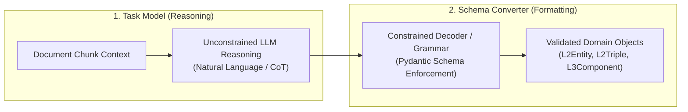

# Constrained Decoding Architecture

This document details the engineering and architectural implementation of **Constrained Decoding** within the Episteme pipeline.

*For the empirical literature review, experimental benchmarks, and theoretical motivations, see [Constrained Decoding Research](../research/constrained_decoding.md). For formal domain schemas, see [Schema Reference](../reference/schema.md).*

---

## Architectural Challenge & Strategy

As established in our research review, enforcing strict JSON output schemas during reasoning-intensive LLM tasks
significantly degrades extraction performance due to the suppression of natural language Chain-of-Thought (CoT). Constrained grammars restrict the sampling space and disrupt the internal attention representations necessary for nuanced philosophical argument extraction.

To resolve this, our implementation relies on **decoupling the reasoning process from schema compliance**,
heavily inspired by the "NL-to-Format" approach (Tam et al., 2024) and unified trigger-token frameworks (Nguyen et al., 2026).

---

## The Decoupled Pipeline

The extraction process is split into two logical phases (which may occur in one single-pass trigger-token call or two chained calls depending on handler configuration):

### Phase A: The Task Model (Identification & Reasoning)
* **Execution**: The model is prompted to identify concepts, philosophical definitions, and describe relationships in free-form natural language.
* **Constraint Level**: Unconstrained (or loose Markdown bullet points).
* **Purpose**: Allows the model to maximize its in-context reasoning capabilities without encountering grammar-based probability gaps or token prefix distortions.

### Phase B: The Schema Converter (Formatting & Classification)
* **Execution**: The natural language output from the Task Model is mapped into the strict Pydantic schemas required by our Neo4j graph store.
* **Constraint Level**: Strict Constrained Decoding (Grammar-guided or provider-level Structured Outputs).
* **Purpose**: Acts as a classification and structural mapping step. Because classification and formatting tasks remain mathematically stable under format restrictions, this step securely enforces our schema without degrading the underlying logic.

---

## Implementation Flags & Handlers

To remain agile and support empirical experimentation, the pipeline utilizes handler flags in `PipelineConfig` to configure the decoding strategy dynamically:

* **Mode Toggles**: Flags to switch between a single-pass forced JSON mode (for high-throughput baseline runs) and the decoupled "Natural-to-Format" approach (for high-precision philosophical texts).
* **Trigger-Token Support**: Implementations that allow "Thinking Before Constraining" (Nguyen et al., 2026), where structured decoding grammars are activated only after the model emits a specific trigger token (e.g., `<schema_start>`) indicating reasoning is complete.
* **Entity Maturation Strategies**: Flags for `per-entity-maturation` versus `batch-maturation` dictate whether entities are reasoned about and formatted individually or en masse via geometric centroid synthesis (see [Dense Alignment & Maturation](../concepts/dense_alignment.md)).

---

## Input Context Formatting

When constructing the prompt envelope (providing episodic memory, existing sub-graphs, or schema exemplars), we format this contextual data as **JSON**. Research indicates (Narvekar et al., 2025) that models, particularly smaller ones, parse and utilize context much more effectively when structured as JSON rather than flat unstructured text.

---

## Resilience & Fault Tolerance

* **Constraint Enforcement**: We utilize established tools for constrained decoding (e.g., `guidance`, `outlines`, or provider-specific APIs like OpenAI / Anthropic Structured Outputs via LiteLLM) to guarantee adherence to our Pydantic domain models during the formatting phase.
* **Failure Strategy**: The pipeline includes a deterministic failure mitigation strategy for schema non-compliance during the conversion phase:
  1. **Log**: Emit a structured telemetry event (`SchemaValidationFailed`) with raw payload and parser traceback to Langfuse.
  2. **Retry**: Attempt a targeted repair prompt supplying the raw output and the validation error message.
  3. **Omit & Continue**: If retry fails, gracefully omit the corrupted entity/triple rather than terminating the entire pipeline run, preserving upstream extractions.

---

## Related Documentation

- **Research**: [Constrained Decoding Research](../research/constrained_decoding.md)
- **Pipeline Architecture**: [Pipeline Architecture](pipeline_architecture.md)
- **Phase 2 Implementation**: [Entity Discovery Workflow](../workflow/2_entity_discovery/index.md)
- **Schema Reference**: [Schema Reference](../reference/schema.md)
