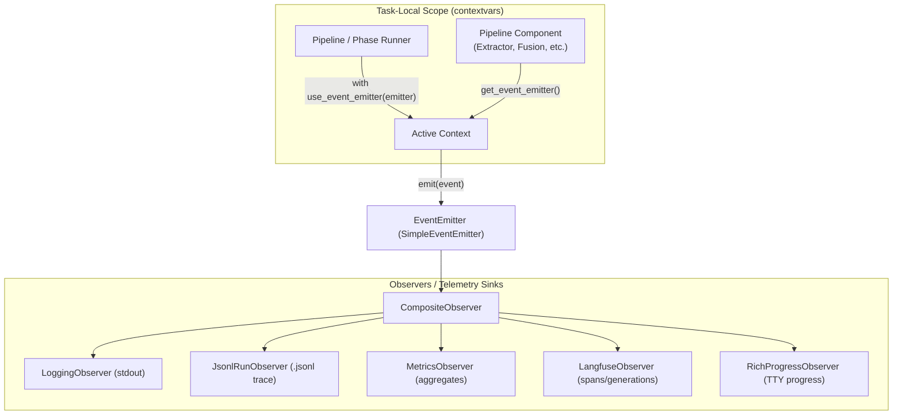
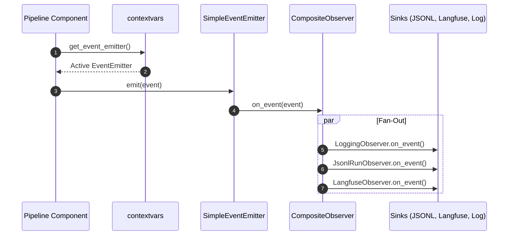

# Event System Architecture

This document provides an architectural explanation of the **Episteme** event system. It covers the
design rationale, context-based dispatch mechanisms, publisher-subscriber topology, and operational guarantees.

*For the complete catalog of event types and developer how-to guides, see
[Event Reference and Observers](../observability/events.md). For Langfuse tracing setup, see
[Langfuse Integration](../observability/langfuse.md).*

---

#Overview & Architectural Role

The event system enforces a strict architectural boundary between **domain execution** and
**observability/telemetry concerns**:

1. **Decoupled Domain Logic**: Pipeline components (extractors, fusion engines, clustering, evaluators) focus purely
   on scientific graph construction without knowing where or how telemetry is recorded.
2. **Semantic Domain Events vs. Generic Traces**: Rather than emitting unstructured logs or arbitrary span annotations,
   components emit strongly-typed domain events (e.g., `TripleCommitted`, `DenseCandidatesGenerated`, `FusionDecisionMade`).
   These events capture scientifically meaningful state transitions that are essential for auditability and reproducibility.
3. **Pluggable Observability Sinks**: Telemetry sinks (structured loggers, research JSONL files, Langfuse tracing,
   TTY progress displays) act as observers subscribed to the event stream. They can be attached or detached per run
   without modifying pipeline code.

---

#Core Architectural Patterns



##Context-Bound Dispatch (`contextvars`)

A major design challenge in pipeline architectures is passing telemetry sinks through deeply nested component
hierarchies. Episteme avoids constructor parameter drilling ("prop-drilling") and global singletons by using Python's
`contextvars` module (`pipeline/events/context.py`):

- **Task-Local Binding**: An `EventEmitter` instance is bound to the async task context using the `use_event_emitter`
  context manager at the runner level.
- **Transparent Retrieval**: Components anywhere in the call stack retrieve the active emitter via `get_event_emitter()`.
- **Concurrent Run Isolation**: Concurrent pipeline runs within the same process execute in separate async contexts,
  guaranteeing that events from one run never leak into the observer stream of another.

```python
from pipeline.events import use_event_emitter, get_event_emitter
from pipeline.events.models import TripleCommitted

# 1. Pipeline runner binds the emitter to the execution scope:
with use_event_emitter(emitter):
    await pipeline.run(pipeline_input)

# 2. Deeply nested components retrieve the emitter from context:
get_event_emitter().emit(
    TripleCommitted(
        subject_id="atom_1",
        predicate="SUPPORTS",
        object_id="atom_2",
        confidence=0.92,
        scope="global",
        source_chunk_id="chunk_42",
    )
)
```

##Observer Pattern & Fan-Out

The system implements the standard Gang-of-Four **Observer Pattern**:

- **`EventEmitter` (Protocol)**: Interface for objects capable of broadcasting `PipelineEvent` instances to observers.
- **`SimpleEventEmitter`**: Default broadcast implementation that sequentially forwards each emitted event to all
  registered `EventObserver` instances.
- **`CompositeObserver`**: Fan-out wrapper that enables combining multiple distinct observers into a single logical
  subscription.

##Zero-Cost Default & Test Isolation

When no emitter is bound in the active context, `get_event_emitter()` returns a singleton `NoOpEventEmitter`:

- **Zero Overhead**: In unit tests or headless scripts where observability is not configured, event emissions are
  instant no-ops with zero serialization or allocation overhead.
- **No Test Mocking Required**: Unit tests for pipeline components do not need mock observers or logger fixtures;
  the components run naturally against the no-op emitter.

---

#Operational Guarantees & Constraints

##Failure Isolation

Telemetry sinks must never compromise pipeline execution. Observers are treated as external side-effects:

- An exception raised inside an observer's `on_event` handler must be caught, logged, and isolated.
- A failure in one observer (e.g., a Langfuse network timeout or disk write error) must not prevent other observers
  from receiving the event, nor cause the pipeline phase to abort.

##Side-Effect Only & Non-Blocking

- **No Return Values**: `EventEmitter.emit()` returns `None`. Pipeline components never await or branch on the outcome
  of an event emission.
- **Immutability**: Observers receive event models for inspection and must not mutate event payloads.
- **Lightweight Payloads**: Components should avoid placing multi-megabyte raw prompt dumps or full graph dumps into
  event fields unless strictly necessary. References (such as entity IDs, chunk IDs, and candidate counts) are preferred.

---

#Event Lifecycle



1. **Trigger**: A domain component completes a scientifically relevant action (e.g., dense candidates retrieved,
   triple committed, LLM relation decoded).
2. **Instantiation**: The component instantiates a Pydantic `BaseEvent` subclass, populating domain attributes.
3. **Dispatch**: The component calls `get_event_emitter().emit(event)`.
4. **Fan-Out**: `SimpleEventEmitter` iterates over registered observers and invokes `on_event(event)` on each.
5. **Consumption**:
   - `LoggingObserver` formats human-readable logs to stdout.
   - `JsonlRunObserver` appends an immutable JSON line to the run's audit trail.
   - `LangfuseObserver` creates or updates spans, generations, or scores.
   - `RichProgressObserver` advances console progress bars.

---

#Related Documentation

- [Event Reference and Observers](../observability/events.md) — Comprehensive catalog of all event types, payload schemas, and observer usage guides.
- [Langfuse Integration](../observability/langfuse.md) — Configuration and span mapping for distributed LLM tracing.
- [Adapters & Migration](../observability/adapters-migration.md) — Incremental migration guide from legacy `TraceSink`.
