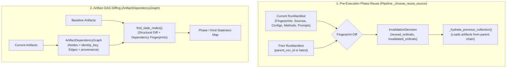

# Invalidation and Resume

This document defines the invalidation and resume architecture in Episteme.

The pipeline combines **deterministic run-manifest fingerprinting** for pre-execution phase reuse with **DAG-based artifact dependency diffing** for fine-grained staleness detection.

---

## Architectural Overview

Invalidation operates across two distinct, complementary layers:

1. **Pre-Execution Phase Reuse (`Pipeline._choose_reuse_source`)**:
   Evaluated *before* execution starts. Compares the current run's manifest fingerprints (source, config, models, prompts) against the parent or latest completed run to determine which upstream phases can be reused without recomputation.
2. **Post-Execution / Cross-Run Artifact Diffing (`ArtifactDependencyGraph`)**:
   Operates on persisted artifacts. Constructs a directed acyclic graph (DAG) of artifact identities and upstream provenance to detect exactly which artifacts changed, which became structurally stale, and what downstream nodes were affected across runs.



---

## Run Modes

The pipeline provides three execution and resumption entry points in `pipeline/pipeline.py`:

### 2.1 Standard Execution with Automated Reuse (`Pipeline.run`)

```python
async def run(
    self,
    input: PipelineInput,
    run_id: str | None = None,
    parent_run_id: str | None = None,
) -> ExecutionResult: ...
```

- Assembles the initial `RunManifest` with all current fingerprints.
- Calls `_choose_reuse_source(manifest)` to compare against `parent_run_id` (or the latest completed run).
- Hydrates upstream artifacts from the prior run lineage for all reused phases.
- Starts execution at the first invalidated phase ordinal.

### Explicit Boundary Resumption (`Pipeline.run_from_phase`)

```python
async def run_from_phase(
    self,
    phase_number: int,
    input: PipelineInput | None = None,
    run_id: str | None = None,
    parent_run_id: str | None = None,
) -> ExecutionResult: ...
```

- Forces execution to begin at the specified 1-based phase ordinal (`phase_number`).
- Recovers input source paths from the prior manifest if `input` is omitted.
- Phases prior to `phase_number` are reused if completed in the prior manifest; phases from `phase_number` onward are re-executed.

### Resumption from a Specific Run (`Pipeline.resume_from_run`)

```python
async def resume_from_run(
    self,
    run_id: str,
    input: PipelineInput,
    from_phase: int | None = None,
) -> ExecutionResult: ...
```

- Resumes explicitly against a historical `run_id`.
- Reuses all phases preceding `from_phase` and invalidates all phases from `from_phase` onward.
- Hydrates the required upstream artifacts directly from the target run's lineage.

---

## Fingerprint System

Fingerprints are deterministic SHA-256 hashes generated via `pipeline/runs/fingerprints.py`:

### Source and Input Fingerprints

- **Corpus Files**: Computed by `fingerprint_existing_sources()`. Combines filesystem stat metadata (file size, modification time) with full SHA-256 content hashes of all corpus source and bibtex files.
- **Structural Anchors**: `fingerprint_structural_anchor()` hashes chapter/section structural metadata when provided.
- **Input Fingerprint**: Combined hash `stable_fingerprint({"source": source_fp, "anchor": anchor_fp})`. Any change in corpus content invalidates the entire pipeline from Phase 1 onward.

### Phase-Config Fingerprints

- Serialized configuration hashes for each phase (`fingerprint_phase_config()`).
- **Fine-Grained Nested Configs**: `fingerprint_phase_config_nested()` traverses Pydantic phase configurations and generates per-leaf fingerprints under `config.<field>` keys (e.g., `config.chunk_size`, `config.ner_prompt_template`). This detects changed leaves individually while preserving unchanged ones.

### Method and Model Fingerprints

`fingerprint_method()` captures fine-grained parameters for LLMs and embedding models:
- Model class and identifier (`model_name`).
- API version and provider configuration (`base_url`, `api_version`).
- Output generation parameters (`temperature`, `max_tokens`, `top_p`, `n`).
- Embedding-specific configuration (`dimensions`, `embedding_api_version`).
- Arbitrary model keyword arguments (`model_kwargs`).

### Prompt Template Fingerprints

- All 7 prompt task categories (across NER extraction, entity linking, global relations, entity synthesis, ADU segmentation, ACC classification, and ARC classification) are fingerprinted per run.
- Fingerprints are partitioned by the phase that actually consumes the prompt, preventing prompt changes in later phases (e.g., ADU segmentation in Phase 4) from invalidating Phase 1 ingestion.
- Because prompt templates are configured as part of each phase's `StructuredPromptBundle` inside `PhaseNConfig`, prompt updates are automatically tracked via both `phase_config_fingerprints` and `prompts_fingerprints`.

### Schema Version

- `RunManifest.schema_version` tracks the ontology version from `SchemaConfig.version`. Changes in taxonomy or schema definitions trigger re-execution of extraction and fusion phases.

---

## Phase Invalidation Logic (`_choose_reuse_source`)

When `Pipeline.run()` is invoked with phase reuse enabled (`config.execution.allow_phase_reuse = True`):

1. **Phase List Compatibility Check**:
   `_phase_lists_match()` verifies that the prior run executed the identical sequence of phase runners. If the phase list or order changed, all phases are invalidated.
2. **Prior Phase Completion Check**:
   If the prior run terminated early or failed, invalidation starts at the first incomplete phase.
3. **Input Change Check**:
   If `prior.input_fingerprint != current.input_fingerprint`, all phases are invalidated starting at Phase 1.
4. **Config, Method, and Prompt Check**:
   Phases are checked in sequential ordinal order. The first phase exhibiting any difference in:
   - `phase_config_fingerprints`
   - `method_fingerprints` (LLM, embedder, extractors)
   - Prompt fingerprints
   becomes the `earliest_invalid` phase.
5. **Transitive Invalidation**:
   All phases from `earliest_invalid` through the end of the pipeline are marked as invalidated (`invalidated_phase_ordinals`). All phases strictly preceding `earliest_invalid` are marked as reused (`reused_phase_ordinals`).
6. **Artifact Hydration**:
   If `config.execution.allow_artifact_hydration = True`, artifacts produced by reused phases are hydrated from the parent run lineage via `_hydrate_previous_collection()`.

---

## Artifact Dependency Graph Diffing (`ArtifactDependencyGraph`)

Located in `pipeline/artifacts/invalidate.py`.

While phase reuse decisions must be made *before* a run executes, fine-grained artifact comparison operates across completed runs to analyze the exact downstream impact of parameter changes.

### Dual-Key Graph Representation

Artifacts carry two complementary identifiers:
- `artifact_id` (`artifact::<uuid>`): Concrete artifact instance identifier used in `provenance.upstream_artifact_ids`.
- `identity_key` (`<kind>::<canonical_id>`): Stable semantic identity across runs.

`ArtifactDependencyGraph` resolves raw `artifact_id` provenance references into stable `identity_key` edges, producing a clean DAG where nodes and adjacency maps share the same semantic key space.

### Topological Sorting & Cycle Detection

`dag.topsort()` implements Kahn's algorithm over `identity_key` nodes, establishing the dependency ordering and validating that no cyclical dependencies exist in artifact provenance.

### Staleness Detection (`find_stale_nodes`)

`find_stale_nodes()` evaluates an `ArtifactDependencyGraph` against prior run artifacts and fingerprints:

A node is marked **stale** if:
1. **Missing Prior**: It has no corresponding entry in `prior_fps` (a newly discovered entity or relation).
2. **Fingerprint Mismatch**: Its `dependency_fingerprint` differs from the stored prior value.
3. **Structural Divergence**: Its upstream dependency edge set changed (`_compare_dag_structures()`), even if the content hash coincided.
4. **Transitive Staleness**: It depends directly or indirectly on any stale node (propagated breadth-first through downstream edges).

### Diagnostic Diffing (`Pipeline.diff_artifacts`)

The pipeline exposes `diff_artifacts(run_id, baseline_run_id) -> dict[str, list[str]]`, which groups stale `identity_key`s by phase name. This allows researchers to:
- Trace the exact downstream ripple effects of prompt or parameter adjustments.
- Inspect which entities or relations diverged between experimental configurations.
- Verify that unchanged subgraphs remain deterministic across pipeline runs.

---
 
## Open Architecture Enhancements

As tracked in the [Project & Research Roadmap](../roadmap.md):

- **DAG Stage Execution Planning**:
  The orchestrator currently executes phase runners in a sequential 1-based ordinal loop. Refactoring `_execute` to support arbitrary DAG execution plans (`_build_execution_plan`, `_resolve_phase_order`, `_execute_via_plan`) remains an active architecture enhancement to allow non-linear, branching phase topologies.

---

## Related Documentation

- **Artifact and Run Model**: [Artifact and Run Model](artifact_run_model.md)
- **Runtime and Complexity**: [Pipeline Runtime Analysis](runtime_analysis.md)
- **System Architecture Overview**: [System Architecture Overview](overview.md)
- **Pipeline Architecture**: [Pipeline Architecture](pipeline_architecture.md)
- **ADRs**: [ADR 0014: Deterministic Identity Diffing](../adr/0014-deterministic-identity-diffing-and-progression-workbench.md), [ADR 0016: Phase 3 Checkpointing & Atomicity](../adr/0016-phase-3-within-phase-checkpointing-and-atomicity.md)
