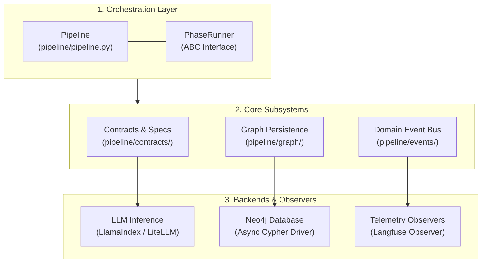
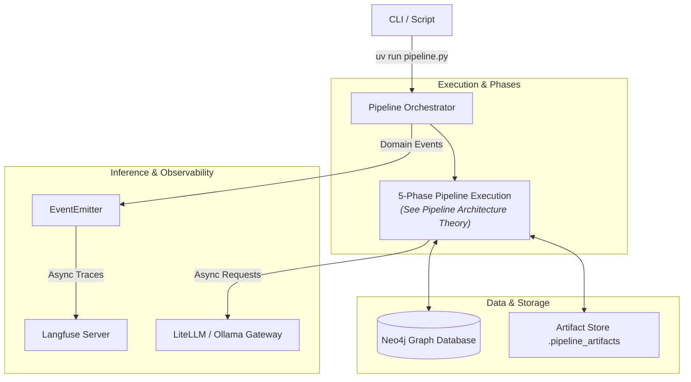

# System Architecture Overview

This document provides an architectural perspective on the **Episteme** codebase. It details the
technical stack, core software layers, subsystem interactions, and cross-cutting concerns.

*For domain concepts, scientific rationale, and phase-by-phase functional breakdowns,
see [Pipeline Architecture](pipeline_architecture.md), [Formal Graph Schema (TheoryNet)](../concepts/formal_graph_model.md), and the [Documentation Index](../index.md).*

---

## Technical Stack & Runtime Specifications

Episteme is built on a **contract-driven, backend-agnostic architecture**. The core construction engine inside `pipeline/` has zero hard dependencies on specific database vendors, LLM providers, or telemetry platforms. Instead, it relies on **Dependency Injection (DI)** across strictly defined Python `Protocol` interfaces and Pydantic data contracts.

The technologies below are organized into the **agnostic core engine** and the **default reference adapters** provided out-of-the-box for production deployments:

### Core Engine (Agnostic Runtime)

| Component | Technology | Version / Spec | Architectural Role |
|:---|:---|:---|:---|
| **Language & Runtime** | Python | `>= 3.12` | Core execution environment, strict typing, and async protocols |
| **Data Contracts** | Pydantic | `v2.x` | Strictly typed phase contracts, inputs, artifact models, and configs |
| **Package Management** | `uv` | SOTA Cargo-like | Fast dependency resolution & reproducible virtual environments |
| **Testing & Quality** | Pytest + Ruff | Standard suite | Non-LLM deterministic test harness, linting, and formatting |
| **Documentation** | Zensical / MkDocs | Material Theme | Static documentation build & API reference generation |

### Pluggable Subsystems & Reference Adapters (Dependency Injection)

Every external capability is decoupled from business logic via abstract protocols. While Episteme ships with production-grade reference adapters, any component can be swapped by providing a class implementing the respective protocol:

| Subsystem | Core Protocol (Agnostic Contract) | Default Reference Adapter | Capabilities & Role |
|:---|:---|:---|:---|
| **Property Graph** | `GraphReader` / `GraphWriter` | `Neo4jGraphReader` / `Neo4jGraphWriter` | Async Cypher driver, APOC, GDS Leiden clustering, native vector indexing |
| **LLM Inference** | `StructuredLLM` / `BaseLLM` | `LiteLLM` / `LlamaIndex` | Multi-provider router supporting OpenAI, Anthropic, Ollama, vLLM |
| **Embedding Model** | `EmbeddingModel` | `LiteLLMEmbedding` / LlamaIndex | Normalized async text and batch vector embeddings |
| **Reranking & Scoring** | `CrossEncoder` / `RelationReranker` | `SentenceTransformerCrossEncoderReranker` | PyTorch / HuggingFace joint-attention candidate relation scoring |
| **Prompt Management** | `PromptProvider` | `LangfusePromptProvider` | Remote prompt versioning, label resolution (`production`), auto-sync (with `DefaultPromptProvider` fallback) |
| **Observability & Tracing** | `EventEmitter` / `Observer` | `LangfuseObserver` | Distributed LLM call tracing, token/cost analysis, latency tracking |

---

## Subsystem & Layered Architecture

The codebase inside `pipeline/` follows a clean, decoupled layered architecture separating orchestrators, business
logic, persistence, and telemetry observers.

### Orchestration Layer (`pipeline/pipeline.py`, `pipeline/runner.py`)

- **`Pipeline`**: Central executor managing phase lifecycle, YAML configuration loading, state transitions, and
  resumption flags.
- **`PhaseRunner`**: Abstract base class enforcing a uniform async contract `run(input: PipelineInput) -> PhaseResult`
  across all pipeline phases.

### Domain Contracts & Data Layer (`pipeline/contracts/`)

- Pure data models (Pydantic v2) defining explicit input/output boundaries for each phase.
- Guarantees strict serialization/deserialization for intermediate file artifacts stored under `.pipeline_artifacts/`.

### Persistence & Graph Layer (`pipeline/graph/`)

- **`GraphReader` / `GraphWriter`**: Abstract interfaces isolating pipeline business logic from direct database drivers.
- **`Neo4jGraphWriter` / `Neo4jGraphReader`**: Concrete implementations executing parameterised Cypher queries using
  async connections.
- **Dual-Graph Strategy**:
    - *Processing Graph*: Temporary operational nodes tracking chunking state, intermediate extraction status, and
      provenance.
    - *Projection Graph*: Final canonicalized nodes and relationships forming the clean theory graph.

### Domain Event & Telemetry System (`pipeline/events/`)

- Decouples observability from pipeline execution logic.
- Components emit semantic domain events (e.g., `PhaseStartedEvent`, `EntityExtractedEvent`, `PipelineCompletedEvent`)
  via an `EventEmitter`.
- Registered observers (such as `LangfuseObserver`) handle event delivery asynchronously without blocking pipeline
  progress.

### Schema & Vocabulary (`pipeline/schema/`)

- Enforces entity types, relationship taxonomy, property constraints, and validation rules applied during extraction and
  alignment fusion.

---

## Integration Topology

---

## Cross-Cutting Concerns

- **Configuration Management**: Hierarchical parameters configured in `pipeline/config.py` with CLI overrides.
- **Fault Recovery**: Automatic retry handlers for transient database connections and rate-limited LLM endpoints.
- **LLM Prompt Caching**: Integrated structured prompt responses to optimize execution time and API costs.

---

## Architectural Governance

Engineering and architectural decisions made over the evolution of this project are documented in detail in our ADR
repository:

- See the full index in [Architecture Decision Records (ADRs)](../adr/index.md).
- Key architectural choices:
    - **ADR 0001**: Neo4j Async Graph Backend
    - **ADR 0005**: Two-Pass Fusion Strategy
    - **ADR 0008**: Diátaxis Documentation Framework
