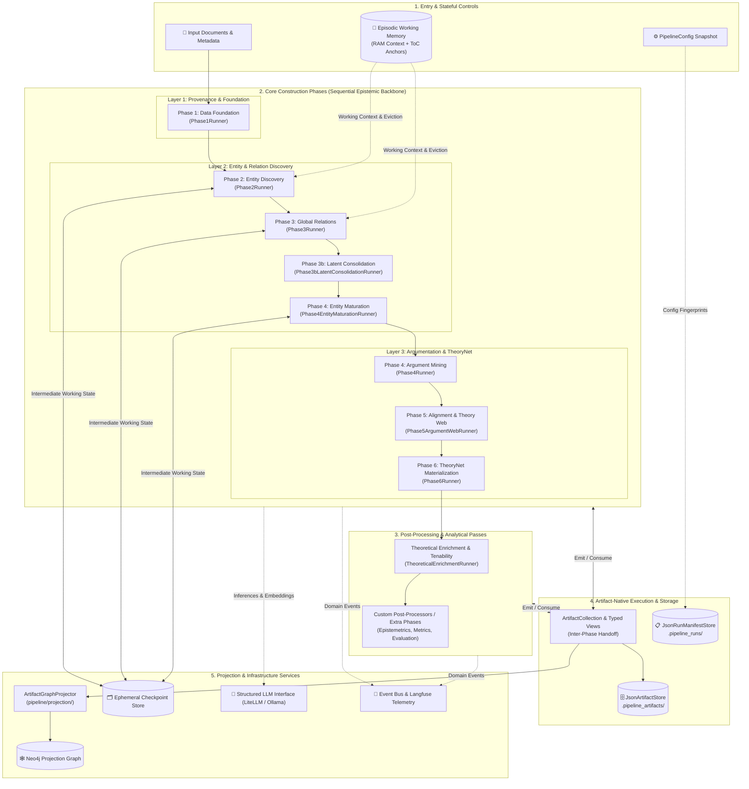
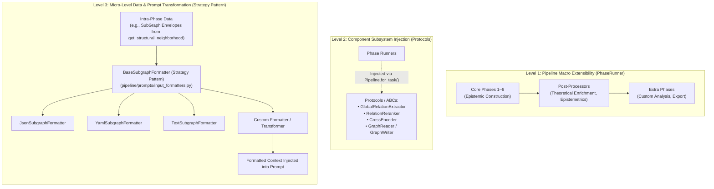

# Pipeline Architecture

The Episteme pipeline implements a **Synergized Bidirectional Reasoning Engine for Scientific Theory Graphs** (grounded
in the roadmap framework of Pan et al., 2024). It combines LLMs and Knowledge Graphs in a mutually beneficial feedback
loop to transform unstructured scientific text into formally structured theory graphs.

*For formal mathematical models, epistemic foundations, and graph definitions, see [Formal Graph Schema (TheoryNet)](../concepts/formal_graph_model.md) and [Epistemic Grounding & Dense Alignment](../concepts/dense_alignment.md).*

---

## Architectural Overview

The pipeline follows an event-driven, modular, and artifact-native architecture designed for:

- **Synergized Reasoning**: LLMs extract and canonicalize entities/arguments; the Text-Attributed Graph (TAG) in turn
  conditions and guides global LLM relation extraction and argumentative stance classification.
- **Episodic Working Memory**: Maintains a SOTA Dual-Memory stateful context (Short-Term Memory RAM + Long-Term Memory
  Neo4j Disk) using Global Structural Anchors (ToC) and boundary-based eviction across sequential text chunks.
  See [Episodic Working Memory](../concepts/episodic_working_memory.md) and [ADR 0009](../adr/0009-sota-dual-memory-episodic-working-memory.md).
- **Artifact-Native Orchestration**: Every phase consumes typed artifact views and emits durable, content-addressed
  artifact collections. Execution is completely decoupled from database drivers.
- **Decoupled Graph Projection**: Intermediate outputs are evaluated and stored independently of Neo4j. A dedicated
  projection layer materializes validated artifacts into the final property graph.
- **Multi-Level Extensibility**: Supports macro-level post-processing passes, component-level protocol injection,
  and micro-level prompt/data transformation strategies.
- **Observability & Telemetry**: Domain event bus emitting typed lifecycle events to async observers (e.g., Langfuse).

---

## Core Components & System Topology



---

## Phase-by-Phase Breakdown

The theory-graph construction process is organized into sequential phase runners in [`Pipeline.for_task()`](../reference/pipeline.md):

### Phase 1: Data Foundation (`Phase1Runner`)

- **Input**: [`PipelineInput`](../reference/phase_contracts.md) (source document paths, bibtex paths, structural anchors).
- **Purpose**: Document parsing, adaptive rhetorical chunking, and provenance metadata generation.
- **Key Operations**:
  - Multi-format parsing (PDF, TeX, Markdown).
  - Structure-aware chunking preserving section boundaries (H1/H2 headers) to prevent evidence fragmentation.
  - Bibliography extraction and citation linking.
- **Emitted Artifacts**: [`DocumentArtifact`](../reference/artifacts.md), [`ChunkArtifact`](../reference/artifacts.md).
- **See**: [Phase 1: Data Foundation Workflow](../workflow/1_data_foundation/index.md).

---

### Phase 2: Entity Discovery & Local Relations (`Phase2Runner`)

- **Input View**: `Phase1ArtifactsView` (`documents`, `chunks`).
- **Purpose**: Identify theoretical concepts, assign stable IDs, extract within-chunk local relations, and maintain episodic context.
- **Key Operations**:
  - **Named Entity Recognition (NER)**: Structured LLM extraction guided by CoT structural reasoning.
  - **Episodic Working Memory**: SOTA Dual-Memory stateful context (RAM Short-Term Memory + Neo4j Long-Term Memory) with ToC anchors and boundary-based eviction.
  - **Constrained Decoding**: Enforces ontology schema constraints while preserving reasoning tokens. See [Constrained Decoding Architecture](constrained_decoding.md).
  - **Local Relation Extraction**: Intra-chunk semantic triples with confidence scores.
  - **Deterministic Entity Linking (`NameEntityLinker`)**: String containment checks mapping mentions to stable graph IDs.
- **Emitted Artifacts**: [`EntityMentionArtifact`](../reference/artifacts.md), [`LinkedEntityArtifact`](../reference/artifacts.md), [`LocalRelationArtifact`](../reference/artifacts.md).
- **See**: [Phase 2: Entity Discovery Workflow](../workflow/2_entity_discovery/index.md).

---

### Phase 3: Global Relation Discovery (`Phase3Runner`)

- **Input View**: `Phase2ArtifactsView` (`entities`, `local_triples`, type distributions).
- **Purpose**: Discover semantic relationships across distant sections/documents using dense graph retrieval.
- **Key Operations**:
  - **Text-Attributed Graph (TAG) Envelopes**: Constructs rich context envelopes around entity pairs via MIPS bi-encoder retrieval. Detailed in [Dense Alignment](../concepts/dense_alignment.md).
  - **LLM Relational Reranking**: Evaluates context envelopes via Cross-Encoder joint attention to score cross-chunk triples.
  - **Structural Correspondence (ADR 0007)**: Scores edge admissibility $\kappa$-overlap.
- **Emitted Artifacts**: [`GlobalRelationArtifact`](../reference/artifacts.md).
- **See**: [Phase 3: Relation Extraction Workflow](../workflow/3_relation_extraction/index.md).

---

### Phase 3b: Latent Graph Consolidation (`Phase3bLatentConsolidationRunner`)

- **Input View**: `Phase3ArtifactsView` (`global_triples`, `chunks`, relation distributions).
- **Purpose**: Consolidate duplicate Layer 2 entity nodes using latent topological invariance.
- **Key Operations**:
  - Dense vector similarity matrix over entity textual envelopes (`dense_similarity_threshold`).
  - Topological relation overlap via Jaccard similarity ($J(A, B)$) over 1-hop edge signatures (`IN:rel:id`, `OUT:rel:id`).
  - Union-Find clustering to merge duplicate entity pairs and elect canonical nodes with maximal source grounding.
- **Emitted Artifacts**: [`CanonicalizationArtifact`](../reference/artifacts.md).
- **See**: [Phase 3b Consolidation Workflow](../workflow/3b_consolidation/index.md).

---

### Phase 4: Entity Maturation (`Phase4EntityMaturationRunner`)

- **Input View**: `Phase3ArtifactsView` (`global_triples`, `chunks`, relation distributions).
- **Purpose**: Resolve entity-level epistemic drift across continuous extraction.
- **Key Operations**:
  - **Epistemic Centroid Calculation**: Computes geometric centroid $C = \frac{1}{N} \sum E_{\text{ctx}}(T_i)$ of accumulated empirical envelopes.
  - **Batch Epistemic Synthesis**: Synthesizes canonical descriptions to eliminate description mutation drift. Detailed in [Dense Alignment & Maturation](../concepts/dense_alignment.md#24-two-stage-entity-maturation-protocol).
- **Emitted Artifacts**: Updated [`LinkedEntityArtifact`](../reference/artifacts.md) payloads with synthesized descriptions.
- **See**: [Phase 4: Entity Maturation Workflow](../workflow/4_entity_maturation/index.md).

---

### Phase 4: Argument Mining (`Phase4Runner`)

- **Input View**: `Phase3ArtifactsView` (`global_triples`, `chunks`, relation distributions).
- **Purpose**: Extract Layer 3 bipolar argumentation structures from the corpus.
- **Key Operations**:
  - **ADU Segmentation (`TAGADUSegmenter`)**: Identifies Argumentative Discourse Units and classifies text spans as claims, premises, or conclusions.
  - **Component Classification (`TAGACCClassifier`)**: Assigns argumentative roles and epistemic statuses (`TheoryAtom`).
  - **Relation Classification (`TAGARCClassifier`)**: Classifies defeasible support and attack relations (`TheoryRelation`: `SUPPORTS`, `ATTACKS`).
- **Emitted Artifacts**: [`TheoryAtomArtifact`](../reference/artifacts.md), [`TheoryRelationArtifact`](../reference/artifacts.md).
- **See**: [Phase 4: Argument Mining Workflow](../workflow/4_argument_mining/index.md).

---

### Phase 5: Alignment & Theory Web (`Phase5ArgumentWebRunner`)

- **Input View**: `Phase4ArtifactsView` (`theory_atoms`, `theory_relations`).
- **Purpose**: Cluster semantically equivalent argument components across documents and detect theory-level graph communities.
- **Key Operations**:
  - **Argument Component Clustering (`EmbeddingArgumentClustering`)**: Computes dense vector embeddings of argument components and merges equivalent claims via Union-Find for Key Point Analysis.
  - **Leiden Theory Clustering (`LeidenTheoryClustering`)**: Builds a global graph of entities and argument relations, applies modularity optimization via Hierarchical Leiden community detection, and assigns theoretical community affiliations.
- **Emitted Artifacts**: [`FusionDecisionArtifact`](../reference/artifacts.md).
- **See**: [Phase 5 Workflow](../workflow/5_inter_document_argument_web/index.md).

---

### Phase 6: TheoryNet Materialization (`Phase6Runner`)

- **Input View**: `Phase4ArtifactsView` (`theory_atoms`, `theory_relations`).
- **Purpose**: Formalize argument components and relations into the TheoryNet ($\text{TF} = (\text{At}, R)$) mathematical model, iterate QBAF gradual semantics, and calculate baseline empirical content.
- **Key Operations**:
  - Mathematical formalization of TheoryAtoms ($\text{At}$) and TheoryRelations ($R$).
  - Evaluates gradual epistemic semantics (initial base score $\rho \to$ final degree of justification $\tau$).
  - Calculates empirical content ratio of theoretical antecedents to empirical observation base ($B \cap P$).
- **Emitted Artifacts**: Formalized `TheoryNet` graph structures and projection records.
- **See**: [Formal Graph Schema (TheoryNet)](../concepts/formal_graph_model.md).

---

## Post-Processing & Analytical Passes

Beyond core graph construction (Phases 1–6), modular post-processors can be attached via `Pipeline.for_task(..., post_processors=[...])` or enabled in `PipelineConfig`:

### Theoretical Enrichment & Tenability Evaluation (`TheoreticalEnrichmentRunner`)

- **Input View**: `Phase4ArtifactsView`.
- **Purpose**: Execute the structuralist dual-enrichment architecture ($\Phi = \Phi_{\text{spec}} \circ \Phi_{\text{gen}}$).
- **Key Operations**:
  - Maps empirical clusters to Intended Applications ($I \subseteq M_{pp}$).
  - Applies domain-specific lenses ($\Phi_{\text{spec}}$).
  - Calculates local tenability ($TS_{\text{local}} = \sup \{ 1 - \delta \}$).
  - Evaluates cross-theory constraint edges ($TS_{\text{edge}}$), flagging untenable anomalies ($TS < 0.5$).
- **Emitted Artifacts**: [`TheoreticalEnrichmentArtifact`](../reference/artifacts.md) (postulated theoretical parameters, $TS_{\text{local}}$, $TS_{\text{edge}}$, admissible blurs $\delta^*$).
- **Governed by**: [ADR 0015](../adr/0015-theoretical-enrichment-and-tenability-evaluation.md) and documented in [Theoretical Enrichment Workflow](../workflow/post_processing/theoretical_enrichment.md).

---

##. Extensibility & Data Transformation Architecture

The pipeline distinguishes between three distinct architectural levels of extensibility:



### Level 1: Macro Extensibility (`PhaseRunner`)

- **Interface**: All phases and post-processors implement the uniform async [`PhaseRunner`](../reference/pipeline.md) protocol:
  ```python
  async def run(
      self, input: ViewT, context: ArtifactExecutionContext
  ) -> ArtifactCollection: ...
  ```
- **Phases vs. Post-Processors**:
  - **Core Phases (Phases 1–6)** form the sequential epistemic construction backbone: each stage depends on the ontology constructed by preceding stages.
  - **Post-Processors** (e.g., `TheoreticalEnrichmentRunner`, standalone Epistemetrics evaluation) run *after* core construction. They inspect, enrich, or score the synthesized graph without altering foundational entity/relation boundaries.
  - **Ordering Rules**: In `Pipeline.for_task(...)`, `post_processors` and `extra_phases` are appended after Phase 6. When instantiating `Pipeline(phases=[...])` directly, runners can be arranged in any order, provided each runner's declared `input_view` is satisfied by the accumulated `ArtifactCollection`.

###.2 Level 2: Component Subsystem Injection (Protocols)

Rather than hardcoding algorithms into phase runners, subsystem behaviors are defined as abstract protocols in `pipeline/protocols/`:
- **`GlobalRelationExtractor`**: Retrieval and candidate pair scoring (`DenseRetrievalGlobalRelationExtractor`, `TAGRelationExtractor`).
- **`RelationReranker` & `CrossEncoder`**: Joint-attention scoring for relation candidates (`CrossEncoderRelationReranker`).
- **`GraphReader` & `GraphWriter`**: Isolates storage operations from graph business logic.
- **`EmbeddingModel`**: Normalized embedding interface supporting LlamaIndex, sentence-transformers, or custom embedding providers.

These components are injected at composition time via `Pipeline.for_task(...)`, allowing alternative retrieval or reranking algorithms to be swapped without modifying phase runners.

###.3 Level 3: Micro-Level Data Transformation & Strategy Pattern

When data within a phase needs to be transformed before consumption (for example, converting a `get_structural_neighborhood()` subgraph envelope into a specialized prompt representation), this is handled via the **Strategy Pattern** in `pipeline/prompts/input_formatters.py`:

- **`BaseSubgraphFormatter`**: Abstract strategy defining:
  ```python
  class BaseSubgraphFormatter(ABC):
      @abstractmethod
      def format(
          self, env_a: SubGraph, env_b: SubGraph, include_description: bool = True
      ) -> str: ...
  ```
- **Built-in Strategies**:
  - `JsonSubgraphFormatter`: Structured JSON serialization (recommended for modern LLMs).
  - `YamlSubgraphFormatter`: YAML representation minimizing token overhead.
  - `TextSubgraphFormatter`: Human-readable plain text block.
- **Custom Transformers**: Custom formatting logic (e.g., converting graph neighborhoods into natural language narratives, Cypher path lists, or mindmaps) is implemented by subclassing `BaseSubgraphFormatter` and selecting it via `InputFormatStrategy`.

---

##. Data Flow & Artifact Lifecycle

###.1 Artifact Management

All phase outputs are persisted as typed research artifacts:
- **Storage**: [`JsonArtifactStore`](../reference/artifacts.md) writes envelopes under `.pipeline_artifacts/<run_id>/<kind>/<id>.json`.
- **Versioning & Identity**: Dual-identifier system (`artifact_id` for instance lineage, `identity_key` for cross-run semantic matching).
- **Lineage & Hydration**: When resuming or reusing phases, `_hydrate_previous_collection()` walks the parent run chain (`parent_run_id`), hydrating nearest-run artifacts so downstream phases receive a complete artifact collection without recomputation.

###.2 Decoupled Graph Projection

Phases have no direct write dependencies on the final projection graph:
- **Artifact Projection**: When `config.execution.project_artifacts_to_graph` is enabled, [`ArtifactGraphProjector`](packages/episteme-pipeline/episteme_pipeline/projection/artifact_projector.py) maps emitted artifacts into Neo4j nodes and edges.
- **Dual Graph Architecture**:
  - *Checkpoint Store (Operational Graph)*: Temporary graph tracking extraction working state, co-occurrence blocking, and episodic memory.
  - *Projection Graph*: Final canonical property graph holding the clean, validated theory graph.

---

##. Performance & Asymptotic Complexity

For a rigorous asymptotic complexity analysis across all phases, candidate bounding constants $K$, and small-corpus overhead mitigations, see [Pipeline Runtime Analysis](runtime_analysis.md).

### Key Performance Considerations

- **Parallelization**: Chunk-level parallelism within phases and bounded candidate evaluation.
- **Caching**: LLM response caching via `DiskCachedStructuredLLM` and content-addressed artifact reuse.
- **Memory Management**: Streaming document ingestion and episodic working memory eviction.

---

## Related Documentation

- **Artifact and Run Model**: [Artifact and Run Model](artifact_run_model.md)
- **Invalidation and Resume**: [Invalidation and Resume](invalidation_and_resume.md)
- **Graph Projection**: [Graph Projection Layer](graph_projection_layer.md)
- **System Overview**: [System Architecture Overview](overview.md)
- **Runtime Analysis**: [Pipeline Runtime Analysis](runtime_analysis.md)
- **ADRs**: [Architectural Decision Records](../adr/index.md)
