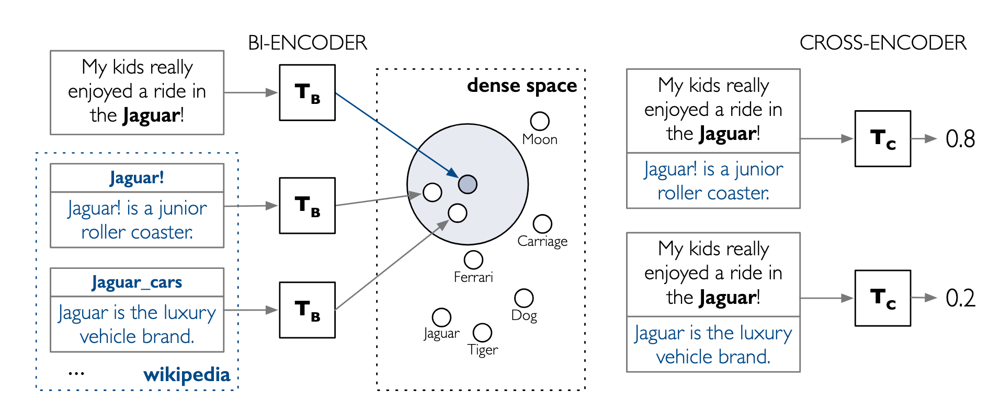

# Epistemic Grounding & Dense Alignment

This document details the formal mathematical model, topological representations, and machine learning architecture for
grounding textual mentions into unified Theory Graphs. It formalizes **Textual Envelopes**, **Custom Vector Pooling**,
**Dual-Space Dense Alignment**, **Two-Stage Entity Maturation**, and **Global Relational Discovery**.

---

## Mathematical Foundations & Heterogeneous Information Networks (HIN)

We model the global knowledge space as a **Heterogeneous Information Network (HIN)**:

\[ \mathcal{H} = (\mathcal{V}, \mathcal{E}, \phi, \psi)
\]

Where:

- $\mathcal{V}$ is the set of vertices (representing text chunks, entities, claims, and premises).
- $\mathcal{E} \subseteq \mathcal{V} \times \mathcal{V}$ is the set of directed edges (representing provenance,
  structural equivalence, support, or attack relations).
- $\phi: \mathcal{V} \to \mathcal{T}_v$ is the node-type mapping function, where:
  \[ \mathcal{T}_v = \{ \text{L1Chunk}, \text{L2Entity}, \text{L3ArgumentComponent} \} \]
- $\psi: \mathcal{E} \to \mathcal{T}_e$ is the edge-type mapping function, where:
  \[ \mathcal{T}_e = \{ \text{MENTIONED\_IN}, \text{EXTRACTED\_FROM}, \text{SAME\_AS}, \text{SUPPORTS},
  \text{ATTACKS} \} \]

The network is stratified into three epistemic layers:

1. **Layer 1 (Empirical Manifold):** Unstructured text sequences $S \in \Sigma^*$ and their provenance constraints.
2. **Layer 2 (Deterministic Ontology):** Concept nodes $e \in \mathcal{V}_{\text{L2}}$ and factual
   edges $r \in \mathcal{E}_{\text{L2}}$.
3. **Layer 3 (Abstract Framework):** Bipolar argumentation structures capturing theoretical defeasibility.

---

## Entity Extraction: Span Methods vs. Generative LLMs

In automated information extraction from scholarly texts, two paradigms exist:

1. **Span-Based Extraction (e.g., Zhong & Chen, 2021; Maracani et al., 2026):** Focuses on exhaustive token
   classification. While achieving high precision in identifying localized surface tokens, pure span models frequently
   extract non-salient, trivial entities that create severe downstream query bottlenecks.
2. **Generative LLM Extraction:** Excels at extracting the primary thesis and conceptual abstractions, but can suffer
   from boundary hallucination, loss of verbatim provenance, and format-induced reasoning degradation (addressed
   via [Constrained Decoding](../architecture/constrained_decoding.md)).

**Episteme's Hybrid Resolution:**
We combine the semantic abstraction of LLMs with exact token-level boundary verification through **Topological
Injection** into symmetrical textual envelopes.

---

## Phase 2: Entity Discovery & Topological Injection ($T \times G$)

Let a text chunk be a sequence of tokens $C = (t_1, t_2, \dots, t_N)$. When an entity mention $m$ is extracted, it
specifies a verbatim substring span $m = (t_i, \dots, t_k)$.

### Symmetrical Textual Envelopes ($T_n$)

To prevent truncation bias and context distortion, we define the **Textual Envelope** $T_n$ for a mention span $m$ as a
symmetrically bounded context window centered around the mention's midpoint $j = \lfloor \frac{i+k}{2} \rfloor$:

\[ \text{Window}_L (C, m) = C\left[ \max\left (0, j - \frac{L}{2}\right) : \min\left (N, j + \frac{L}{2}\right) \right]
\]

Let $s_{\text{rel}}$ and $e_{\text{rel}}$ be the indices of $t_i$ and $t_k$ relative to the start of $\text{Window}_L$.
We apply a topological injection mapping $\pi$ to insert explicit boundary markers:

\[ T_n = \pi (\text{Window} _L (C, m)) = (t' _1, \dots, t'_{s_{\text{rel}}-1}, \text{[ENT]}, t' _{s_{\text{rel}}},
\dots, t' _{e_{\text{rel}}}, \text{[\textbackslash ENT]}, t' _{e_{\text{rel}}+1}, \dots)
\]

### Custom Vector Pooling ($h_j$)

Standard sentence transformers pool the sequence output using the classification token
embedding $\mathbf{h}_{[\text{CLS}]}$. In long contexts, this averages semantics across the entire window, washing out
the entity representation.

To solve this, we define the **Entity-Centered Contextual Embedding** $E_{\text{ctx}} (T_n)$ by isolating the hidden
state $\mathbf{h}_j \in \mathbb{R}^d$ corresponding directly to the special token $\text{[ENT]}$:

\[ E_{\text{ctx}} (T_n) = \mathbf{W} \cdot \mathbf{h}_{\text{index} (\text{[ENT]})} + \mathbf{b} \]

where $\mathbf{W} \in \mathbb{R}^{d \times d}$ and $\mathbf{b} \in \mathbb{R}^d$ represent projection parameters.


### Dual-Space Dense Alignment

Linking a newly extracted textual envelope $T_n$ to an existing canonical graph node $G_k$ is resolved via a dual-funnel
retrieval architecture:

1. **Maximum Inner Product Search (MIPS):**
   For candidate graph nodes $e_k \in \mathcal{V}_{\text{L2}}$ serialized to structural descriptions $G_k$, we compute
   the Bi-Encoder cosine score:
   \[ \text{score} _{\text{bi}} (T_n, G_k) = \cos\left (E_{\text{ctx}} (T_n), \, E_{\text{ctx}} (G_k)\right)
   \]
2. **Cross-Encoder Verification:**
   The top-$K$ candidates are reranked using a Cross-Encoder to compute the joint probability of identity:
   \[ \text{score} _{\text{cross}} (T_n, G_k) = \sigma\left (\mathbf{W}_{\text{CE}} \cdot \text{Transformer}\left
   (\text{[CLS]} \, T_n \, \text{[SEP]} \, G_k \, \text{[SEP]}\right)_{[\text{CLS}]}\right)
   \]
3. **Out-of-Ontology (OoO) Fallback:**
   Let $\tau$ be a calibrated threshold constraint. If:
   \[ \max_k \left (\text{score}_{\text{cross}} (T_n, G_k)\right) < \tau \] The candidate is declared out-of-ontology,
   triggering the creation of a novel canonical entity $e_{\text{new}} \in \mathcal{V}_{\text{L2}}$.

---

## Two-Stage Entity Maturation Protocol

Attempting to update an entity's canonical description during continuous extraction (Phase 2) introduces **epistemic
drift**. Modifying the text of $G$ with every new mention continuously shifts its vector coordinates, invalidating the
vector index and destabilizing alignment mathematics.

To maintain structural invariance, Episteme implements a **Two-Stage Maturation Protocol**:

```
STAGE 1: GENESIS & ACCUMULATION (Phase 2)
  Mention m_1 ──► Mint Baseline Node G (Immutable Anchor in Latent Space)
  Mention m_2 ──► Attach Envelope T_2 via EXTRACTED_FROM Edge (No text mutation)
  Mention m_3 ──► Attach Envelope T_3 via EXTRACTED_FROM Edge (No text mutation)

STAGE 2: BATCH EPISTEMIC SYNTHESIS (Phase 4)
  Accumulated Envelopes {T_1, T_2, ..., T_N}
         │
         ▼
  Compute Geometric Centroid: C = (1/N) ∑ E_ctx(T_i)
         │
         ▼
  Select Top-k Envelopes Closest to C
         │
         ▼
  Synthesize Canonical Description via LLM Reasoner
```

1. **Deterministic Genesis & Accumulation (Phase 2):** The initial mention mints a baseline node $G$, establishing an
   immutable anchor in the latent space. Subsequent alignments do not mutate $G$; instead, they commit structural
   `EXTRACTED_FROM` provenance edges connecting the new empirical envelope $T_{\text{new}}$ to $G$.
2. **Batch Epistemic Synthesis (Phase 4):** A geometrically rigorous synthesis runs over the accumulated envelopes. The
   system computes the geometric centroid $C = \frac{1}{N} \sum_{i=1}^{N} E_{\text{ctx}} (T_i)$ of all envelopes
   attached to $G$, filters the Top-$k$ closest to $C$, and uses the LLM Reasoner to synthesize a definitive canonical
   description.

---

## Phase 3: Global Relation Discovery ($T_A \times T_B$)

Global relations connect distinct entities across different documents. Evaluating relations based solely on static graph
distance is computationally prohibitive and prone to topological cycle errors.


/// caption Wu, Ledell, Fabio Petroni, Martin Josifoski, Sebastian Riedel, und Luke Zettlemoyer. „Scalable Zero-Shot
Entity Linking with Dense Entity Retrieval“. EMNLP, 2020. ///

We resolve this by measuring the **Contextual Isomorphism** of their empirical textual envelopes $T_A$ and $T_B$.

### Epistemic Proximity

Let $T_A$ and $T_B$ be textual envelopes containing injected entity markers. The dense candidate generation computes:

\[ \text{score} _{\text{prox}} (T_A, T_B) = E_{\text{ctx}} (T_A) \cdot E_{\text{ctx}} (T_B)^T \]

Because $E_{\text{ctx}}$ projects vectors using the targeted $\mathbf{h}_{\text{[ENT]}}$ token, this dot product
measures the semantic similarity of the syntactic and contextual frames surrounding the two entities rather than the
lexical meaning of their names.

### Relational Reranking

High-scoring candidate pairs are mapped to the Cross-Encoder:

\[ \text{Input}_{\text{CE}} = \text{[CLS]} \, T_A \, \text{[SEP]} \, T_B \, \text{[SEP]} \]

The multi-head self-attention layer computes the joint cross-attention matrix between tokens of $T_A$ and $T_B$. Because
`[ENT]` markers bound the target terms in both inputs, the self-attention mechanism computes empirical alignment
directly between the concepts' physical contexts:

\[ \text{score} _{\text{rel}} = \text{CrossEncoder} (\text{Input}_{\text{CE}})
\]

This guarantees that Layer 3 global relationships are derived directly from the mathematical topology of their Layer 1
textual provenances.

---

## Event-Driven Auditing & Telemetry

To inspect the empirical validity of these dense projections in real-time, the pipeline dispatches domain events to an
observability sink (Langfuse):

* `EntityLinkingCandidatesRetrieved`: Dispatched immediately following the MIPS Bi-Encoder step, capturing the list of
  candidates matched in vector space, their database identifiers, and similarity scores.
* `EntityLinkingReranked`: Dispatched after the Cross-Encoder computes the joint representation, capturing the candidate
  evaluated, the classification score, the acceptance status based on the threshold, and the parameter $\tau$.

---

## Related Documentation

- **Formal Model**: [Formal Graph Schema (TheoryNet)](formal_graph_model.md)
- **Episodic Memory**: [Episodic Working Memory](episodic_working_memory.md)
- **Pipeline Implementation**: [Pipeline Architecture](../architecture/pipeline_architecture.md)
- **Phase 2 Workflow**: [Entity Discovery Workflow](../workflow/2_entity_discovery/index.md)
- **Phase 4 Workflow**: [Entity Maturation Workflow](../workflow/4_entity_maturation/index.md)
- **Telemetry System**: [Event System & Telemetry](../observability/events.md)
