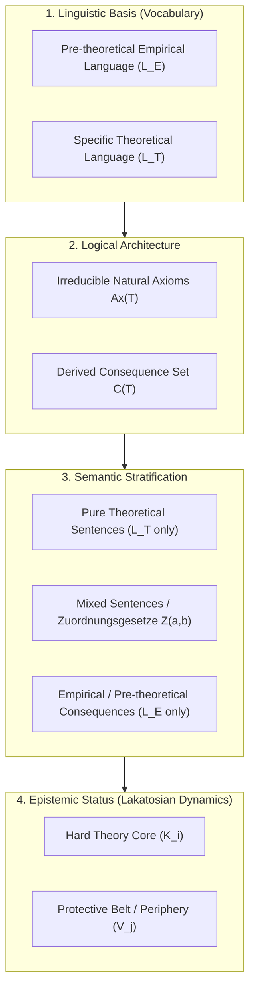

# Epistemology & Wissenschaftstheorie

This document details the epistemological foundations, philosophy of science criteria, and metatheoretical models that
justify the architecture of **Episteme**. It draws primarily from the formal epistemology of **Gerhard Schurz** (2014),
**Imre Lakatos'** methodology of scientific research programmes (1978), the structuralist framework of **Joseph Sneed**
and **Wolfgang Stegmüller** (1976), and **Paul Thagard's** computational model of explanatory coherence (1989).

---

## Methodological Characteristics of Scientific Theories

In formal philosophy of science (*Wissenschaftstheorie*), an isolated theoretical axiom (e.g., Newton's $F = m \cdot a$)
possesses virtually no empirical content on its own; it cannot be directly verified or falsified in isolation. Empirical
content and explanatory power emerge strictly through the **systemic architecture** of the theory.

Schurz (2014) identifies four primary methodological criteria that distinguish genuine scientific theories from
speculative or ad-hoc systems:

### System Character and Empirical Creativity

The systemic interaction of multiple hypotheses generates **empirical creativity** (*Empirische Kreativität*): two or
more theoretical hypotheses combined in a system yield *novel* empirical content that strictly exceeds the set-theoretic
union of their isolated empirical contents.

* **Formal Operationalization:**
  Let $E(H)$ denote the empirical content (observable deductive consequences) of a hypothesis $H$. A theoretical system
  exhibits empirical creativity if and only if:

  \[
  E(H_1 \wedge H_2) \supset E(H_1) \cup E(H_2)
  \]

  When evaluating extracted theoretical premises from scholarly literature, the pipeline verifies whether introducing a
  new premise into conjunction with the background theory deduces novel observable consequences. If it does not, it
  represents empirical deadweight or metaphysical surplus.

### Globality and Empirical Unification

A hallmark of progressive science is **globality** (*Globalität*): the capacity of a theory to explain qualitatively
disparate empirical phenomena (e.g., planetary orbits, ocean tides, and free fall in Newtonian mechanics) through the
identical theoretical mechanism. This **unification power** (*Vereinheitlichungsleistung*) reduces an unmanageable
multitude of isolated empirical generalizations to a concise set of fundamental principles.

* **Formal Operationalization:**
  Unification cannot be operationalized merely by counting post-hoc explanations of already known data. Instead, it is
  measured by the theory's capacity to generate **novel predictions**—predicting qualitatively new phenomena of which no
  instance had previously been observed (e.g., predicting that artificial satellites can maintain a stable orbit). In
  our graph representation, unification is reflected in high out-degree centrality of core axioms connecting across
  diverse empirical clusters.

### Holism of Meaning and Testing (Duhem-Neurath-Quine)

Because empirical content emerges only globally within the system, the meaning of a theoretical term is determined by
the *entire network* of interconnected laws (Holism of Meaning).

From this follows the **Holism of Theory Testing** (the Duhem-Neurath-Quine thesis): an empirical anomaly refutes via
*Modus Tollens* only the global conjunction of all involved premises; it does not indicate *which* specific premise is
false. There is no definitive *experimentum crucis*.

* **Formal Operationalization:**
  Because isolated axioms cannot be falsified individually, we operationalize theory evaluation comparatively over the
  set algebra of empirical **successes** ($E$) and empirical **failures** ($M$). A theory version $T_1$ represents
  rational scientific progress over $T_2$ if and only if:

  \[
  E(T_1) \supseteq E(T_2) \quad \wedge \quad M(T_1) \subset M(T_2)
  \]

  This creates a strict **partial order** of theoretical superiority. Merely counting raw numbers of successes is
  epistemologically invalid; progress requires expanding verified successes while strictly shrinking the domain of
  anomalies.

### Homogeneity vs. The Tacking Paradox (Klebeparadoxon)

Karl Popper famously demanded "boldness" in scientific theories in the form of maximized unexamined empirical content.
However, unconstrained maximization leads to a fatal logical trap: the **Tacking Paradox** (*Klebeparadoxon*).

If one takes an empirically well-confirmed physical theory $T$ and conjoins an arbitrary, untested claim $H$ (e.g.,
"Telepathy exists"), the conjunction $T \wedge H$ strictly possesses a vastly increased empirical content. Yet this is
not progressive science; it is trivial conjunctive padding.

* **Formal Operationalization:**
  We demand that a scientific theory must be **homogeneous** (non-factorizable, *nicht-faktorisierbar*). A theory $T$ is
  unacceptably heterogeneous (factorizable) if it can be decomposed into two disjoint sub-theories $T_1$ and $T_2$ such
  that its empirical content $E(T)$ also decomposes into disjoint sets $E_1$ and $E_2$:

  \[
  T \equiv T_1 \wedge T_2 \quad \text{such that} \quad E(T) = \operatorname{Cn}(E_1 \cup E_2) \quad \text{with} \quad T_1 \vdash E_1, \; T_2 \vdash E_2
  \]

  An increase in empirical content is methodologically legitimate only when newly added axioms logically interact with
  the existing core, preserving structural and semantic homogeneity.

---

## Schurz's Four-Dimensional Theory Statics (Theorienanalyse)

To decompose complex philosophical and scientific texts into machine-processable theory graphs without losing structural
integrity, the pipeline implements Gerhard Schurz's four-dimensional framework of theory statics:

### Linguistic Basis (Das Vokabular)

The terminology of the theory is sharply separated into two distinct sub-vocabularies:

- **Pre-Theoretical Empirical Language ($L_E$):** Terms presupposed as already understood and empirically grounded
  (observation terms or terms established by unproblematic background theories).
- **Theoretical Language ($L_T$):** Novel, theory-specific constructs introduced by the theory itself (e.g., *quarks*,
  *subconscious*, *categorical imperative*).

### Logical Architecture (Axiome vs. Konsequenzen)

The deductive statement system is organized into:

- **Natural Axioms ($Ax(T)$):** The irreducible, non-redundant core laws that define the theory. Redundant conjunctive
  appendages must be eliminated to prevent artificial inflation.
- **Consequence Set ($\operatorname{Cn}(T)$):** The set of all theorems, explanations, and predictions logically or
  probabilistically entailed by natural axioms ($Ax(T) \vdash \operatorname{Cn}(T)$).

### Semantic Stratification (Satzarten)

Axioms and consequences are classified by their semantic composition:

- **Pure Theoretical Sentences:** Principles formulated entirely within $L_T$ (e.g., Newton's *actio = reactio*).
- **Mixed Sentences (*Zuordnungsgesetze*):** Crucial bridge principles connecting $L_T$ with $L_E$. Without explicit
  mapping laws, theoretical terms remain empirically disconnected and decay into speculative metaphysics.
- **Empirical Consequences:** Testable assertions formulated strictly in $L_E$ that establish contact with observable
  phenomena.

### Epistemic Status & Theory Dynamics (Hard Core vs. Periphery)

Following Imre Lakatos, theories are structured into differential epistemic strata:

- **The Hard Core ($K_i$):** Axioms that define the historical and paradigm identity of the theory. If these are
  abandoned, the paradigm collapses.
- **The Protective Belt / Periphery ($V_j$):** Auxiliary hypotheses, boundary conditions, and specialized parameters
  surrounding the core. When anomalies occur, *Modus Tollens* is redirected to modify peripheral hypotheses in the
  protective belt, shielding the hard core from premature refutation.

---

## Lakatosian Theory Dynamics & The Degeneration Index

When scientific theories evolve over time across multiple text versions or historical editions, Episteme evaluates
whether the evolution represents a **progressive** or a **degenerating** research programme.

### Successes vs. Failures

Empirical interactions for a given theory version $V_j$ are partitioned into:

- **Empirical Successes ($S$, or $E$ in German *Erfolg*):** Phenomena correctly predicted or explained by the theory.
- **Failures Type a ($F_{\text{Typ a}}$, or $M_a$ in German *Misserfolg Typ a* - Direct Refutations):** Well-established empirical
  observations in direct logical contradiction with the theory.
- **Failures Type b ($F_{\text{Typ b}}$, or $M_b$ in German *Misserfolg Typ b* - Ad-Hoc Immunizations):** Anomalies that contradicted an
  earlier version of the theory, but were "resolved" in the current version by introducing an ad-hoc auxiliary hypothesis that produces
  *no novel testable predictions* ($\operatorname{Cn}(K_{i+1}) \setminus \{a\} \subseteq \operatorname{Cn}(K_i)$).

### The Degeneration Index ($D$)

Schurz operationalizes Lakatos's criterion through the **Degeneration Index** $D(V_j)$:

\[
D(V_j) = \frac{|F_{\text{Typ b}}(V_j)|}{|S(V_j)| + |F_{\text{Typ a}}(V_j)|} \quad \left( \equiv \frac{|M_b|}{|E| + |M_a|} \right)
\]

- **Progressive Programme ($D \to 0$):** New versions expand empirical coverage, resolve anomalies via hypotheses that
  generate verified novel predictions, and keep ad-hoc immunizations minimal.
- **Degenerating Programme ($D \gg 0$):** Anomalies are continuously patched by circular auxiliary clauses that shield
  the core without expanding empirical creativity, turning the theory into an empirical patchwork.

---

## Explanatory Coherence (Thagard's ECHO Model)

To evaluate the mutual acceptability of contested hypotheses within the extracted Theory Graph, Episteme implements
principles from Paul Thagard's **Theory of Explanatory Coherence (TEC)**:

1. **Symmetry:** If proposition $P$ explains $Q$, then $P$ and $Q$ cohere with each other symmetrically
   ($w_{pq} = w_{qp}$).
2. **Explanatory Breadth:** Hypotheses that explain a larger volume and diversity of empirical evidence receive greater
   excitatory support.
3. **Simplicity:** The network penalizes complex, convoluted explanations. The excitatory weight between a hypothesis
   and the explained data is inversely proportional to the number of auxiliary co-hypotheses required for the deduction.
4. **Unification:** Core hypotheses that repeatedly explain diverse data without requiring case-by-case ad-hoc
   assumptions achieve high global coherence.
5. **Higher-Level Warrant:** A hypothesis gains substantial plausibility if it is itself explained by a deeper,
   overarching theoretical principle.
6. **Data Priority:** Verified empirical data nodes possess intrinsic acceptability, providing an independent source of
   activation energy that spreads through excitatory links.
7. **System Coherence ($H$):** The global mathematical harmony of the entire network at state $t$ is calculated via:
   \[
   H(t) = \sum_{i} \sum_{j} w_{ij} \cdot a_i(t) \cdot a_j(t)
   \]
   Where $w_{ij}$ represents excitatory or inhibitory edge weights and $a_i(t)$ represents continuous node activations.

---

## Avoiding Retrospective Bias (Presentism)

A severe challenge in computational digital humanities and philosophy is **retrospective bias** (*Presentism*): the
tendency to analyze historical theories using modern concepts, formalisms, or measurement instruments that were
unavailable to the historical authors.

Episteme enforces historical neutrality:
- The graph structure must reflect the author's native conceptual framework and explicitly stated background
  assumptions.
- Theoretical claims are evaluated relative to the historical empirical base ($B(t)$) available at the time of
  authorship, rather than modern ground-truth datasets.

---

## References & Bibliography

1. **Schurz, G. (2014).** *Philosophy of Science: A Unified Approach*. Routledge.
2. **Lakatos, I. (1978).** *The Methodology of Scientific Research Programmes: Philosophical Papers Volume 1*. Cambridge University Press.
3. **Sneed, J. D. (1976).** *The Logical Structure of Mathematical Physics*. D. Reidel Publishing Company.
4. **Stegmüller, W. (1976).** *The Structure and Dynamics of Theories*. Springer-Verlag.
5. **Thagard, P. (1989).** "Explanatory Coherence." *Behavioral and Brain Sciences*, 12(3), 435–467.
6. **Thagard, P. (1992).** *Conceptual Revolutions*. Princeton University Press.
7. **Quine, W. V. O. (1951).** "Two Dogmas of Empiricism." *The Philosophical Review*, 60(1), 20–43.
8. **Duhem, P. (1906).** *La théorie physique: son objet, et sa structure*. Marcel Rivière.

---

## Related Documentation

* **Formal Graph Representation**: [Formal Graph Schema (TheoryNet)](formal_graph_model.md)
* **Topologies & Posets**: [Theory-Nets, Posets & Topologies](theory_nets_and_topologies.md)
* **Evaluation Taxonomy & Algorithms**: [Theory Metrics Subsystem](theory/metrics/index.md)
* **LPG-ECHO Algorithm**: [Adapted ECHO Algorithm](theory/metrics/adapted_echo_algorithm.md)
* **Glossary of Epistemic Terms**: [Glossary](glossary.md)
