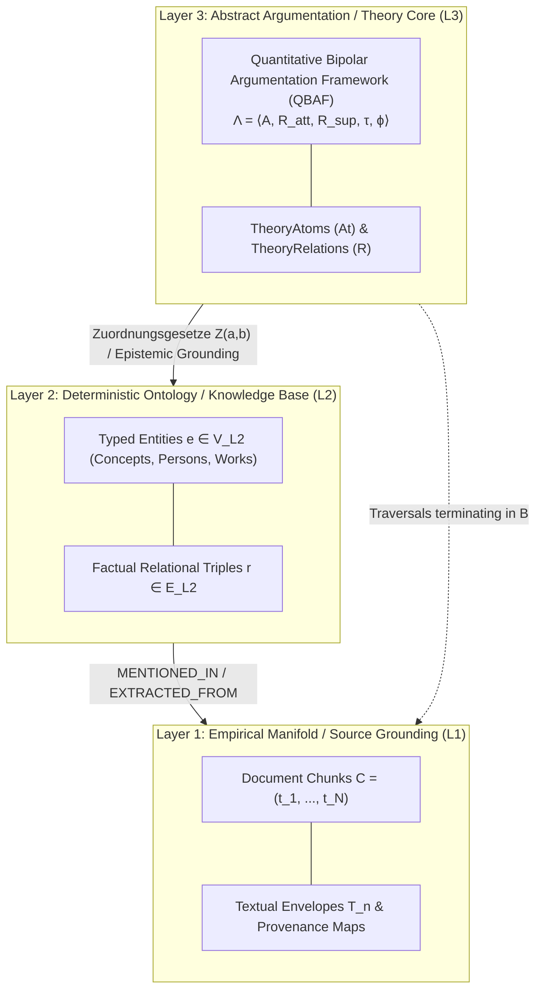

# Formal Graph Schema (TheoryNet)

This document establishes the unified formal mathematical architecture of the **Theory Graph (TheoryNet)** in **Grund
Episteme**. It synthesizes epistemological theory, structuralist philosophy of science, abstract argumentation, and
graph-theoretic models into a single, mathematically rigorous framework designed to represent, extract, and evaluate
contested scientific literature.

---

## Mathematical Foundations & Graph Representation

The Theory Graph is formally defined as a labeled, directed multigraph:

\[ G = (V, E, \lambda_v, \lambda_e)
\]

Where:

- $V$ is the finite set of vertices (entities, concepts, premises, and claims).
- $E \subseteq V \times V$ is the finite set of directed edges (semantic relationships, support, or attack vectors).
- $\lambda_v: V \to T_v$ assigns vertex types from an ontology type hierarchy $T_v$.
- $\lambda_e: E \to T_e$ assigns edge types from a relationship hierarchy $T_e$.

### Isomorphism to the Logical TheoryNet ($TF$)

The logical framework of the scientific theory—the **TheoryNet**—is defined as a relational tuple:

\[ TF = (At, R)
\]

where $At$ denotes the set of argumentative atoms and $R$ denotes the set of argumentative relations. To unify
computational graph storage (in Neo4j) with model-theoretic argumentation, we enforce a strict **isomorphism**:

- The vertex set $V$ maps directly to the set of argumentation atoms $At$ ($V \cong At$).
- The edge set $E$ maps directly to the argumentative relations $R$ ($E \cong R$).

### Epistemic Partitioning ($\Delta = (B, A)$)

Scientific theories are not flat assertions of fact; they fundamentally differentiate between empirical observations and
abstract theoretical hypotheses. We formally partition the vertex set $V$ via the underlying knowledge
base $\Delta = (B, A)$:

* **$B$ (Empirical Observation Base / *Beobachtungssätze*):** The foundation of verifiable, minimally contested
  empirical data points, localized existential assertions, and raw evidentiary units.
* **$A$ (Theoretical Antecedents / Hypotheses):** Abstract theoretical statements, core axioms, and hypotheses accepted
  as tenable only under specific inferential conditions.

Consequently, the global vertex set satisfies:

\[ V = B \cup A \quad \text{where} \quad B \cap A = \emptyset \]

---

## Layered Architecture Model (L1, L2, L3)

To maintain epistemic purity and prevent semantic drift across processing steps, the theory graph is stratified into
three distinct structural layers:

### Layer 1: Empirical Manifold / Source Grounding ($L1$)

Represents raw document chunks, unstructured token sequences $S \in \Sigma^*$, and exact provenance offsets:

\[ L1 = (C, \lambda_c, \pi)
\]

Where:

- $C = \{c_1, c_2, \dots, c_m\}$ is the set of document chunks.
- $\lambda_c: C \to \text{DocumentMetadata}$ assigns structural coordinates (e.g., Table of Contents section, chapter,
  author, page number).
- $\pi: C \to \text{Text}$ provides the verbatim character substring sequence $(t_1, t_2, \dots, t_N)$.

### Layer 2: Deterministic Ontology / Knowledge Base ($L2$)

Captures entity-centric factual relationships extracted directly from the literature:

\[ L2 = (\mathcal{V}_{\text{L2}}, \mathcal{E}_{\text{L2}}, \gamma, \delta)
\]

Where:

- $\mathcal{V}_{\text{L2}}$ is the set of typed entity nodes ($e \in \mathcal{V}_{\text{L2}}$), such as *Concept*, *Person*, *Theory*, or
  *Work*.
- $\mathcal{E}_{\text{L2}} \subseteq \mathcal{V}_{\text{L2}} \times \mathcal{V}_{\text{L2}}$ is the set of directed relationship edges ($r \in \mathcal{E}_{\text{L2}}$), such as
  `INFLUENCED`, `DEFINES`, or `ASSOCIATED_WITH`.
- $\gamma: \mathcal{V}_{\text{L2}} \to [0, 1]$ assigns extraction confidence scores.
- $\delta: \mathcal{E}_{\text{L2}} \to [0, 1] \times \mathcal{P} (L1)$ assigns relationship certainty paired with explicit evidentiary text
  snippets from $L1$.

### Layer 3: Abstract Argumentation Framework ($L3$)

Encodes argumentative, defeasible, and theoretical dependencies as a Quantitative Bipolar Argumentation Framework (QBAF):

\[ L3 \equiv \Lambda = \langle A, \mathcal{R}_{att}, \mathcal{R}_{sup}, \tau, \phi \rangle
\]

Where:

- $A$ is the set of argument components / theoretical hypotheses ($a \in \mathcal{V}_{\text{L3}}$), formally categorized as *Claims* or
  *Premises*.
- $\mathcal{R}_{att} \subseteq A \times A$ is the class of attacking/undermining relations.
- $\mathcal{R}_{sup} \subseteq A \times A$ is the class of supporting/warranting relations.
- $\tau: A \to [0, 1]$ is the prior plausibility base score.
- $\phi: \mathcal{R}_{att} \cup \mathcal{R}_{sup} \to [0, 1]$ assigns continuous structural relationship weights.
- Continuous gradual semantics $\rho: A \to [0, 1]$ subsequently updates and evaluates node acceptability.

---

## Argumentation Framework & Gradual Semantics

Scientific reasoning is rarely binary; theoretical statements carry varying degrees of warrant and face conditional
objections. We model the logical interaction over theoretical nodes $A$ as a **Quantitative Bipolar Argumentation
Framework (QBAF)**.

### Super-Role Inclusion (DL-LiteR)

Drawing upon Description Logics (specifically DL-LiteR), argumentative interactions are not restricted to monolithic
primitives. Instead, "attack" and "support" are formalized as broad **super-role classes**, denoted
as $\mathcal{R}_{att}$ and $\mathcal{R}_{sup}$:

Any fine-grained relational predicate identified in the scientific text
(e.g., $r_k \in \{\text{REFUTES}, \text{CRITICIZES}, \text{UNDERMINES}\}$) is treated as a role inclusion inheriting the
formal semantics of its parent super-class:

\[ r_k \sqsubseteq \mathcal{R} _{att} \quad \text{or} \quad r_k \sqsubseteq \mathcal{R}_{sup} \]

The complete argumentation space is defined as the tuple:

\[ \Lambda = \langle A, \mathcal{R} _{att}, \mathcal{R}_{sup}, \tau, \phi \rangle \]

Where:

- $A$ is the set of theoretical antecedents.
- $\mathcal{R}_{att} \subseteq A \times A$ is the class of all attacking/undermining relations.
- $\mathcal{R}_{sup} \subseteq A \times A$ is the class of all supporting/warranting relations.
- $\tau: A \to [0, 1]$ is the prior plausibility function (vertex labeling $\lambda_v$).
- $\phi: \mathcal{R}_{att} \cup \mathcal{R}_{sup} \to [0, 1]$ is the continuous edge weight function (edge
  labeling $\lambda_e$).

### Continuous State Computation & Gradual Semantics

The ultimate acceptability of any scientific premise within the Theory Graph is calculated via an update
function $\rho: A \to [0, 1]$ that combines its prior plausibility $\tau (a_i)$ with the aggregated strengths of
incoming relations.

For any premise $a_i \in A$, the framework calculates an aggregation function $\alpha (a_i)$ summing incoming support
and subtractive attack:

\[ \alpha (a_i) = \sum_{ (a_j, a_i) \in \mathcal{R} _{sup}} \rho (a_j) \cdot \phi (a_j, a_i) \; - \sum_{ (a_k, a_i) \in
\mathcal{R}_{att}} \rho (a_k) \cdot \phi (a_k, a_i)
\]

Using gradual semantics (e.g., Quadratic Energy or Euler-based convergence), this yields the final stability
score $\rho (a_i)$, iteratively propagated through the network until convergence.

### Dung Abstract Argumentation Mapping

In discrete evaluation contexts, the graph can be reduced to Dung's classical abstract argumentation framework:

- **Arguments**: $A \subseteq \mathcal{V}_{\text{L3}}$.
- **Attack Relations**: $\leadsto \; \subseteq A \times A$, where $u \leadsto v \iff (u, v) \in \mathcal{R}_{att}$.
- **Extensions**: Evaluated under standard grounded, preferred, and stable extension semantics.

---

## Zuordnungsgesetze (Mapping Laws) & Epistemic Grounding

For an abstract theory core ($A$) to possess empirical creativity rather than remaining purely speculative, it must
anchor to the empirical base ($B$). This anchoring is mediated by formal **Mapping Laws** (*Zuordnungsgesetze*, Schurz,
2014):

\[ Z: A \times B \to [0, 1]
\]

Between an empirical observation $b \in B$ and a theoretical antecedent $a \in A$, the mapping law is governed by two
complementary functions:

1. **Correlational Mapping ($Z_1$):**
   \[ Z_1: A \times B \to \mathcal{P} \] Models the probabilistic correlation between theoretical constructs and
   observable indicators, mapped to the continuous $[0, 1]$ interval of the QBAF.
2. **Structural Isomorphism ($Z_2$):**
   \[ Z_2: A \times B \to \sigma (\kappa (a), \kappa (b))
   \] Measures the structural overlap $\sigma$ between the theoretical model structure $\kappa (a)$ and the empirical
   domain $\kappa (b)$.

### Epistemic Justification Paths ($J (at)$)

Rather than storing justifications as static, ungrounded node attributes, the set of epistemic justifications $J (at)$
for any atom $at \in At$ is **dynamically inferred** via directed graph traversal through supportive and mapping edges
terminating in $B$:

\[ J (at) = \{ p = (a_0, e_1, a_1, \dots, e_k, b) \mid a_0 = at, \; b \in B, \; e_i \in \mathcal{R}_{sup} \cup Z \} \]

This ensures that logical inferences remain provably grounded in empirical textual evidence.

---

## Structuralist Model-Theoretic Foundations

Complementing abstract argumentation, the pipeline integrates the **Structuralist Theory of Science** (Sneed, 1971;
Stegmüller, 1976; Balzer et al., 1987). Theories are model-theoretic entities rather than syntactic statement lists.

### The Model-Theoretic Triad: $M_p$, $M$, and $M_{pp}$

A theory-element is defined as a pair $T = \langle K, I \rangle$, where $K$ is the formal theory core and $I$ is the
domain of intended applications. The formal core relies on three nested classes of set-theoretic structures:

1. **Potential Models ($M_p$):** Defines the mathematical vocabulary and conceptual framework (e.g., coordinate frames,
   mass functions, force vectors), regardless of whether empirical laws hold.
2. **Actual Models ($M \subseteq M_p$):** The subset of potential models satisfying the substantive natural laws or
   mathematical axioms of the theory.
3. **Partial Potential Models ($M_{pp}$):** The empirical substructure obtained by stripping away all $T$-theoretical
   functions, leaving only non-theoretical, directly observable terms.

### Uniform Space $(M_p, \mathcal{U})$ & Admissible Blurs ($\mathcal{A}$)

Real-world scientific applications inevitably involve measurement noise and observational tolerances. Rather than
requiring absolute mathematical exactness, closeness between empirical observations and theoretical models is formalized
via a **Uniform Space** $(M_p, \mathcal{U})$:

- **Uniformity ($\mathcal{U}$):** A family of entourage relations $u \subseteq M_p \times M_p$ satisfying diagonal
  containment ($\Delta (M_p) \subseteq u$), filter intersection ($u_1 \cap u_2 \in \mathcal{U}$), and triangular
  composition ($v \circ v \subseteq u$).
- **Admissible Blurs ($\mathcal{A} \subseteq \mathcal{U}$):** A pragmatically restricted sub-collection of entourages
  bounded by an upper tolerance limit:
  \[ \text{Bound} (\mathcal{A})
  \] If observational discrepancy exceeds $\text{Bound} (\mathcal{A})$, the theory is falsified; conversely,
  if $\mathcal{A}$ were allowed to be arbitrarily large, the theory would become empirically vacuous.

### Tenability and Adequacy

These model-theoretic structures define two critical validity conditions:

* **Tenability (*Haltbarkeit*):** The requirement that intended applications can be formulated in the non-theoretical
  empirical vocabulary:
  \[ I \subseteq M_{pp} \] If an intended application cannot be expressed within $M_{pp}$, the theory is conceptually
  untenable for that domain.
* **Approximative Empirical Adequacy (*Adäquatheit*):** The condition that empirical observations $I$ can be enriched
  with theoretical functions such that the resulting model lies within an admissible blur $u \in \mathcal{A}$ of an
  actual model $M$:
  \[ \exists X \in M \quad \text{such that} \quad (I, X) \in u, \quad u \in \mathcal{A} \]

---

## Temporal Evolution & Uncertainty

Scientific knowledge is non-static; theories evolve, revise hypotheses, and encounter anomalies.

### Temporal Graph Evolution

The graph evolves over chronological time $t$:

\[ G (t) = (V (t), E (t), \lambda_v (t), \lambda_e (t))
\]

* **Description Versioning:** When an entity or premise matures into a more specialized conceptualization, earlier
  descriptions are not overwritten. Instead, the graph retains an immutable historical semantic trace. This ensures that
  early, less sophisticated terminology remains matchable in vector space during cross-document alignment.
* **Dynamic Refinement:** Relations strengthen, weaken, or undergo modal retraction when confronted with empirical
  counterexamples.

### Probabilistic Semantics

To capture extraction and inferential uncertainty, each element carries belief-theoretic scores:

- **Belief Score**: $\beta \in [0, 1]$
- **Disbelief Score**: $\delta \in [0, 1]$
- **Epistemic Uncertainty**: $u = 1 - \beta - \delta \quad (\beta + \delta \le 1)$

For composite argument structures:

- **Conjunction**: $c (A \land B) = \min (c (A), c (B))$
- **Disjunction**: $c (A \lor B) = \max (c (A), c (B))$
- **Implication**: $c (A \to B)$ weighted by evidentiary support and conditional transfer confidence.

---

## Computational Tractability & Search Heuristics

Evaluating the global structural coherence of a scientific theory requires determining maximal $B$-consistent
subsets $\Sigma \subseteq A$, such that $\Sigma \cup B$ is free of logical contradictions, while any
superset $\Sigma' \cup B$ introduces an inconsistency.

Because computing admissible extensions in abstract argumentation and verifying constraint satisfaction over posets is
**NP-hard**, the pipeline avoids exhaustive combinatorial search. Instead, it employs:

1. **Dense Vector Retrieval (Bi-Encoder MIPS):** Constrains cross-chunk candidate generation to top-$K$ semantic
   neighbors.
2. **Cross-Encoder Attention Filtering:** Reranks relation candidates using fine-grained multi-head cross-attention.
3. **Machine-Learning Guided Solvers:** structural predictors guide search-based solvers to approximate stable
   extensions in polynomial time.

---

## Quality & Validation Metrics

The formalized theory graph is evaluated across multiple structural and empirical quality dimensions:

| Metric                            | Target Layer          | Formal Definition                                                                 | Purpose                                                                       |
|:----------------------------------|:----------------------|:----------------------------------------------------------------------------------|:------------------------------------------------------------------------------|
| **Entity Precision & Recall**     | Layer 2               | $\frac{                                                                           | E_{\text{correct}}                                                            |}{|E_{\text{extracted}}|}, \quad \frac{|E_{\text{correct}}|}{|E_{\text{gold}}|}$ | Evaluates extraction faithfulness against gold-standard literature. |
| **Evidence Precision & Coverage** | Layer 1 $\to$ Layer 2 | Ratio of accurately localized verbatim text spans grounding entities and triples  | Prevents hallucinated relationships and guarantees source auditability.       |
| **Semantic Soft Matching**        | Layer 2 / Layer 3     | $\cos(E_{\text{ctx}}(a_{\text{pred}}), E_{\text{ctx}}(a_{\text{gold}})) \ge \tau$ | Accommodates paraphrasing and terminological variation in philosophy.         |
| **Empirical Content Ratio**       | Layer 3 $\to$ Layer 1 | Ratio of theoretical antecedents grounded via $Z(a, b)$ into $B$                  | Penalizes ungrounded metaphysical baggage.                                    |
| **Structural Coherence**          | Layer 3               | Parallel constraint satisfaction score ($H(t)$ via ECHO)                          | Assesses the absence of unmitigated circularities or internal contradictions. |

---

## Related Documentation

- **Philosophy of Science**: [Epistemology & Wissenschaftstheorie](epistemology.md)
- **Topologies & Community Structure**: [Theory-Nets, Posets & Topologies](theory_nets_and_topologies.md)
- **Dense Alignment & Maturation**: [Dense Alignment & Grounding](dense_alignment.md)
- **Evaluation Taxonomy**: [Theory Metrics Subsystem](theory/metrics/index.md)
- **Software Implementation**: [Pipeline Architecture](../architecture/pipeline_architecture.md)
- **Contracts & Schemas**: [Schema Reference](../reference/schema.md)
  and [Phase Contracts](../reference/phase_contracts.md)
