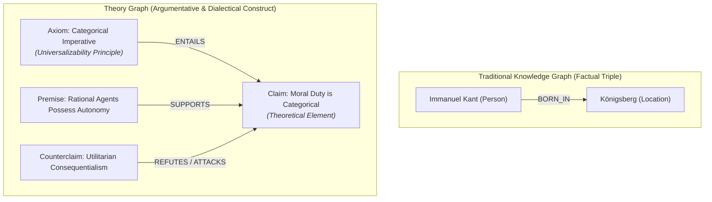

# Knowledge as Structure: From Knowledge Graphs to Theory Graphs

Understanding the distinction between traditional knowledge graphs and theory graphs is fundamental to appreciating the
core mission of **Episteme**.

---

## Knowledge as Structure: Moving from Language to Topology

We argue that the knowledge graph—or more formally, *knowledge as structure*—is an indispensable tool for human and
computational inquiry. Breaking the dense, interconnected architecture of scientific theories into tractable, structured
representations is one of our primary objectives.

Complex scientific and philosophical ideas are notoriously difficult to reason about when they remain locked in flat,
sequential text. For both human scholars and large language models, linear prose obscures long inferential dependency
chains, masks latent assumptions, and conceals subtle dialectical contradictions. Moving beyond mere sequential language
into **graph topology**—structuring theoretical discourse into explicit conceptual and inferential networks—provides the
formal scaffolding required to merge deep reasoning with artificial intelligence.

Traditional knowledge graphs organize factual assertions into collections of static triples. However, scientific
theories are fundamentally more than catalogues of facts: they are dynamic, interconnected networks of concepts, axioms,
hypotheses, defeasible warrants, and empirical applications
([Balzer, Moulines, & Sneed, 1987](theory_nets_and_topologies.md); [Schurz, 2014](epistemology.md)).

---

## The Ontological Divide: Consensus Facts vs. Dialectical Networks

The fundamental divide between a Knowledge Graph (KG) and a Theory Graph (TG) stems from their underlying epistemic
assumptions:

### Traditional Knowledge Graphs: The Factual Consensus Paradigm

Traditional knowledge graphs (such as Google Knowledge Graph, Wikidata, and DBpedia) operate under a **factual consensus
paradigm**:

- **Entities:** Represent concrete objects, named individuals, institutions, and standardized taxonomy terms.
- **Relations:** Model objective, state-of-affairs predicates (`born_in`, `works_for`, `located_at`, `authored`).
- **Ontological Assumption:** They assume a single, consistent, shared reality. Conflicting edges are treated as data
  quality errors, ambiguities, or duplicates to be resolved through entity resolution and consensus merging.
- **Primary Use Cases:** Fact retrieval, question answering, semantic search, and recommendation systems.

### Theory Graphs: The Dialectical & Multi-Paradigmatic Paradigm

Scientific, philosophical, and theoretical discourse does not operate on a single consensus reality. Instead, it is
characterized by **competing paradigms, defeasible warrants, and dialectical opposition**:

- **Concepts & Axioms:** Represent abstract theoretical constructs (*categorical imperative*, *transcendental
  deduction*, *defeasible warrant*) whose definitions often depend strictly on their theoretical framework.
- **Inferential & Dialectical Edges:** Model logical and dialectical relationships (`SUPPORTS`, `ATTACKS`, `ENTAILS`,
  `UNDERMINES`, `SPECIALIZES`).
- **Ontological Assumption:** They acknowledge **truth pluralism and defeasibility**. Conflicting claims are not data
  errors; they are the very engine of scientific progress
  ([Lakatos, 1978](epistemology.md#lakatos-research-programmes)). Utilitarianism attacking Kantian deontology is not a
  merge conflict—it is an essential dialectical edge that must be explicitly formalized.
- **Primary Use Cases:** Theoretical analysis, argument evaluation, consistency verification, and comparative paradigm
  modeling.

---

### Visual Comparison: Factual Triple vs. Dialectical Construct

---

## Key Dimensions of Difference

| Dimension               | Knowledge Graphs                                           | Theory Graphs                                                             |
|:------------------------|:-----------------------------------------------------------|:--------------------------------------------------------------------------|
| **Primary Focus**       | Concrete entities, places, and factual states              | Abstract concepts, axioms, hypotheses, and arguments                      |
| **Edge Semantics**      | Factual predicates (`born_in`, `works_at`, `capital_of`)   | Inferential & dialectical links (`SUPPORTS`, `ATTACKS`, `ENTAILS`)        |
| **Claim Status**        | Asserted facts (assumed static, objective, and true)       | Defeasible claims (subject to debate, conditions, and defeat)             |
| **Epistemic Stance**    | Monological (single consensus worldview)                   | Dialectical & pluralistic (accommodates rival paradigms)                  |
| **Construction Method** | Named entity recognition (NER) & factual triple extraction | Hermeneutic interpretation, argument mining, and structural formalization |
| **Graph Topology**      | Entity-centric clusters and star graphs                    | Directed Acyclic Graphs (DAGs), Theory-Posets, and QBAF networks          |
| **Evolution Pattern**   | Monotonic accumulation (adding new verified facts)         | Non-monotonic revision (paradigm shifts, theory refinement, defeat)       |
| **Target Systems**      | Search engines, conversational agents, knowledge bases     | Epistemologists, scholars, automated scientific reasoning engines         |

---

## Epistemic & Construction Challenges

Constructing a theory graph from scientific literature poses fundamental challenges that do not exist in classical
knowledge engineering:

### 1. Interpretation Variance

Scholarly and philosophical texts inherently admit multiple valid interpretations. Unlike determining an author's
birthplace, identifying the underlying logical structure of an argument requires interpreting inferential intent. A
theory graph framework must represent contested readings without artificially collapsing dialectical nuance into an
oversimplified consensus.

### 2. Conceptual Ambiguity & Incommensurability

In academic literature, identical lexical terms denote radically different concepts across theoretical traditions (e.g.,
*mass* in Newtonian vs. Relativistic physics, or *rationality* in economics vs. Frankfurt School critical theory).
Classical entity linking fails when homonyms mask incommensurable theoretical paradigms
([Kuhn, 1962](glossary.md#kuhn-thomas); [Stegmüller, 1976](glossary.md#stegmuller-wolfgang)).

### 3. Implicit Assumptions & Enthymemes

Scholars rarely articulate every step of their reasoning in explicit symbolic logic; academic prose relies heavily on
**enthymemes** (arguments with unstated premises or
warrants; [Lawrence & Reed, 2020](https://doi.org/10.1613/jair.1.12028)). Reconstructing a coherent theory graph
requires surfacing implicit assumptions that link explicit claims to foundational axioms.

### 4. Non-Monotonicity and Defeat Status

In traditional knowledge bases, adding new facts typically does not invalidate existing assertions. In theoretical
discourse, reasoning is fundamentally non-monotonic: introducing a novel counterargument, rebuttal, or empirical anomaly
can overturn the acceptability of an established claim. Theory graphs must maintain dynamic acceptability calculations
using formal frameworks such as Dung abstract argumentation and Quantitative Bipolar Argumentation Frameworks
([QBAF](formal_graph_model.md#layer-3-abstract-argumentation-framework-l3)).

### 5. Metatheoretical Evaluation Beyond Precision/Recall

A knowledge graph can be evaluated against a static benchmark using precision, recall, and F1 scores over extracted
triples. Evaluating a theory graph requires assessing **structural and epistemological coherence**:

- Does the graph preserve the deductive dependencies between axioms and theorems?
- Does it reflect explanatory unification ([Schurz, 2014](epistemology.md#globality-and-empirical-unification))?
- Can it quantify the empirical creativity and vulnerability of competing frameworks
  ([Lakatos, 1978](epistemology.md#lakatos-research-programmes))?

---

!!! info "How We Build Theory Graphs: Argument Mining as the Bridge"

    In the structuralist philosophy of science ([Sneed, 1971](glossary.md#sneedian-structuralism); [Balzer, Moulines, & Sneed, 1987](theory_nets_and_topologies.md#structuralist-theory-nets-as-posets)), scientific theories are formalized as networks of mathematical law-skeletons, specialized sub-theories ($\alpha$), and intended application domains ($I$).

    However, researchers rarely publish their work directly as formal model-theoretic structures; they write argumentative papers in natural language prose.

    **Episteme** bridges this gap: it utilizes **computational argument mining** (extracting argument discourse units, premises, claims, warrants, and rebuttals; [Lawrence & Reed, 2020](https://doi.org/10.1613/jair.1.12028)) as the empirical linguistic vehicle to reconstruct structuralist theory networks from natural language literature.

---

## Research Horizons & Implications

By moving beyond factual triples into topological theory representations, theory graphs open new research horizons
across multiple disciplines:

### Computational Philosophy & Epistemology

- **Formalizing Philosophical Debates:** Translating centuries of prose debate into queryable dialectical graphs.
- **Automated Coherence & Fallacy Checking:** Analyzing theoretical consistency, circular dependencies, and
  vulnerability to counterarguments.
- **Tracking Theory Dynamics:** Formally evaluating whether theoretical modifications represent progressive problem
  shifts or degenerating ad-hoc maneuvers ([Lakatos, 1978](epistemology.md#lakatos-research-programmes)).

### Digital Humanities & History of Ideas

- **Evolution of Paradigms:** Tracking how theoretical concepts specialize, drift, or bifurcate across historical
  corpora.
- **Topological Centrality of Concepts:** Identifying foundational conceptual bottlenecks that anchor entire
  intellectual movements.
- **Influence & Dialectical Lineage:** Moving beyond bibliographic citation counts to measure substantive inferential
  support and dialectical critique between thinkers.

### Advanced Epistemic AI & Neuro-Symbolic Reasoning

- **Contested Knowledge Representation:** Enabling language models to reason over disputed domains without hallucinating
  an artificial consensus.
- **Gradual Semantics:** Quantifying argument strength, confidence, and defeat through continuous values rather than
  brittle binary truth assignments.
- **Explainable Inference Paths:** Providing explicit provenance chains from high-level theoretical claims directly down
  to the source text spans that substantiate them.

---

## Conceptual Grounding in Episteme

Within the broader architecture of **Episteme**, this conceptual distinction is operationalized through a stratified
representation:

- **Layer 1 ($L_1$):** Grounds assertions in raw text chunks and character-level provenance.
- **Layer 2 ($L_2$):** Captures the factual, entity-relational scaffold (`Person`, `Work`, `Concept`).
- **Layer 3 ($L_3$):** Materializes the formal TheoryNet—modeling axioms, claims, warrants, dialectical attacks, and
  poset hierarchies.

For the mathematical formalization of these structures, see
the [Formal Graph Schema (TheoryNet)](formal_graph_model.md). For the philosophical criteria governing theory
evaluation, see [Epistemology & Wissenschaftstheorie](epistemology.md).

---

## Related Documentation

* **Formal Graph Specification**: [Formal Graph Schema (TheoryNet)](formal_graph_model.md)
* **Epistemological Criteria**: [Epistemology & Wissenschaftstheorie](epistemology.md)
* **Topologies & Posets**: [Theory-Nets, Posets & Topologies](theory_nets_and_topologies.md)
* **Quantitative Evaluation**: [Theory Metrics Subsystem](theory/metrics/index.md)
* **Pipeline Architecture**: [System Architecture Overview](../architecture/overview.md)
* **Bilingual Philosophical Lexicon**: [Glossary](glossary.md)
