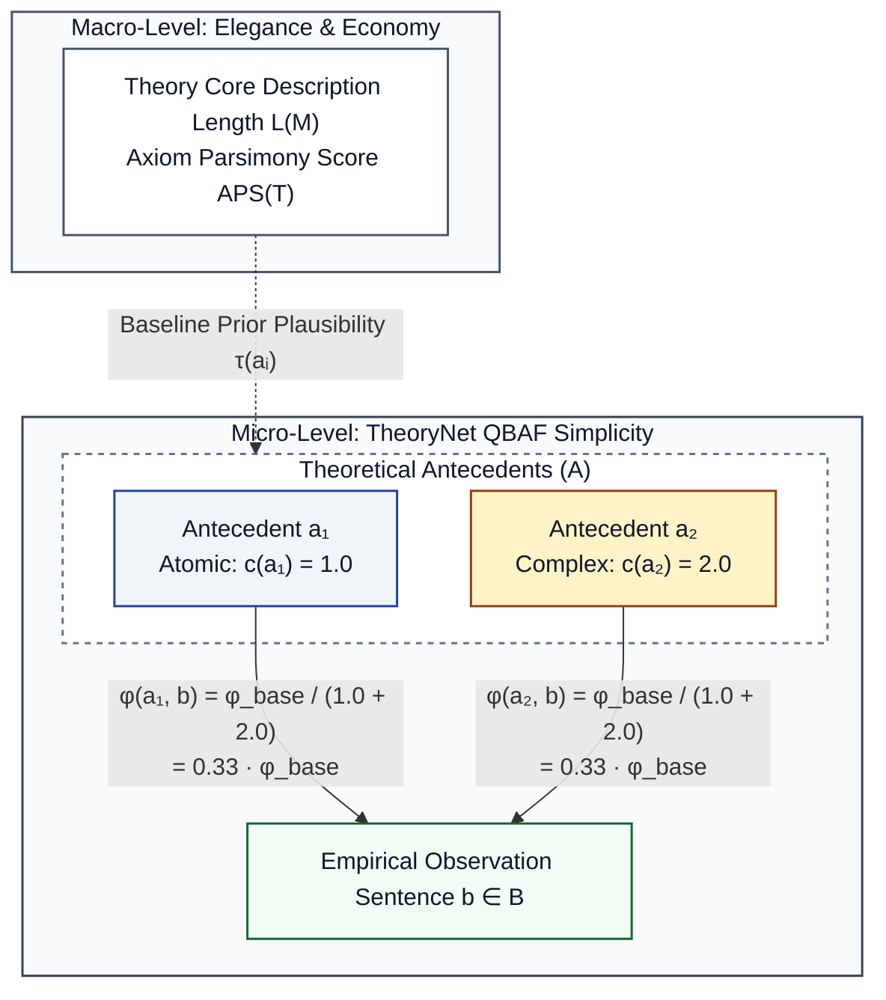

## Definition & Conceptual Goal

The **Simplicity (Einfachheit)** metric evaluates the parsimony, inferential efficiency, and structural elegance of
scientific hypotheses, explanation chains, and formal theory architectures within the Theory Graph. In the philosophy of
science, simplicity is a foundational epistemic virtue that serves as a safeguard against ad-hoc, multi-premise, or
excessively convoluted explanations [153, 190].

Simplicity operates across three interconnected levels within TheoryNet:

1. **Local Intrinsic Explanatory Simplicity $SR_{\text{MDL}}$**: Evaluates local inferential parsimony on empirical
   observation sentences $b \in B$ grounded by theoretical antecedents $a \in A$ via supportive mapping laws
   $Z (a, b) \sqsubseteq \mathcal{R}_{sup}$. By integrating **Minimum Description Length (MDL) / Kolmogorov Complexity**
   and LLM-based semantic decomposition $Ce (a)$ into the Quantitative Bipolar Argumentation Framework (QBAF), it scales
   support relation weights $\phi (a, b)$ inversely with the intrinsic semantic complexity $c (a)$ of co-antecedents,
   completely resolving Hempel's Conjunction Problem (1B) [84, 150].
2. **Global Informational Simplicity $S_{\text{global}}$**: Implements Nováček’s graph-entropy model [7, 18], assessing
   whether a candidate antecedent hypothesis subgraph $H = (V_H, E_H)$ simplifies the topological and topic structure of
   the Theory Graph universe $G = (V, E, \lambda_v, \lambda_e)$ by reducing Shannon cluster association
   entropy $E (G \setminus H) / E (G)$ [17, 19].
3. **Macro-Level Integration with Elegance & Economy (S&E / E&E)**: Connects local explanation chains to the
   macro-formalization of the theory-core $K = \langle M_p, M, M_{pp}, GC, GL \rangle$ [190, 200]. While Elegance &
   Economy measures the global compression trade-off $MDL = L (M) + L (D \mid M)$, parameter parsimony
   $|\Theta (T)|$, and Axiom Parsimony $APS$, Simplicity operationalizes how these macro-level constraints initialize
   prior argument plausibility $\tau (a)$ and govern gradual semantics updates $\rho (a)$ [84, 152].

---

## Theoretical Grounding & Structuralist Integration

### Resolution of Hempel's Conjunction Problem via MDL

#### The Syntactic Manipulation Dilemma

Under a naive premise-counting metric $SR = 1/n$, conjoining three independent auxiliary
hypotheses $a_1, a_2, a_3 \in A$
into a single composite antecedent $a^* = (a_1 \land a_2 \land a_3)$ artificially reduces $n$ from 3 to 1. This "games"
the metric, awarding a perfect local simplicity score $1.0 \cdot \phi_{\text{base}}$ to a syntactically packed
macro-premise [150].

#### Grounding in Content-Element Decomposition

Gerhard Schurz demonstrates that any rigorous simplicity or coherence metric must evaluate **irreducible content
elements** $Ce (a)$ rather than superficial sentence syntax [81, 150], therefore we identify the non-redundant content
$IR (a)$ elements with the **Minimum Description Length (MDL)** principle (Kolmogorov Complexity $K (a)$:

$$\text{Content Elements } Ce (a) \equiv \text{Irreducible Representation } IR (a) \equiv \text{MDL} / K (a)$$

#### Invariance of Algorithmic Information

In algorithmic information theory, conjoining premises into a single node string $a^*$ does *not* reduce description
length:

$$K (a_1 \land a_2 \land a_3) \approx K (a_1) + K (a_2) + K (a_3) - I (a_1; a_2; a_3)$$

Merely replacing logical conjunctions with comma clauses leaves $K (a^*) \approx 3$. Thus, **MDL-weighted simplicity is
completely invariant to graph syntactic partitioning** [84, 150].

---

## Mathematical Specification & Graph Formulation

Let the Theory Graph be represented as a labeled, directed multigraph $G = (V, E, \lambda_v, \lambda_e)$ whose vertex
set is partitioned by the knowledge base $\Delta = (B, A)$ such that $V = B \cup A$ [TheoryNet Concept, Sec. 1]:

* $B$ is the set of **Empirical Observation Sentences**.
* $A$ is the set of **Theoretical Antecedents / Premises**.

Let $b \in B$ be an empirical observation sentence, and let $\mathcal{A}_b = \{a_1, \dots, a_n\} \subseteq A$ be the set
of co-antecedents participating in a joint supportive mapping law
(*Zuordnungsgesetz*) $Z (\mathcal{A}_b, b) \sqsubseteq \mathcal{R}_{sup}$
grounding $b$.

### Intrinsic Antecedent Complexity $c (a_i)$

Each antecedent node $a_i \in A$ possesses an intrinsic complexity property $c (a_i) \in [1.0, \infty)$, extracted via
LLM content-element decomposition:

$$c (a_i) = \max\left (1.0, \; |Ce (a_i)|\right)$$

### Dynamic Relation Weight Function (QBAF Relaxation)

The supportive relation weight $\phi (a_i, b)$ between co-antecedent $a_i$ and empirical sentence $b$ is scaled
inversely by the total MDL complexity of the co-antecedent set $\mathcal{A}_b$:

$$\phi (a_i, b) = \frac{\phi_{\text{base}}}{\sum_{a_j \in \mathcal{A}_b} c (a_j)}$$

### Co-Antecedent Simplicity Ratio $SR_{\text{MDL}}$

For an entire explanation chain $\mathcal{E}$ with contributing antecedent set $\mathcal{A}_{\mathcal{E}} \subseteq A$:

$$SR_{\text{MDL}} (\mathcal{E}) = \frac{1}{\sum_{a_j \in \mathcal{A}_{\mathcal{E}}} c (a_j)}$$

### Global Informational Simplicity $S_{\text{global}}$

Let $L$ be the set of topic clusters across Theory Graph $G$, and let $\gamma : V \to 2^L$ be the vertex-to-cluster
mapping function [17].

For a candidate theoretical sub-network or antecedent hypothesis subgraph $H = (V_H, E_H)$ with $V_H \subseteq V$:

1. **Cluster Association Probability $p (l, H)$**: The probability that a randomly chosen vertex in $H$ belongs to topic
   cluster $l \in L$:
$$
   p (l, H) = \frac{|\{v \in V_H \mid l \in \gamma (v)\}|}{|V_H|}
$$

2. **Cluster Association Entropy $E (H)$**: The Shannon topic entropy quantifying the information complexity and topic
   dispersion across $H$:
$$
   E (H) = -\sum_{l \in L} p (l, H) \log_2 p (l, H)
$$

3. **Universe Simplification Rate $S_{\text{global}}$**: The ratio of graph entropy without $H$ to total graph entropy:

$$
   S_{\text{global}} (H) = \frac{E (G \setminus H)}{E (G)}
$$

A value $S_{\text{global}} (H) > 1.0$ indicates that the introduction of hypothesis subgraph $H$ unifies and organizes
the global knowledge topology, reducing overall disorder across the Theory Graph.

---

## Measurement & Graph Implementation Workflow

1. **Ingestion & Content-Element Extraction**: Pass each theoretical antecedent $a_i \in A$ through LLM decomposition to
   extract irreducible content elements $Ce (a_i)$ [81]. Store $c (a_i) = |Ce (a_i)|$ on the antecedent node.
2. **Zuordnungsgesetz Detection & MDL Weighting**: Identify all joint mapping/explanatory
   hyper-edges $Z (\mathcal{A}_b, b) \sqsubseteq \mathcal{R}_{sup}$
   grounding empirical sentences $b \in B$. Compute total complexity $\sum_{a_j \in \mathcal{A}_b} c (a_j)$ and set
   relation weight $\phi (a_i, b) = \phi_{\text{base}} / \sum c (a_j)$.
3. **Macro-Micro Coupling**: Import Axiom Parsimony Score $APS$ from the Elegance & Economy module as the baseline prior
   plausibility $\tau (a_i)$ for argument initialization [153].
4. **Global Entropy Computation**: Pre-calculate cluster topic labels $\gamma (v)$ across Theory Graph $G$ [17]. For a
   candidate hypothesis subgraph $H$, compute the universe simplification
   rate $S_{\text{global}} (H) = E (G \setminus H) / E (G)$ [18].
5. **Gradual Semantics Convergence**: Run QBAF state computation using update function $\rho (a_i)$. Hypotheses backed
   by low MDL complexity and high macro-parsimony receive undiluted positive aggregation $\alpha (a_i)$, converging to
   higher posterior acceptability $\rho (a_i)$ [153, 424].

---

## Diagnostic & Metascientific Value Matrix

| Local Simplicity $SR_{\text{MDL}}$ | Global Simplicity $S_{\text{global}}$ | Macro Elegance $APS / MDL$     | Metascientific Evaluation & Diagnosis                                                                                                                                |
|:-----------------------------------|:--------------------------------------|:-------------------------------|:---------------------------------------------------------------------------------------------------------------------------------------------------------------------|
| **High** $\ge 0.8$                 | **High** $> 1.0$                      | **High** $APS \ge 0.8$         | **Epistemic Ideal**: Pure, elegant, direct explanation. Highly unificatory, low description length, maximal prior probability [153, 190].                            |
| **High** $\ge 0.8$                 | **Low** $< 1.0$                       | **High** $APS \ge 0.8$         | **Trivial / Isolated**: Direct and simple, but lacks global unificatory power across the universe graph [150, 200].                                                  |
| **Low** $\le 0.33$                 | **High** $> 1.0$                      | **Moderate** $APS \approx 0.5$ | **Synthetically Complex / Deep Theory**: Locally requires auxiliary premises, but globally organizes topic clusters and exhibits high premise reusability [98, 152]. |
| **Low** $\le 0.33$                 | **Low** $< 1.0$                       | **Low** $APS \le 0.3$          | **Ad-hoc / Overfitted Chaos**: Heavy local auxiliary burden, global disorganization, and bloated axiom/parameter count. Prime candidate for rejection [143, 153].    |

---

### Integration Matrix: Simplicity vs. Elegance & Economy (S&E)

The **Simplicity Metric** and the **Elegance & Economy (S&E) Metric** form a unified, multi-scale evaluation suite for
Theory Graphs. They share the same information-theoretic compression engine, but operate on distinct structural scopes:

| Metric Dimension        | Simplicity Metric (Micro & Local System)                                                                                 | Elegance & Economy Metric (Macro Representation)                                                                             |
|:------------------------|:-------------------------------------------------------------------------------------------------------------------------|:-----------------------------------------------------------------------------------------------------------------------------|
| **Primary Scope**       | Local Explanation Chains: Evaluates co-hypothesis parsimony on `:EXPLAINS` hyper-edges and graph topic entropy [7, 424]. | Global Theory Architecture: Evaluates formal theory-elements $T = \langle K, I \rangle$ and parameter efficiency [190, 200]. |
| **Core Formulation**    | $SR_{\text{MDL}} = \frac{1}{\sum c(H_j)}$ and $S_{\text{global}} = \frac{E(U \setminus H)}{E(U)}$                        | $MDL(T) = L(M) + L(D \mid M)$ and $APS(T) = \frac{1}{1 + \log_2(1+ \dots)}$                                                  |
| **Micro-Macro Mapping** | Node complexity $c(H_i)$                                                                                                 | $Ce(H_i)$                                                                                                                    |
| **Data Fit Mapping**    | Excitatory weights $w(H_i, E)$ transfer activation from confirmed evidence $E$.                                          | Data Description Length $L(D \mid M)$ encodes residual unexplained observation noise across empirical base $B$.              |
| **Prior Probability**   | High local simplicity maximizes local prior probability $P(H_1) > P(H_1 \land A)$ [153].                                 | Axiom parsimony $APS(T)$ establishes macro prior probability for entire theory lattices [153].                               |

---

## Grounding References

* **[Schurz, 2024]** Schurz, G. (2024). *Philosophy of Science: A Unified Approach*. Routledge, sec. 3.12 (Def. 3.12-3,
  Def. 3.12-4, Footnote 10 on MDL & Hempel's Conjunction Problem), sec. 5.10 (Parameter Fitting), & sec. 5.11.2
  (\"Unification, Coherence, and Simplicity\").
* **[Thagard, 1989]** Thagard, P. (1989). Explanatory Coherence. *Behavioral and Brain Sciences*, 12 (3), pp. 435–467.
* **[Nováček, 2015]** Nováček, V. (2015). Formalising Hypothesis Virtues in Knowledge Graphs. *Research in
  Literature-Based Discovery*, 1503.09137v2, sec. 2.2.3 & 3.2.3.
* **[Balzer et al., 1987]** Balzer, W., Moulines, C. U., & Sneed, J. D. (1987). *An Architectonic for Science: The
  Structuralist Program*. Reidel, sec. Overview (p. xviii - Secondary criteria: Consistency, Elegance, Economy) & sec.
  II.5.
