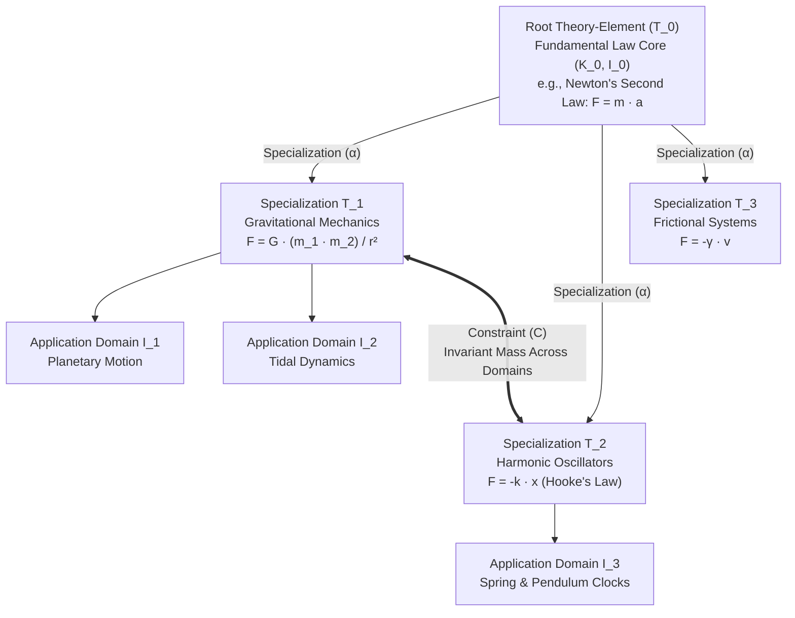
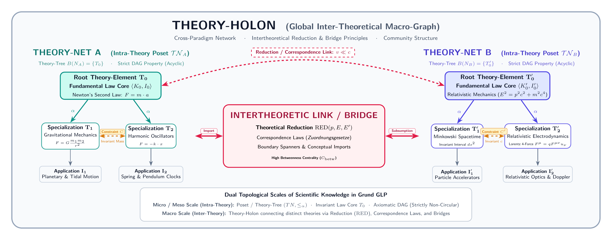

# Theory-Nets, Posets & Topologies

This document establishes the structural topology of scientific theories within **Episteme**. It details how theories
organize internally as **Partially Ordered Sets (Posets)** and **Theory-Trees**, how multiple theories connect globally
into **Theory-Holons**, and how **Hierarchical Leiden Community Detection** extracts macro-level paradigms from the
underlying graph.

---

## Structuralist Theory-Nets as Posets

In the structuralist philosophy of science (Balzer, Moulines, & Sneed, 1987), the fundamental unit of scientific
knowledge is not a linguistic sentence, but a **theory-element**:

\[ T = \langle K, I \rangle \]

where $K$ is the formal mathematical core and $I$ is the domain of intended applications.

A single complex scientific theory (such as Classical Mechanics or General Relativity) does not consist of a single
isolated equation, but rather a structured hierarchy of interconnected theory-elements known as a **Theory-Net** ($TN$).

### The Specialization Relation ($\alpha$) and Bourbaki Structure Species

Theory-elements within a Theory-Net are ordered by a **specialization relation** ($\alpha$):

\[ T_j \ \alpha \ T_i \quad (T_j \text{ is a specialization of } T_i)
\]

Drawing on Nicolas Bourbaki's concept of *structure species*, the specialization relation $\alpha$ ensures that
lower-level laws strictly inherit the conceptual framework of parent laws while adding specific constraints or
mathematical restrictions (e.g., Hooke's law $F = -k \cdot x$ restricting the general force function $F = m \cdot a$).

Structuring the intra-theory graph as a **Partially Ordered Set (Poset)** $(TN, \alpha)$ prevents circular definitions:

1. **Reflexivity:** $T_i \ \alpha \ T_i$
2. **Antisymmetry:** If $T_i \ \alpha \ T_j$ and $T_j \ \alpha \ T_i$, then $T_i = T_j$
3. **Transitivity:** If $T_i \ \alpha \ T_j$ and $T_j \ \alpha \ T_k$, then $T_i \ \alpha \ T_k$

### Theory-Trees ($B (TN) = \{T_0\}$)

A mature, well-founded scientific theory forms a **Theory-Tree**: a connected Theory-Net ($TN$, often denoted $N$) originating from a **unique
singleton root element** $T_0$:

\[ B (TN) = \{ T_0 \} \]

Where $B (TN)$ is the set of top-level minimal elements in the specialization poset. The root $T_0$ embodies the
fundamental invariant law (e.g., Newton's second law, Schrödinger's equation), while the outer branches represent
specialized peripheral applications.

---

## Structuralist Typology of Nodes and Edges

To map philosophical and scientific literature into property graph databases (such as Neo4j), Episteme classifies nodes
and relationships using formal epistemic criteria:

### Node Classifications & Sentence Typologies

Nodes are typed according to their propositional and epistemic status (Schurz, 2014; Balzer et al., 1987):

* **Beobachtungssatz i.e.S. (Observation / Evidence Unit):** Singular or localized statements containing exclusively
  empirical terms ($L_E$). In explanatory coherence models, these data units possess intrinsic acceptability (**Data
  Priority**).
* **Empirischer Satz i.e.S. (Empirical Generalization):** Statements containing logical and empirical concepts where all
  quantifiers have strictly empirical scope.
* **Theoretischer Satz i.w.S. (Theoretical Hypothesis):** Statements containing theoretical terms ($L_T$) or theoretical
  quantifiers. These represent core axioms or abstract hypotheses.
* **Core Expansions (Mutable Auxiliary Hypotheses):** Shiftable peripheral laws introduced to absorb anomalies without
  discarding the hard core ($K_0$).

#### Epistemic Sentence Classifications

To qualify these nodes further, we track their logical scope:

- **Synthetic Contingent (*Synthetischer kontingenter Satz*):** Statements that exclude possible empirical worlds,
  ensuring genuine empirical content (neither logically tautological nor contradictory).
- **Essential Universal (*Essentieller Allsatz*):** Unrestricted universal laws forming core principles.
- **Existential Statement (*Existenzsatz*):** Assertions of theoretical or empirical existence.
- **Localized Statements (*Lokalisierte All- / Existenzsätze*):** Spatiotemporally bounded empirical statements (e.g.,
  "In experimental trial $k$, measurement $x$ observed").

### Relational Edges

Edges capture deductive, structural, and coherence dynamics:

1. **Specialization Edges ($\alpha$):** Directed vertical edges linking general laws to specialized variants.
2. **Constraint Edges ($C, CL$):** Horizontal/lateral links crossing distinct application domains. Constraints demand
   that intrinsic properties (such as mass, charge, or utility preferences) maintain invariant values when identical
   entities appear in overlapping applications.
3. **Intertheoretical Links (Reduction & Entailment):** Directed links between distinct theories, representing
   theoretical reduction ($RED (p, E, E')$) or conceptual imports.
4. **Deductive Entailment Relations:**
	- *Erklärungsschema:* Universal Law $\wedge$ Singular Antecedent $\Vdash$ Singular Consequence.
	- *Falsifikationsschema I:* Singular Empirical Evidence $\Vdash \neg (\text{Universal Law})$.
	- *Falsifikationsschema II:* Existential Counterexample $\Vdash \neg (\text{Universal Law})$.
5. **Coherence Links (Thagard's TEC):**
	- *Excitatory Links ($\mathcal{R}_{sup}$, weight $\approx +0.05$):* Connect hypotheses that explain evidence or co-hypotheses
	  that jointly explain a fact.
	- *Inhibitory Links ($\mathcal{R}_{att}$, weight $\approx -0.20$):* Connect contradictory or mutually competing hypotheses.

---

## Dual Topological Scales: Theory-Nets vs. Theory-Holons

Episteme explicitly distinguishes between two topological tiers of scientific organization:

1. **Theory-Net (Intra-Theory Micro/Meso Graph):** The internal, local structure of a single theory. Mathematically
   organized as a Poset or Theory-Tree. The DAG property ensures absence of internal circularity.
2. **Theory-Holon (Inter-Theory Macro Graph):** The global, cross-paradigm network connecting multiple, distinct
   scientific theories via intertheoretical links and community bridges. Its topology can be:
	- *Foundationalist:* A directed acyclic graph terminating in foundational bedrock theories.
	- *Coherentist:* A cyclical network of mutually supporting and interpreting theoretical frameworks.

---

## Hierarchical Leiden Community Detection

While intra-theory structures follow formal deductive trees, cross-document scholarly literature forms dense, complex
networks of competing arguments. To detect macroscopic paradigms, theoretical schools of thought, and conceptual
clusters, Phase 5 of the pipeline executes the **Hierarchical Leiden Algorithm** (Traag et al., 2019).

### Graph Projection & Modularity Optimization

During Phase 5b (Theory Fusion), the pipeline:

1. Pulls all global `L2Entity` and `L3ArgumentComponent` nodes along with their relationships from Neo4j into an
   in-memory NetworkX graph.
2. Builds an undirected weighted representation where edge weights represent aggregate relational confidence and
   argument support strengths.
3. Optimizes network modularity $\mathcal{H}$ hierarchically, avoiding the disconnected sub-cluster defects
   characteristic of older Louvain algorithms.

### Three Hierarchy Levels

The Leiden detector partitions the theory graph across three semantic scales:

* **Level 0 (Micro-Scale):** Tight-knit argument units, individual claims, and their direct empirical grounding data.
* **Level 1 (Meso-Scale):** Conceptual subfields and thematic clusters (e.g., *Epistemology*, *Ontology*, *Decision
  Theory*).
* **Level 2 (Macro-Scale):** Overarching scientific paradigms and comprehensive schools of thought (e.g., *Kantian
  Rationalism*, *Logical Positivism*, *Bayesian Decision Theory*).

### Graph Persistence

Identified communities are committed directly back to the Neo4j database:

- A `Community` node is minted for each partition, annotated with its hierarchical `level`, modularity score, and
  generated centroid label.
- Participating entities and argument components are connected to their parent community via `IN_COMMUNITY` structural
  edges.

---

## Topological Node Centrality

Complementing community partitioning, microscopic node prominence is quantified via graph centrality metrics:

- **Out-Degree Centrality ($C_{\text{out}}$):** High out-degree identifies unifying core axioms and explanatory
  generators.
- **In-Degree Centrality ($C_{\text{in}}$):** High in-degree reflects evidentiary focal points or contested theoretical
  vulnerabilities.
- **Betweenness Centrality ($C_{\text{betw}}$):** High betweenness pinpoints **Community Bridges**—boundary-spanning
  concepts that mediate theoretical transfers between disparate disciplines.
- **Eigenvector & PageRank Centrality:** Quantify prestige and foundational importance by weighting connections by the
  centrality of neighboring nodes.

---

## Related Documentation

- **Formal Graph Schema**: [Formal Graph Schema (TheoryNet)](formal_graph_model.md)
- **Structuralist Benchmark (STNB)**: [Structuralist Theory-Net Benchmark](../research/structuralist_theory_benchmark.md)
- **Epistemological Criteria**: [Epistemology & Wissenschaftstheorie](epistemology.md)
- **Dense Alignment & Maturation**: [Dense Alignment & Grounding](dense_alignment.md)
- **Topological Metrics**: [Theory Metrics: Structural Topology](theory/metrics/structural_topology/index.md)
- **Terminology**: [Glossary](glossary.md)
