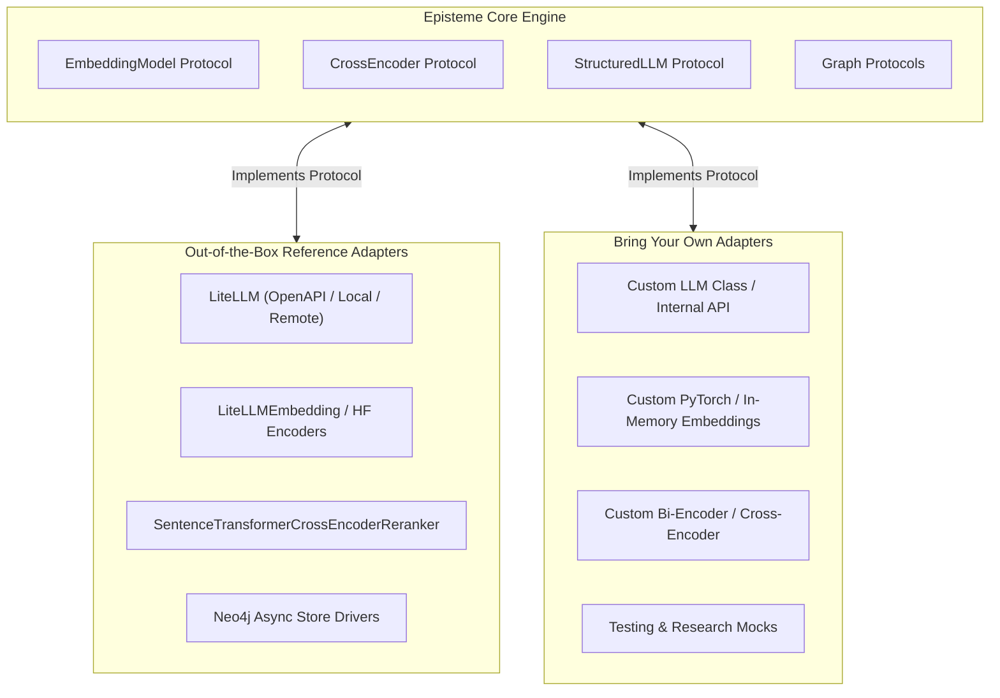

# Prerequisites

Before deploying or developing with Episteme, ensure your environment meets the necessary runtime, database, and
inference requirements.

---

## 1. Runtime & System Requirements

* **Python >= 3.13**: Required across all monorepo packages (`episteme-pipeline`, `epistemetrics`, `episteme-studio`).
* **`uv` Package Manager**: Fast dependency resolver and workspace orchestrator.
* **Pandoc >= 2.19**: Required for converting academic literature (TeX, LaTeX, Markdown, PDF) into standardized text
  chunks.

---

## 2. Graph Database

Episteme is contract-driven: graph operations interact through generic storage protocols (`GraphReader`, `GraphWriter`,
`ProcessingGraph`). You can plug in any backend that satisfies these contracts.

For production use, Episteme ships with fully implemented adapters for **Neo4j >= 5.18**:

!!! note "Neo4j Version & Vector Indexing"
When using the default Neo4j adapters, Neo4j 5.18+ with APOC Core or Extended is required. The pipeline uses native
Cypher vector indexing (`CREATE VECTOR INDEX ...`) for chunk retrieval and latent entity consolidation. Earlier versions
(such as Neo4j 4.4) do not support this syntax.

### Neo4j Quick Setup via Docker

The easiest way to run Neo4j with APOC pre-configured:

```bash
docker run -d \
  --name neo4j-Episteme \
  --publish=7474:7474 --publish=7687:7687 \
  --volume=$HOME/neo4j/data:/data \
  --volume=$HOME/neo4j/logs:/logs \
  --env NEO4J_AUTH=neo4j/neo4jdbpass \
  --env NEO4J_PLUGINS='["apoc"]' \
  --env NEO4J_dbms_security_procedures_unrestricted=apoc.* \
  --env NEO4J_dbms_memory_heap_initial__size=2G \
  --env NEO4J_dbms_memory_heap_max__size=4G \
  neo4j:5.26.0
```

Verify availability at `http://localhost:7474` (Username: `neo4j`, Password: `neo4jdbpass`).

---

## 3. Model Layer: Pure Contract-Driven Architecture

Episteme is **completely decoupled** from model providers and frameworks. The pipeline core only depends on structural
contracts (`Protocols` and `ABCs`). It does not mandate any specific commercial vendor, external inference engine, or
proxy service.



### Reference Adapters Included Out of the Box

For convenience and zero-boilerplate usage, ready-to-use reference adapters are bundled:

* **LLM Generation**: `LiteLLM` adapter (works with any local or remote model exposing standard completion endpoints).
* **Vector Embeddings**: `LiteLLMEmbedding` or local HuggingFace embedding adapters.
* **Cross-Encoder Reranker**: `SentenceTransformerCrossEncoderReranker` (defaults to HuggingFace
  `Qwen/Qwen3-Reranker-0.6B`).
* **Graph Storage**: `Neo4jGraphReader`, `Neo4jGraphWriter`, and `Neo4jProcessingGraph`.

Alternatively, you can implement any of these contracts in a few lines of Python as detailed in
the [Configuration Guide](configuration.md).

---

## Next Steps

Proceed to the [Installation Guide](installation.md) to set up your workspace.
