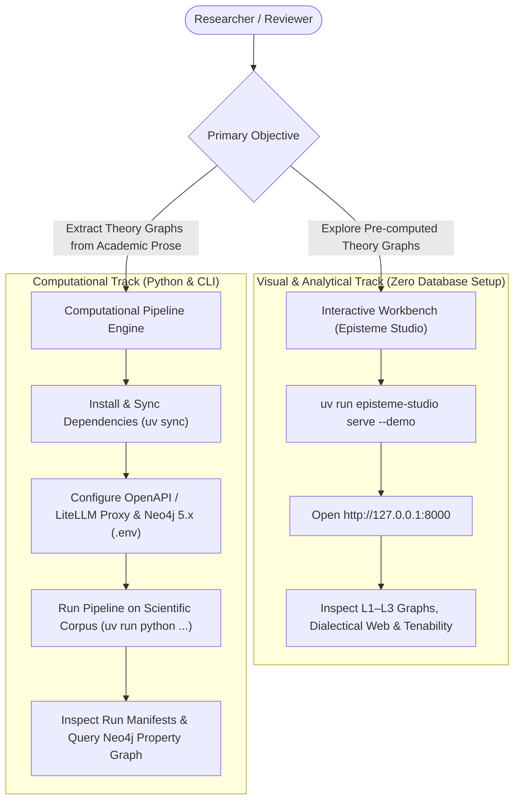

# Getting Started: Overview & Pathways

Welcome to the **Episteme** onboarding guide. Episteme is a research-grade platform designed to reconstruct **theory graphs**—multi-layered semantic, conceptual, and dialectical structures—from scientific literature.

---

## Onboarding Pathways

Depending on your objective and background, choose one of two distinct pathways:



### Pathway A: Interactive Workbench (Episteme Studio)
* **Target Audience**: Epistemologists, domain researchers, and peer reviewers.
* **Key Advantage**: Zero local database or API setup required.
* **Quick Launch**:
  ```bash
  uv run episteme-studio serve --demo
  ```
  Launches the visual workbench at `http://127.0.0.1:8000` pre-loaded with demonstration runs, graph diffs, and metatheoretical tenability evaluations.
* **Learn More**: [Episteme Studio Workbench](studio.md)

### Pathway B: Computational Pipeline Engine
* **Target Audience**: Computational linguists, NLP researchers, and software engineers.
* **Key Advantage**: Full programmatic control over extraction, model adapters, and graph projections.
* **Recommended Reference Stack**:
  * **Neo4j 5.x**: Recommended graph store providing native property graph queries, vector indexing for TAG candidate retrieval, and GDS Leiden clustering.
  * **Langfuse**: Recommended platform for both **Distributed Tracing** (end-to-end token, cost, and latency visibility) and **Remote Prompt Management** (`LangfusePromptProvider`, enabling versioning, production labeling, and prompt iteration without modifying code).
* **Sequence**:
  1. [Prerequisites](prerequisites.md): System requirements, Python 3.13+, and Neo4j 5.x.
  2. [Installation](installation.md): Monorepo workspace setup via `uv`.
  3. [Configuration & Endpoints](configuration.md): Setting up OpenAPI-compatible endpoints and credentials.
  4. [First Run Tutorial](first_run.md): Executing `pipeline_langfuse_full_run.py` on authentic scientific texts.

---

## The Three-Layer Epistemic Graph

Episteme does not produce flat, unstructured knowledge graphs. Instead, it extracts a **tri-layer theoretical property graph**:

| Layer | Visual Encoding | Epistemic Function |
| :--- | :--- | :--- |
| **Layer 1: Provenance Embedding** | Blue Nodes (`Chunk`, `SourceDoc`) | Verifiable textual grounding, citation coordinates, and dense embeddings. |
| **Layer 2: Empirical Ontology** | Green Nodes (`Entity`, `Concept`) | Canonical entities, aliases, and factual relationships (`Triple`). |
| **Layer 3: Dialectical TheoryNet** | Purple Nodes (`TheoryAtom`, `Claim`) | Higher-level theoretical claims, formal `SUPPORT`/`ATTACK` vectors, and tenability scores. |

---

## Authentic Scientific Corpus

All tutorials and runnable examples in Episteme use authentic, peer-reviewed scientific literature located in `packages/episteme-pipeline/examples/text/`:

* **`teachers_expectancies.md`**: Rosenthal & Jacobson (1966) *Teacher Expectancies: Determinants of Pupils' IQ Gains* (educational psychology).
* **`planwirtschaft.md`**: Classical socialist calculation and market mechanism debate (economic philosophy, German).

---

## Next Steps

- To explore theory graphs visually right now: [Launch Episteme Studio](studio.md)
- To configure your environment for graph construction: [Review Prerequisites](prerequisites.md)
