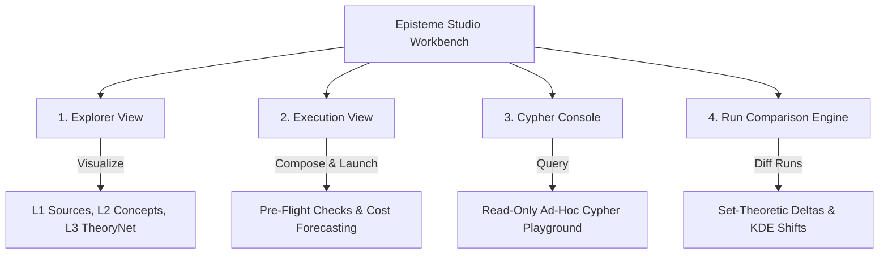

# Episteme Studio Workbench

**Episteme Studio** is an interactive visual workbench, orchestration pipeline, and analytical environment for computational epistemology, structuralist philosophy of science, and argument mining.

---

## Quick Launch & Operating Modes

Episteme Studio can be launched immediately via the monorepo CLI.

### Instant Demo Mode (Zero Setup Required)
To explore theory graphs and interface features without connecting to Neo4j or an LLM gateway, launch the canned demonstration server:

```bash
uv run episteme-studio serve --demo
```

Once running, navigate to **`http://127.0.0.1:8000`** in your browser. Demo mode populates the explorer with pre-computed scientific runs, epistemic metrics, and graph diffs.

### Production Mode (Live Database Binding)
To inspect your actual pipeline runs and query your live Neo4j 5.x database:

```bash
uv run episteme-studio serve --host 127.0.0.1 --port 8000
```

### CLI Command Options
```text
options:
  -h, --help            show this help message and exit
  --host HOST           Host interface to bind (default: 127.0.0.1)
  --port PORT           Port to listen on (default: 8000)
  --demo                Launch with canned demonstration runs and mock dependencies
  --runs-dir DIR        Path to directory containing run manifests (default: .pipeline_runs)
  --artifacts-dir DIR   Path to directory containing artifact envelopes (default: .pipeline_artifacts)
  --dev [URL]           Proxy frontend requests to Vite dev server (default: http://127.0.0.1:5173)
  --token TOKEN         Authentication token (required when binding to external hosts)
```

---

## Core Workbench Views

Episteme Studio organizes epistemic analysis into four primary views:



---

### View 1: Multi-Layer Theory Canvas (`Explorer`)

The main canvas renders the generated theory graph using a GPU-accelerated force-directed layout:

| Graph Element | Visual Encoding | Epistemic Function |
| :--- | :--- | :--- |
| **Layer 1 (L1 Sources)** | Blue nodes | Ground-truth academic sources and text chunk anchors. |
| **Layer 2 (L2 Concepts)** | Green nodes | Extracted domain concepts, named entities, and empirical terms. |
| **Layer 3 (L3 TheoryNet)** | Purple nodes | Higher-level theoretical constructs, latent hypotheses, and structural laws. |
| **Dialectical Support** | Green directed vectors | Formal argumentative warrant: `SUPPORT` relations. |
| **Dialectical Attack** | Red directed vectors | Formal argumentative objections: `ATTACK` relations. |
| **Unscoped / Drift** | Orange nodes | Entities or assertions operating outside axiomatic boundaries. |

#### Canvas Controls
* **Global Entity Search (`⌘K`)**: Instant fuzzy lookup across all extracted concepts and theoretical terms.
* **Epistemic Lenses**: Filter the visible canvas according to structuralist partitions:
  - **Empirical Base ($M_{pp}$)**: Isolates non-theoretical observations, empirical data, and grounded claims.
  - **Theoretical Postulates ($M$)**: Isolates abstract axioms, latent variables, and structural laws (Stegmüller 1976 / Balzer 1987).

---

### View 2: Pipeline Orchestrator (`Execution`)

The Execution view provides interactive DAG composition:
* **Thinking Level Switch**: Regulate model reasoning compute (`Off`, `Low`, `Medium`, `High`, `Custom`) for complex relation extraction.
* **Pre-Flight Readiness Inspection**: Static configuration validator verifying Neo4j index status and endpoint responsiveness prior to dispatch.
* **Cost & Latency Forecasting**: Real-time pre-execution estimates calculating anticipated compute duration and API invocation costs.
* **Reproducible CLI Generator**: Generates headless bash commands corresponding to active UI configurations for remote compute cluster execution.

---

### View 3: Safe Database Playground (`Cypher Console`)

* **Safety Sandbox**: Enforces a strict **Read-Only** mode to protect generated theoretical structures, embeddings, and relations from accidental deletion during exploratory queries.
* **Sample Queries Catalog**: Quick-insert templates for centrality, bridging concepts, and argument chain inspection.
* **Keyboard Shortcut Dispatch (`⌘↩`)**: Execute ad-hoc structural queries directly against the active graph namespace.

---

### View 4: Run Comparison & Set-Theoretic Deltas (`Comparison`)

Evaluate how varying prompt strategies, temperature settings, or underlying model architectures alter theory reconstruction:

* **Visual Canvas Diff**: Color-coded node and edge highlighting showing structural growth, retention, and pruning between Run A and Run B.
* **Kernel Density Estimation (KDE)**: Overlapping density curves visualizing shifts in semantic extraction confidence across runs.
* **Set-Theoretic Delta Cardinality**:
  - **Intersection ($A \cap B$)**: Invariant entities and edges verified across both configurations.
  - **Pruned Set ($A \setminus B$)**: Baseline structural elements omitted by the candidate configuration.
  - **Discovered Set ($B \setminus A$)**: Novel entities and dialectical relations introduced by the candidate run.

---

## Next Steps

- Execute a headless extraction pass: [First Run Tutorial](first_run.md)
- Explore quantitative epistemic evaluation: [Epistemetrics Suite](../concepts/theory/metrics/index.md)