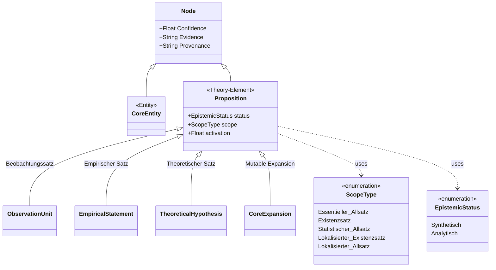
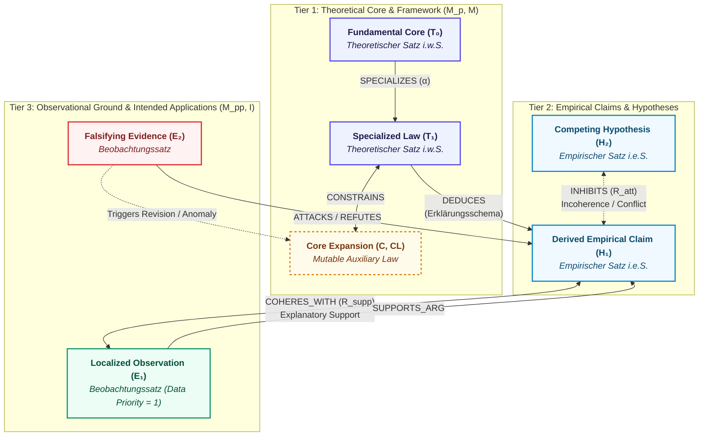

# Schema Reference

Documentation of the theory graph schema and entity/relationship types.

!!! info "Theoretical Foundations"
See [Formal Graph Schema (TheoryNet)](../concepts/formal_graph_model.md) and [Theory-Nets, Posets & Topologies](../concepts/theory_nets_and_topologies.md) for the
structuralist philosophy, coherence models, and formal graph representations that inform this schema's design.

## Graph Schema Configuration

The graph schema defines the expected structure of the constructed theory graph.

::: episteme_pipeline.schema.default_schema.SchemaConfig
    options:
      show_root_heading: false
      show_root_toc_entry: false

## Visual Overview

The following diagrams provide a high-level visualization of the entity typologies and how they interact, broken down
into two core perspectives based on the structuralist framework.

### 1. Node Ontology and Class Hierarchy

This class diagram illustrates the fundamental types of nodes in the graph, separating high-level **Core Entities** from
the epistemological **Propositions** (Theory-Elements). It also explicitly defines the structuralist attributes and
their possible categorical values (enumerations).

### 2. Intra-Theory Topology (Theory-Net)

This graph illustrates how propositions interact *within* a single theory-element. It organizes the theoretical
hierarchy into three epistemological tiers (from abstract theoretical core down to empirical observations),
demonstrating structuralist specialization, logical deduction, and Thagard's explanatory coherence.

## Entity Types (Nodes)

### Core Entity Classes

The schema defines several core entity types that can appear in the theory graph to represent real-world concepts and
actors.

| Entity Type       | Description                                            |
|:------------------|:-------------------------------------------------------|
| **`Concept`**     | Theoretical constructs and abstract ideas.             |
| **`Person`**      | Individuals who contribute to theoretical development. |
| **`Work`**        | Publications, papers, and other scholarly works.       |
| **`Theory`**      | Formal theoretical frameworks and schools of thought.  |
| **`Institution`** | Organizations and academic institutions.               |

### Theory-Elements and Propositions

Based on structuralist epistemology, nodes represent specific propositions and theoretical elements within the knowledge
structure.

| Type                        | Description                                                                                                                                                             |
|:----------------------------|:------------------------------------------------------------------------------------------------------------------------------------------------------------------------|
| **`ObservationUnit`**       | *(Beobachtungssatz i.e.S.)* Singular or localized statements containing exclusively observational terms. Act as raw data nodes.                                         |
| **`EmpiricalStatement`**    | *(Empirischer Satz i.e.S.)* Statements containing only logical and empirical concepts.                                                                                  |
| **`TheoreticalHypothesis`** | *(Theoretischer Satz i.w.S.)* Statements containing theoretical concepts or whose quantifiers have theoretical scope. These represent core laws or abstract hypotheses. |
| **`CoreExpansion`**         | Special auxiliary laws and constraints that form a shifting superstructure around the stable theory core.                                                               |

#### Proposition Attributes (Epistemic & Scope)

Propositions can be further classified by their structuralist properties:

- **Epistemic Status:** `Synthetisch` vs. `Analytisch`.
- **Scope / Type:** `Essentieller Allsatz`, `Existenzsatz`, `Statistischer/probabilistischer Allsatz`,
  `Lokalisierter Existenzsatz`, `Lokalisierter Allsatz`.

## Relationship Types (Edges)

### Semantic Relationships

Basic ontological connections between entities.

| Relationship      | Description                                        |
|:------------------|:---------------------------------------------------|
| **`RELATED_TO`**  | General associative relationship between entities. |
| **`INSTANCE_OF`** | Instance membership in a category or class.        |
| **`PART_OF`**     | Compositional relationship indicating containment. |
| **`SUBCLASS_OF`** | Taxonomic specialization relationship.             |

### Theoretical Relationships

Logical interactions between propositions.

| Relationship      | Description                              |
|:------------------|:-----------------------------------------|
| **`SUPPORTS`**    | Indicates evidential or logical support. |
| **`REFUTES`**     | Indicates contradiction or refutation.   |
| **`IMPLIES`**     | Indicates logical implication.           |
| **`CONTRADICTS`** | Indicates direct theoretical opposition. |

### Argument Relationships

Dialectical interactions between components.

| Relationship       | Description                                                 |
|:-------------------|:------------------------------------------------------------|
| **`ATTACKS`**      | Argument component attacks another (critical relationship). |
| **`SUPPORTS_ARG`** | Argument component provides support for another.            |
| **`UNDERCUTS`**    | Argument component undermines the inference of another.     |

### Structuralist and Coherence Relationships

Advanced relationships mapping to structuralist models and Thagard's explanatory coherence.

| Relationship                 | Formal     | Description                                                                                                                              |
|:-----------------------------|:-----------|:-----------------------------------------------------------------------------------------------------------------------------------------|
| **`SPECIALIZES`**            | $\alpha$   | Directed vertical edges forming a hierarchy where a specialized node inherits and restricts properties from its parent.                  |
| **`CONSTRAINS`**             | $C, CL$    | Lateral/horizontal edges crossing overlapping applications to ensure intrinsic properties remain constant.                               |
| **`REDUCES_TO` / `ENTAILS`** |            | Intertheoretical links connecting entirely separate theories, including strict reduction from older to newer theories.                   |
| **`DEDUCES`**                |            | Logical entailments between nodes such as Explanation Patterns (*Erklärungsschema*) and Falsification Patterns (*Falsifikationsschema*). |
| **`COHERES_WITH`**           | $\mathcal{R}_{sup}$ | Positive (excitatory) connections between hypotheses that explain evidence, or co-hypotheses that jointly explain a fact.                |
| **`INHIBITS`**               | $\mathcal{R}_{att}$  | Negative (inhibitory) weights representing incoherence between logically contradictory or competing hypotheses.                          |

## Quality Attributes

Nodes and edges in the graph encapsulate metadata ensuring traceability and confidence.

- **`Confidence`**: Measure of extraction certainty for entities and relationships.
- **`Evidence`**: Supporting text snippets and source references.
- **`Provenance`**: Tracking of origin and processing history.
- **`Activation`** *(Acceptability)*: A continuous value (ranging between `-1` and `1`) representing the final
  acceptance or rejection of an individual proposition after coherence network relaxation.

## Schema Validation & Extension

### Schema Validation

Rules and constraints enforced on graph construction to ensure data integrity:

- **Type Compatibility**: Restrictions on which entity types can participate in relationships.
- **Cardinality Constraints**: Limits on the number of relationships of each type per entity.
- **Uniqueness Requirements**: Guarantees about identifier uniqueness and entity distinctness.

### Extension Mechanisms

Mechanisms for adding new entity and relationship types to the schema:

- **Custom Types**: Defining domain-specific categories and their properties.
- **Inheritance Hierarchies**: Creating taxonomies of theoretical concepts.
- **Relationship Constraints**: Specifying domain and range restrictions for new relationships.
