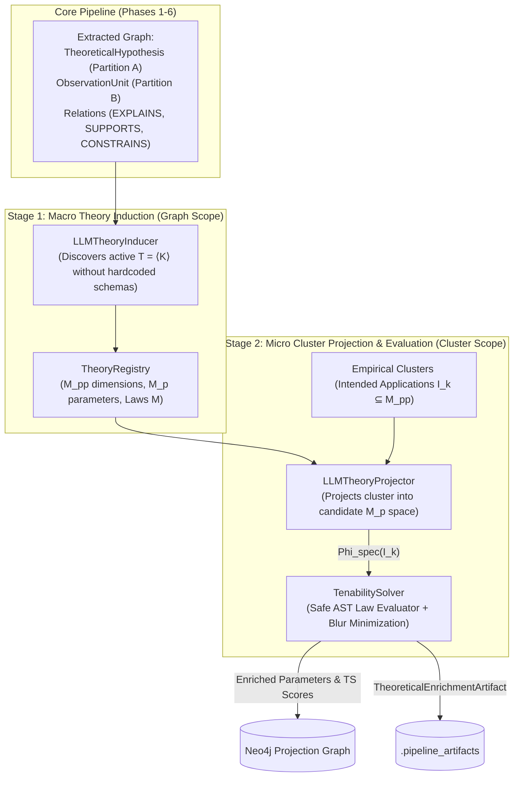

# Theoretical Enrichment & Tenability Evaluation

Theoretical Enrichment is a modular post-processing subsystem implementing dynamic Theory-Element induction ($\Phi_{\text{spec}}$) and structuralist tenability evaluation ($TS_{\text{local}}, TS_{\text{edge}}$) for the Episteme pipeline.

It bridges the domain-agnostic structural graph ($\Phi_{\text{gen}}$) produced by Phases 1–6 with formal structuralist metatheory ([Stegmüller, 1976](zotero://select/library/items/2WXH9HSL); [Balzer et al., 1987](zotero://select/library/items/24SNSW2B); [Schurz, 2024](zotero://select/library/items/24SNSW2B)), without hardcoding any domain-specific scientific frameworks.

---

## Architectural Role & Two-Stage Pipeline



---

## The Four Processing Steps

### Stage 0 / Step 1: Dynamic Theory-Element Induction (Macro Scope)
* If the `TheoryRegistry` is unseeded, `LLMTheoryInducer` scans the entire graph's `TheoreticalHypothesis` nodes (Partition $A$) and empirical observation types (Partition $B$).
* Induces up to `max_theories` active Theory-Elements ($T = \langle K, I \rangle$), extracting:
  - Non-theoretical empirical dimensions ($M_{pp}$).
  - Latent theoretical parameters ($M_p$).
  - Core mathematical constraint laws ($M$) with symbolic formulas (e.g. `abs(P1 - P2) * 0.5`).
* Automatically registers the induced theories into `TheoryRegistry`.

### Step 2: Cluster Mapping & Domain-Specific Projection ($\Phi_{\text{spec}}$)
* Groups `ObservationUnit` and `EmpiricalStatement` nodes into empirical clusters representing **Intended Applications ($I \subseteq M_{pp}$)**.
* Evaluates each cluster through the claiming theory's lens via `LLMTheoryProjector` or structured measurement lookups.
* Estimates candidate latent theoretical parameter values $\Phi_{\text{spec}}(I_k) \in [0.0, 1.0]$.

### Step 3: Local Tenability Calculation ($TS_{\text{local}}$)
* Evaluates core laws using the AST-based `SafeFormulaEvaluator` (zero `eval()` security risk):
$$TS_{\text{local}}(y, M) = \sup \{ 1 - \delta \mid \exists x^* \in M : (\Phi(y), x^*) \in u_\delta \}$$
* Determines the tightest admissible blur $\delta^*$ reconciling postulated parameters with core laws $M$.

### Step 4: Global and Intertheoretical Consistency ($GL$)
* Evaluates `CONSTRAINS` and `REDUCES_TO` edges across clusters and models:
$$TS_{\text{edge}}(e) = \sup \{ 1 - \delta_C \mid (\Phi(y_a), \Phi(y_b)) \in v_{\delta_C} \}$$
* Flags edges or hypotheses with $TS < 0.5$ as untenable anomalies.

---

## Python API Reference

::: episteme_pipeline.post_processing.theoretical_enrichment.runner.TheoreticalEnrichmentRunner
    options:
      show_root_heading: true

::: episteme_pipeline.post_processing.theoretical_enrichment.inducer.LLMTheoryInducer
    options:
      show_root_heading: true

::: episteme_pipeline.post_processing.theoretical_enrichment.projectors.LLMTheoryProjector
    options:
      show_root_heading: true

::: episteme_pipeline.post_processing.theoretical_enrichment.solvers.SafeFormulaEvaluator
    options:
      show_root_heading: true

::: episteme_pipeline.post_processing.theoretical_enrichment.enrichment_models.TheoryRegistry
    options:
      show_root_heading: true

::: episteme_pipeline.post_processing.theoretical_enrichment.solvers.TenabilitySolver
    options:
      show_root_heading: true

---

## Programmatic Seeding of Custom Theories

While the runner dynamically induces theories via LLM by default, custom theories can be registered explicitly:

```python
from pipeline.post_processing.theoretical_enrichment import (
    TheoryElementDefinition,
    TheoryLaw,
    TheoryRegistry,
    TheoreticalEnrichmentRunner,
)

# 1. Define a core law with symbolic formula or callable evaluator
law = TheoryLaw(
    law_id="newton_second_law",
    description="Force equals mass times acceleration.",
    formula_expression="abs(Force - Mass * Acceleration)",
    involved_parameters=["Force", "Mass", "Acceleration"],
)

# 2. Define the Theory-Element
classical_mechanics = TheoryElementDefinition(
    theory_id="classical_mechanics",
    name="Classical Mechanics",
    required_dimensions=["position", "time"],
    parameter_names=["Mass", "Force", "Acceleration"],
    laws=[law],
    max_admissible_blur=1.0,
)

# 3. Seed the registry
registry = TheoryRegistry(seed_theories=[classical_mechanics])
runner = TheoreticalEnrichmentRunner(registry=registry)
```
