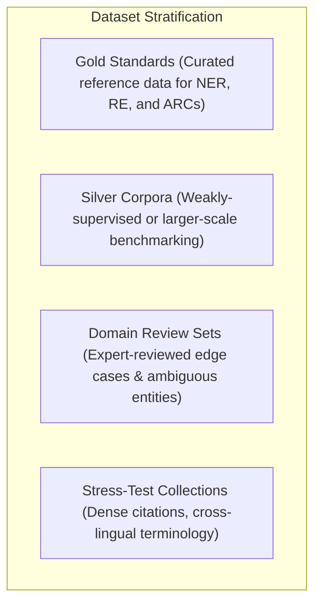

# Datasets Strategy

Episteme employs a strategic dataset portfolio designed to balance rigorous empirical evaluation against standard
natural language processing benchmarks with deep theoretical and argumentative validation on German and English
scholarly literature.

---

## Dataset Selection Principles

Our dataset strategy adheres to four core principles:

1. **Scholarly Depth & Domain Relevance:** Prioritize academic philosophy and science literature exhibiting rich
   theoretical frameworks, complex argument structures, and explicit conceptual hierarchies.
2. **Multi-Task Coverage:** Ensure empirical validation across the entire construction lifecycle: Named Entity
   Recognition (NER), Entity Linking (EL), Relation Extraction (RE), and Argument Mining (ADU, ACC, ARC).
3. **Multilingualism (DE/EN):** Support both German and English corpora to evaluate cross-lingual concept alignment
   and domain-specific terminological transfer.
4. **Reproducibility & Open Licensing:** Favor permissive licenses (CC-BY, MIT, BSD) or clear research instructions
   with automated adapter mappings.

---

## Dataset Portfolio Matrix

The table below summarizes the complete evaluation portfolio used across pipeline benchmarking, domain review,
and stress testing:

| Dataset Name                       | Domain & Source                                                 | Lang    | Primary Target Tasks                                           | Size & Volume                                 | License                   | Adapter Reference                                                                                                                           |
|:-----------------------------------|:----------------------------------------------------------------|:--------|:---------------------------------------------------------------|:----------------------------------------------|:--------------------------|:--------------------------------------------------------------------------------------------------------------------------------------------|
| **SciERC**                         | Computer Science & AI abstracts                                 | EN      | Scientific NER, Relation Extraction                            | 500 abstracts, 8K entities, 4.7K relations    | Open Research (MIT)       | [`adapters/scierc.py`](packages/episteme-pipeline/evaluation/adapters/scierc.py)                 |
| **SciFact**                        | Biomedical & Scientific claims                                  | EN      | Evidence Retrieval, Claim Verification                         | 1.4K claims, 5K evidence snippets             | CC-BY 4.0                 | [`adapters/scifact.py`](packages/episteme-pipeline/evaluation/adapters/scifact.py)               |
| **Arg-Microtexts**                 | Argumentative discourse & editorials                            | DE / EN | Argument Component (ACC) & Relation (ARC) Classification       | 112 microtexts, 576 ADUs                      | CC-BY 4.0                 | [`adapters/arg_microtexts.py`](packages/episteme-pipeline/evaluation/adapters/arg_microtexts.py) |
| **PhilPapers Corpus**              | Philosophy of Science & Epistemology                            | EN      | Concept Discovery, Theoretical Relation Extraction             | 500 papers, ~2,000 annotated constructs       | CC-BY with attribution    | `adapters/philpapers.py`                                                                                                                    |
| **SEP Corpus**                     | Stanford Encyclopedia of Philosophy                             | EN      | Concept Hierarchy, Defeasible Argument Structure               | 100 entries, extensive argument webs          | Educational / Research    | `adapters/sep.py`                                                                                                                           |
| **Deutsches Philosophenlexikon**   | Reference work excerpts in German philosophy                    | DE      | Multilingual Concept Alignment, Cross-Lingual Linking          | 300 passages, bilingual terminology           | Educational use           | `adapters/philosophenlexikon.py`                                                                                                            |
| **CoNLL-2003 (Adapted)**           | General & domain-adapted NER                                    | EN      | Baseline Named Entity Recognition                              | 1,393 news/academic documents                 | Permissive Research       | `adapters/conll_adapted.py`                                                                                                                 |
| **STNB (Structuralist Benchmark)** | Formal structuralist scientific reconstructions (Balzer et al.) | DE / EN | TheoryNet Topology, Specialization Trees, Axiom Identification | 40+ theory-nets (CPM, Freud, Festinger, SETH) | Academic / CC-BY 4.0      | [`adapters/structuralist.py`](packages/episteme-pipeline/evaluation/adapters/structuralist.py) & [STNB Spec](structuralist_theory_benchmark.md) |
| **Domain Review Collection**       | Curated German/English philosophy edge cases                    | DE / EN | Long-range relations, ambiguous naming, contested claims       | 500 sampled passages with expert rubrics      | In-house scholarly review | [`evaluation/rubrics/`](packages/episteme-pipeline/evaluation/rubrics/)                          |

---

## Dataset Roles & Stratification

In accordance with [`docs/research/evaluation_methodology.md`](evaluation_methodology.md), corpora are partitioned into
four operational roles:



* **Gold Datasets:** High-quality ground truth used for quantitative scoring with GM-GBS, OEP, and Information
  Retrieval metrics:
	- *Layer 1 & 2 (Extraction & Relations):* `SciERC`, `SciFact`.
	- *Layer 3 (Argument Components):* `Arg-Microtexts`.
	- *Layer 4 (TheoryNet & Architectonic Structure):* [Structuralist Theory-Net Benchmark (STNB)](structuralist_theory_benchmark.md). Evaluates formal model classes ($\mathcal{M}_p, \mathcal{M}, \mathcal{M}_{pp}$), constraints ($GC$), and specialization trees ($\alpha$). Ground truth pairs human-authored reconstructions (Balzer et al.) with a **Model-Assisted Human Verification (HITL)** protocol where candidate text anchors are model-proposed, double-blind audited, and adjudicated by domain scholars ($\alpha \ge 0.80$).
* **Silver Datasets:** Larger corpora used for triage, ablation studies, and broad sensitivity sweeps.
* **Review Datasets:** Targeted passages where domain experts execute structured rubric assessments
  (`EvaluationRubric`).
* **Stress-Test Collections:** Passages specifically engineered to expose failure modes:
	- *Dense References:* Texts with extreme citation density and nested theoretical attributions.
	- *Ambiguous Naming:* Polysemous concepts across different historical traditions (e.g., *Idealismus* in Kant vs.
	  Hegel).
	- *Cross-Lingual Shifting:* Mixed German/English technical terminology.

---

## Adapter Architecture

To prevent coupling between external dataset schemas and the internal Episteme graph model, all datasets interface
through dedicated adapters in [`packages/episteme-pipeline/evaluation/adapters/`](packages/episteme-pipeline/evaluation/adapters/).

### Adapter Responsibilities

Each adapter performs three normalization steps:

1. **Label Mapping:** Normalizes dataset-specific entity and relation labels into the canonical taxonomy defined in
   [`pipeline/schema/`](packages/episteme-pipeline/episteme_pipeline/schema/).
2. **Text & Span Alignment:** Normalizes character offsets and section boundaries to generate standard `L1Chunk` and
   `L1Document` inputs.
3. **Gold Standard Serialization:** Converts ground-truth annotations into `nx.DiGraph` instances or `SearchResult`
   reference sets for immediate consumption by GM-GBS, OEP, and retrieval scorers.

### Active Adapter Implementations

* **Layer 1 & 2 (Factual Extraction):** [`adapters/scierc.py`](packages/episteme-pipeline/evaluation/adapters/scierc.py) and [`adapters/scifact.py`](packages/episteme-pipeline/evaluation/adapters/scifact.py) normalize entity and factual relation benchmarks.
* **Layer 3 (Argumentation):** [`adapters/arg_microtexts.py`](packages/episteme-pipeline/evaluation/adapters/arg_microtexts.py) maps argument component and relation classification tasks.
* **Layer 4 (Theory-Nets):** [`adapters/structuralist.py`](packages/episteme-pipeline/evaluation/adapters/structuralist.py) normalizes JSON-LD structuralist graph records (`TheoryNet`, `TheoryElement`, `ActualModel`, `Constraint`) into canonical `(list[L1Chunk], nx.DiGraph)` representations with preserved `Episteme:textAnchor` coordinates.

### Adapter Implementation Pattern

```python
"""Typical Adapter Structure (e.g. evaluation/adapters/scierc.py or structuralist.py)"""

from pathlib import Path
import json
import networkx as nx
from pipeline.contracts.domain import L1Chunk


def load_dataset(data_path: Path) -> list[dict]:
    """Ingests raw dataset serialization."""
    ...


def adapt_to_evaluation_format(raw_data: list[dict]) -> tuple[list[L1Chunk], nx.DiGraph]:
    """
    Transforms raw annotations into:
    1. Pipeline inputs (chunks and text).
    2. Gold standard DiGraph for intrinsic scoring.
    """
    ...
```

---

## Contamination Prevention & Reproducibility

### Contamination Guardrails

To ensure that reported evaluation metrics reflect genuine generalization:

* **Closed-Book Evaluation:** Standard benchmark runs prohibit dynamic web search or external retrieval beyond the
  declared corpus scope.
* **Split Isolation:** Strict physical separation is maintained between prompt few-shot development examples and
  evaluation test splits.
* **Model Provenance:** All runs record the exact model version, API provider, and decoding parameters in the run
  manifest.
* **Model-Assisted Annotation Isolation:** In human-in-the-loop curated benchmarks (such as STNB), the LLM model family
  used to propose candidate text spans during curation is permanently recorded in run provenance manifests and strictly
  partitioned from the models evaluated on the benchmark to prevent circular self-evaluation and data leakage.

### Environmental Locking

Every evaluation execution is cryptographically reproducible:

* Dataset files are checksummed and referenced by persistent paths.
* Execution manifests capture random seeds, prompt template checksums, and git commit SHAs.
* Artifact lineage links all evaluation metrics directly to the intermediate artifacts generated during the run.

---

## Related Documentation

* **Structuralist Theory-Net Benchmark (STNB)**: [STNB Specification & Tasks](structuralist_theory_benchmark.md)
* **Evaluation Methodology & Scaffolding**: [Evaluation Methodology](evaluation_methodology.md)
* **Evaluation Harness Architecture**: [Evaluation Harness](evaluation_harness.md)
* **Empirical Construction Metrics**: [Empirical Metrics & Validation](metrics.md)
* **Run Manifest Specification**: [`run_manifest.schema.yaml`](packages/episteme-pipeline/evaluation/run_manifest.schema.yaml)
