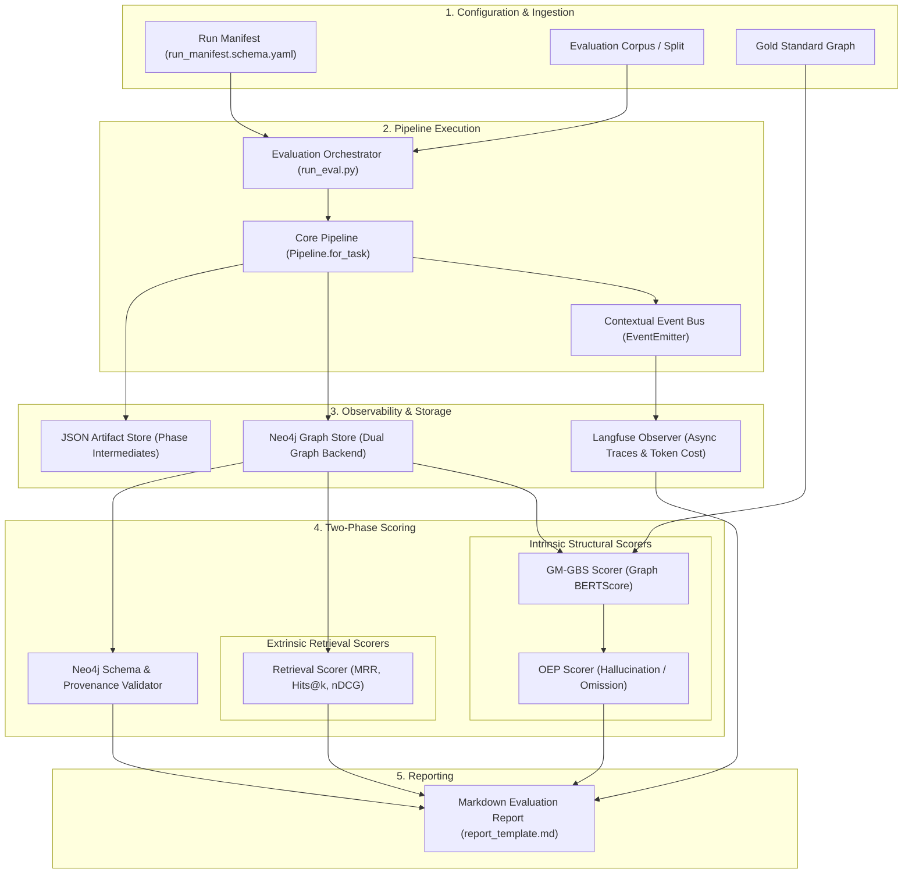

# Technical Specification: Evaluation Harness

This document provides the technical specification and architectural blueprint for the **Episteme Evaluation Harness**.
The harness operates as an orchestration and verification layer wrapped around the core pipeline, automating
observability logging, intrinsic graph structural scoring, extrinsic retrieval evaluation, and reproducible markdown
report generation.

---

## Architecture & Execution Lifecycle

The evaluation harness coordinates pipeline runs under controlled, deterministic conditions specified by an immutable
manifest.



### Execution Lifecycle

1. **Manifest Parsing:** The orchestrator reads [`run_manifest.schema.yaml`](packages/episteme-pipeline/episteme_pipeline/evaluation/run_manifest.schema.yaml) to lock random seeds, dataset splits, language codes, prompt versions, and embedding models.
2. **Pipeline Execution:** The core pipeline is invoked in evaluation mode with decoupled phase runners or pure in-memory stores (`InMemoryGraphStore`).
3. **Event-Driven Observability:** Pipeline execution publishes lifecycle events (`ComponentStarted`, `ComponentCompleted`, `PhaseCompleted`) to an event emitter, streaming traces to Langfuse asynchronously.
4. **Two-Phase Scoring:**
   - **Phase 1: Intrinsic (NetworkX & Structuralist Scorers):** Extracted triples, gold standard graphs, and formal TheoryNets are evaluated via `ModelScorer` (Bourbaki structuralist decomposition, capability subsumption $G_{\text{pred}} \succeq_{\text{cap}} G_{\text{ref}}$) and NetworkX scorers (GM-GBS and OEP error rates).
   - **Phase 2: Extrinsic (Retrieval Scorers):** Benchmark search queries are executed against the graph store using the `GraphReader` protocol to compute IR metrics (MRR, Hits@k, nDCG).
5. **Validation & Reporting:** The harness verifies graph schema integrity and provenance coverage, injecting all scalar metrics and error analyses into a final Markdown and JSON report.

---

## Component 1: Event-Driven Observability (Langfuse Integration)

**Objective:** Abstract away manual tracking of token consumption, model latencies, prompt versions, and execution costs
without polluting pipeline business logic.

### Implementation Architecture (`pipeline/events/langfuse_observer.py`)

In accordance with [ADR 0012: Phase Config Redesign & Langfuse Integration](docs/adr/0012-phase-config-redesign-and-langfuse-integration.md),
observability is decoupled from phase runners using an event bus observer pattern:

* **Event Bus Subscription:** The `LangfuseObserver` subscribes to domain events published by `ContextualEventEmitter`.
* **Trace Metadata:** Traces are automatically tagged with execution metadata derived from the run manifest:
  - `run_id`: The immutable run identifier.
  - `corpus_id` & `language`: The dataset and language split (EN/DE).
  - `prompt_id` & `prompt_version`: The exact prompt template and checksum executed.
  - `phase_name`: The active pipeline phase (`phase1_foundation`, `phase2_entity_discovery`, etc.).
* **Cost & Latency Aggregation:** Upon `EvaluationCompleted`, the orchestrator queries the Langfuse API to aggregate
  prompt tokens, completion tokens, and dollar costs for inclusion in the final report.

---

## Component 2: Structural & Model Decomposition Scorers (Intrinsic Evaluation)

**Objective:** Compute exact topological, model-theoretic, and semantic differences between the predicted graph and the Gold Standard.

### Model Component Decomposition Scorer ([`model_scorer.py`](packages/episteme-pipeline/episteme_pipeline/evaluation/scorers/model_scorer.py))

Bridges sovereign structuralist evaluation in `epistemetrics` to pipeline `ArtifactCollection` and `TheoryNet`:
* **Bourbaki Model Component Decomposition:** Quantifies completeness across all five formal model classes:
  $\mathcal{M}_p$ (Potential Models), $\mathcal{M}$ (Actual Models), $\mathcal{M}_{pp}$ (Partial Potential Models), $GC$ (Global Constraints), and $I_0$ (Paradigmatic Applications).
* **Capability Subsumption ($G_{\text{pred}} \succeq_{\text{cap}} G_{\text{ref}}$):** Verifies that predicted theories subsume reference capabilities with:
  - **Axiomatic Omission Rate ($AOR = 0.0$):** Mandatory zero-omission of core substantive laws.
  - **Model Component Completeness ($MCC \ge 1.0$):** Full coverage of reference model components.
  - **Property Fidelity Score ($PFS \ge 0.8$):** High relational and attribute fidelity.
  - **Text Anchor Grounding IoU ($AG_{\text{IoU}}$):** Character span Intersection over Union against primary source text.

### Graph Construction ([`networkx_builder.py`](packages/episteme-pipeline/episteme_pipeline/evaluation/scorers/networkx_builder.py))

* Converts raw predicted triples and gold-standard annotations into directed `nx.DiGraph` objects.
* Nodes represent entities with normalized identifiers; directed edges represent relationships with attribute dictionaries:
  `G.add_edge(subject_id, object_id, label=predicate_label)`.

### Graph BERTScore Evaluator ([`gm_gbs.py`](packages/episteme-pipeline/episteme_pipeline/evaluation/scorers/gm_gbs.py))

* **Configurable Embeddings:** Evaluates predicate labels using contextual sentence embeddings (e.g., `sentence-transformers/all-MiniLM-L6-v2`).
* **Soft Matching Algorithm:**
  1. Extract edge label lists $L_{\text{pred}}$ and $L_{\text{gold}}$.
  2. Compute pairwise cosine similarity matrix $S_{ij} = \cos(\mathbf{e}_i, \mathbf{e}_j)$.
  3. Apply greedy maximum-weight matching with a similarity threshold (default $\tau = 0.95$).
  4. Yields soft-precision, soft-recall, and overall GM-GBS alignment score.

### Optimal Edit Path Evaluator ([`oep.py`](packages/episteme-pipeline/episteme_pipeline/evaluation/scorers/oep.py))

* Analyzes the edge correspondence established by GM-GBS:
  - **Hallucination Rate ($HR$):** Fraction of predicted edges that have no semantic match in the gold graph:
    $\frac{|E_{\text{pred}}| - |E_{\text{matched, pred}}|}{|E_{\text{pred}}|}$.
  - **Omission Rate ($OR$):** Fraction of gold edges omitted by the model:
    $\frac{|E_{\text{gold}}| - |E_{\text{matched, gold}}|}{|E_{\text{gold}}|}$.

---

## Component 3: Extrinsic Retrieval Evaluator

**Objective:** Validate the practical utility of the constructed Knowledge Graph in downstream information retrieval
and question-answering scenarios.

### Implementation Details ([`retrieval.py`](packages/episteme-pipeline/episteme_pipeline/evaluation/scorers/retrieval.py))

* **Protocol Integration:** Utilizes the `GraphReader` protocol ([`pipeline/protocols/graph_store.py`](packages/episteme-pipeline/episteme_pipeline/protocols/graph_store.py))
  to execute vector search and hybrid graph traversal over the graph backend.
* **Evaluation Query Flow:**
  1. Ingests benchmark queries paired with sets of gold-standard node IDs ($\{v^*_1, v^*_2, \dots\}$).
  2. Generates query embeddings and retrieves top-$k$ candidate nodes.
  3. Computes standard Information Retrieval (IR) metrics:
     - **MRR (Mean Reciprocal Rank):** Rank position of the first relevant node.
     - **Hits@k:** Proportion of queries where a relevant node is found within the top $k$ results.
     - **nDCG@k:** Normalized discounted cumulative gain accounting for position-discounted relevance.
     - **Average Precision (AP):** Area under the precision-recall curve for the query.

---

## Component 4: Sovereign Evaluation Harness

**Objective:** Provide a unified, dependency-injected evaluation entry point for both in-memory testing and manifest-driven batch evaluation.

### Implementation Architecture ([`harness.py`](packages/episteme-pipeline/episteme_pipeline/evaluation/harness.py))

The `EvaluationHarness` implements `EvaluationHarnessProtocol` and supports pure in-memory execution requiring zero Neo4j database or network connectivity:

```python
import asyncio
from episteme_pipeline.evaluation.harness import EvaluationHarness
from episteme_pipeline.contracts.domain import TheoryNet

harness = EvaluationHarness()

# Evaluate pipeline output directly in memory
report = asyncio.run(
    harness.evaluate_in_memory(
        predicted=theory_net,
        gold="packages/episteme-pipeline/episteme_pipeline/evaluation/data/stnb_cpm_pilot.jsonld",
        run_id="cpm_evaluation_run",
    )
)
print(report.summary)
```

### CLI Execution

```bash
# Execute evaluation run using a manifest
rtk uv run python -m episteme_pipeline.evaluation.harness --manifest packages/episteme-pipeline/episteme_pipeline/evaluation/manifests/eval_stnb.yaml
```

---

## Related Documentation

* **Evaluation Methodology & Scaffolding**: [Evaluation Methodology](evaluation_methodology.md)
* **Dataset Portfolio & Adapter Strategy**: [Datasets Strategy](datasets.md)
* **Empirical Construction Metrics**: [Empirical Metrics & Validation](metrics.md)
* **Observability & Langfuse Design**: [ADR 0012: Langfuse Integration](../adr/0012-phase-config-redesign-and-langfuse-integration.md)
* **Graph Store Protocols**: [Graph Store Protocols](packages/episteme-pipeline/episteme_pipeline/protocols/graph_store.py)
