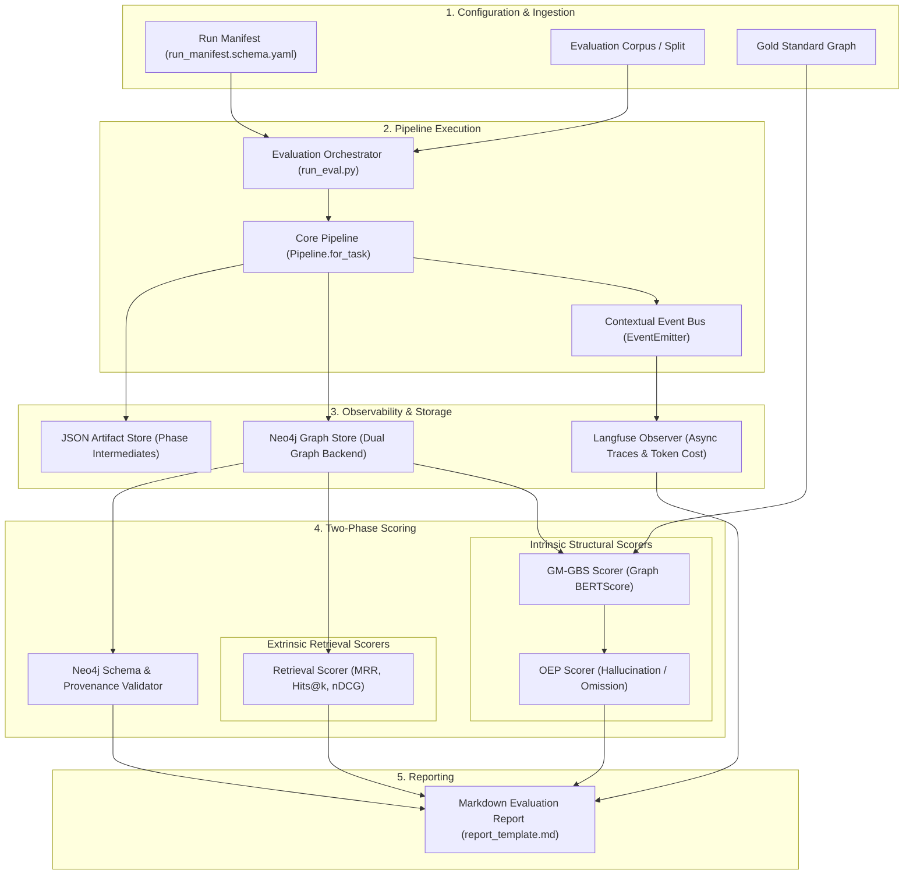

# Technical Specification: Evaluation Harness

This document provides the technical specification and architectural blueprint for the **Episteme Evaluation Harness**.
The harness operates as an orchestration and verification layer wrapped around the core pipeline, automating
observability logging, intrinsic graph structural scoring, extrinsic retrieval evaluation, and reproducible markdown
report generation.

---

## Architecture & Execution Lifecycle

The evaluation harness coordinates pipeline runs under controlled, deterministic conditions specified by an immutable
manifest.



### Execution Lifecycle

1. **Manifest Parsing:** The orchestrator reads [`run_manifest.schema.yaml`](packages/episteme-pipeline/evaluation/run_manifest.schema.yaml) to lock random seeds, dataset splits, language codes, prompt versions, and embedding models.
2. **Pipeline Execution:** The core pipeline is invoked in evaluation mode with decoupled phase runners.
3. **Event-Driven Observability:** Pipeline execution publishes lifecycle events (`ComponentStarted`, `ComponentCompleted`, `PhaseCompleted`) to an event emitter, streaming traces to Langfuse asynchronously.
4. **Two-Phase Scoring:**
   - **Phase 1: Intrinsic (NetworkX Scorers):** Extracted triples and gold standard triples are mapped to `nx.DiGraph` instances to calculate GM-GBS and OEP error rates.
   - **Phase 2: Extrinsic (Retrieval Scorers):** Benchmark search queries are executed against the Neo4j graph using the `GraphReader` protocol to compute IR metrics (MRR, Hits@k, nDCG).
5. **Validation & Reporting:** The harness verifies Neo4j schema integrity and provenance coverage, injecting all scalar metrics and error analyses into a final Markdown report.

---

## Component 1: Event-Driven Observability (Langfuse Integration)

**Objective:** Abstract away manual tracking of token consumption, model latencies, prompt versions, and execution costs
without polluting pipeline business logic.

### Implementation Architecture (`pipeline/events/langfuse_observer.py`)

In accordance with [ADR 0012: Phase Config Redesign & Langfuse Integration](docs/adr/0012-phase-config-redesign-and-langfuse-integration.md),
observability is decoupled from phase runners using an event bus observer pattern:

* **Event Bus Subscription:** The `LangfuseObserver` subscribes to domain events published by `ContextualEventEmitter`.
* **Trace Metadata:** Traces are automatically tagged with execution metadata derived from the run manifest:
  - `run_id`: The immutable run identifier.
  - `corpus_id` & `language`: The dataset and language split (EN/DE).
  - `prompt_id` & `prompt_version`: The exact prompt template and checksum executed.
  - `phase_name`: The active pipeline phase (`phase1_foundation`, `phase2_entity_discovery`, etc.).
* **Cost & Latency Aggregation:** Upon `EvaluationCompleted`, the orchestrator queries the Langfuse API to aggregate
  prompt tokens, completion tokens, and dollar costs for inclusion in the final report.

---

## Component 2: NetworkX Graph Scorers (Intrinsic Evaluation)

**Objective:** Compute exact topological and semantic differences between the predicted graph and the Gold Standard,
accounting for lexical synonymy and paraphrasing.

### Graph Construction ([`networkx_builder.py`](packages/episteme-pipeline/evaluation/scorers/networkx_builder.py))

* Converts raw predicted triples and gold-standard annotations into directed `nx.DiGraph` objects.
* Nodes represent entities with normalized identifiers; directed edges represent relationships with attribute dictionaries:
  `G.add_edge(subject_id, object_id, label=predicate_label)`.

### Graph BERTScore Evaluator ([`gm_gbs.py`](packages/episteme-pipeline/evaluation/scorers/gm_gbs.py))

* **Configurable Embeddings:** Evaluates predicate labels using contextual sentence embeddings (e.g., `text-embedding-3-large`
  or multilingual BGE models).
* **Soft Matching Algorithm:**
  1. Extract edge label lists $L_{\text{pred}}$ and $L_{\text{gold}}$.
  2. Compute pairwise cosine similarity matrix $S_{ij} = \cos(\mathbf{e}_i, \mathbf{e}_j)$.
  3. Apply greedy maximum-weight matching with a similarity threshold (default $\tau = 0.95$).
  4. Yields soft-precision, soft-recall, and overall GM-GBS alignment score.

### Optimal Edit Path Evaluator ([`oep.py`](packages/episteme-pipeline/evaluation/scorers/oep.py))

* Analyzes the edge correspondence established by GM-GBS:
  - **Hallucination Rate ($HR$):** Fraction of predicted edges that have no semantic match in the gold graph:
    $\frac{|E_{\text{pred}}| - |E_{\text{matched, pred}}|}{|E_{\text{pred}}|}$.
  - **Omission Rate ($OR$):** Fraction of gold edges omitted by the model:
    $\frac{|E_{\text{gold}}| - |E_{\text{matched, gold}}|}{|E_{\text{gold}}|}$.

---

## Component 3: Extrinsic Retrieval Evaluator

**Objective:** Validate the practical utility of the constructed Knowledge Graph in downstream information retrieval
and question-answering scenarios.

### Implementation Details ([`retrieval_scorer.py`](packages/episteme-pipeline/evaluation/scorers/retrieval_scorer.py))

* **Protocol Integration:** Utilizes the `GraphReader` protocol ([`pipeline/protocols/graph_store.py`](packages/episteme-pipeline/episteme_pipeline/protocols/graph_store.py))
  to execute vector search and hybrid graph traversal over the Neo4j store.
* **Evaluation Query Flow:**
  1. Ingests benchmark queries paired with sets of gold-standard node IDs ($\{v^*_1, v^*_2, \dots\}$).
  2. Generates query embeddings and retrieves top-$k$ candidate nodes from Neo4j.
  3. Computes standard Information Retrieval (IR) metrics:
     - **MRR (Mean Reciprocal Rank):** Rank position of the first relevant node.
     - **Hits@k:** Proportion of queries where a relevant node is found within the top $k$ results.
     - **nDCG@k:** Normalized discounted cumulative gain accounting for position-discounted relevance.
     - **Average Precision (AP):** Area under the precision-recall curve for the query.

---

## Component 4: The Evaluation Orchestrator

**Objective:** Provide a unified, reproducible CLI entry point to execute evaluation runs and synthesize reports.

### Orchestrator Workflow ([`run_eval.py`](packages/episteme-pipeline/evaluation/run_eval.py))

```bash
# Execute evaluation run using a manifest
python packages/episteme-pipeline/evaluation/run_eval.py --manifest packages/episteme-pipeline/evaluation/manifests/eval_scierc.yaml
```

The orchestrator executes via the `EvaluationRun` class:
```python
class EvaluationRun:
    """Orchestrates pipeline execution, scoring, and report generation."""

    def __init__(self, manifest_path: str, event_bus=None, build_graph: bool = False):
        self.manifest = self._parse_manifest(manifest_path)
        self.event_bus = event_bus or ContextualEventEmitter()
        self.build_graph = build_graph

    async def run_pipeline(self) -> None:
        """Invokes the pipeline configured for evaluation depth (L2 or L3)."""
        ...

    async def run_scorers(self) -> None:
        """Executes GM-GBS, OEP, and ExtrinsicRetrievalEvaluator."""
        ...

    def generate_report(self) -> str:
        """Injects metrics, costs, and schema validations into report_template.md."""
        ...
```

---

## Related Documentation

* **Evaluation Methodology & Scaffolding**: [Evaluation Methodology](evaluation_methodology.md)
* **Dataset Portfolio & Adapter Strategy**: [Datasets Strategy](datasets.md)
* **Empirical Construction Metrics**: [Empirical Metrics & Validation](metrics.md)
* **Observability & Langfuse Design**: [ADR 0012: Langfuse Integration](../adr/0012-phase-config-redesign-and-langfuse-integration.md)
* **Graph Store Protocols**: [Graph Store Protocols](packages/episteme-pipeline/episteme_pipeline/protocols/graph_store.py)
