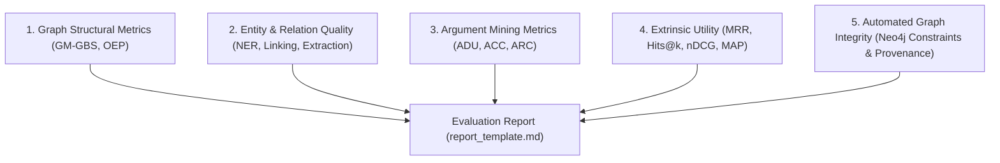

# Empirical Metrics & Validation

This document specifies the quantitative metrics and automated validation checks employed by **Episteme** to evaluate
the technical quality, structural fidelity, and retrieval utility of the constructed knowledge and theory graphs.

!!! tip
    **Theory Graph & Epistemic Metrics (5 Pillars):**
    This document focuses specifically on **empirical construction metrics** (Phases 1 through 5). Formal epistemic
    metrics (Gerhard Schurz's empirical creativity, unification index, and homogeneity against the tacking paradox;
    Imre Lakatos's degeneration index; Dung's abstract argumentation semantics; and Paul Thagard's explanatory coherence)
    are formalized in the [Theory Metrics Overview & Taxonomy](../concepts/theory/metrics/index.md) and developed in the
    companion package `epistemetrics`.

---

## Metric Taxonomy & Architectural Scope

Evaluation metrics in Episteme are organized into five empirical categories:

---

## Graph Structural Metrics (Intrinsic Evaluation)

Graph structural metrics quantify the topological and semantic alignment between the LLM-generated graph and a Gold
Standard, replacing rigid string equality with contextual embedding similarity.

| Metric | Definition & Formula | Target Pipeline Phase | Implementation / Tooling |
| :--- | :--- | :--- | :--- |
| **Model Component Completeness ($MCC$)** | Completeness ratio across formal structuralist model classes ($\mathcal{M}_p, \mathcal{M}, \mathcal{M}_{pp}, GC, I_0$): $\text{MCC} = \frac{\sum |\text{Matched Components}|}{\sum |\text{Reference Components}|}$ | Phase 6 (Level 4 TheoryNet) | [`model_scorer.py`](packages/episteme-pipeline/episteme_pipeline/evaluation/scorers/model_scorer.py) & `epistemetrics` |
| **Axiomatic Omission Rate ($AOR$)** | Fraction of reference substantive laws omitted in the predicted theory graph: $AOR = \frac{|\mathcal{M}_{\text{ref}} \setminus \mathcal{M}_{\text{pred, matched}}|}{|\mathcal{M}_{\text{ref}}|}$ (Target: $AOR = 0.0$) | Phase 6 (Level 4 TheoryNet) | [`model_scorer.py`](packages/episteme-pipeline/episteme_pipeline/evaluation/scorers/model_scorer.py) & `epistemetrics` |
| **Property Fidelity Score ($PFS$)** | Macro average of node type, epistemic stance, and edge relational fidelities in $[0.0, 1.0]$. | Phase 6 (Level 4 TheoryNet) | [`model_scorer.py`](packages/episteme-pipeline/episteme_pipeline/evaluation/scorers/model_scorer.py) & `epistemetrics` |
| **Text Anchor Grounding IoU ($AG_{\text{IoU}}$)** | Average Intersection over Union (IoU) of character spans against primary literature. | Phase 6 (Level 4 TheoryNet) | [`model_scorer.py`](packages/episteme-pipeline/episteme_pipeline/evaluation/scorers/model_scorer.py) & `epistemetrics` |
| **GM-GBS (Graph BERTScore)** | Soft-matching F1 over relation labels using cosine similarity of contextual embeddings above threshold $\tau = 0.95$: $\text{Soft-F1} = \frac{2 \cdot P_{\text{soft}} \cdot R_{\text{soft}}}{P_{\text{soft}} + R_{\text{soft}}}$ | Phase 2, Phase 3, Phase 5 | [`gm_gbs.py`](packages/episteme-pipeline/episteme_pipeline/evaluation/scorers/gm_gbs.py) |
| **Hallucination Rate ($HR$)** | Fraction of predicted edges with no semantic match in the gold standard: $HR = \frac{|E_{\text{pred}}| - |E_{\text{matched, pred}}|}{|E_{\text{pred}}|}$ | Phase 2, Phase 3 | [`oep.py`](packages/episteme-pipeline/episteme_pipeline/evaluation/scorers/oep.py) |
| **Omission Rate ($OR$)** | Fraction of gold-standard edges omitted by the pipeline: $OR = \frac{|E_{\text{gold}}| - |E_{\text{matched, gold}}|}{|E_{\text{gold}}|}$ | Phase 2, Phase 3 | [`oep.py`](packages/episteme-pipeline/episteme_pipeline/evaluation/scorers/oep.py) |
| **Graph Edit Distance (GED)** | Minimum cost sequence of node/edge insertions, deletions, and substitutions required to transform $G_{\text{pred}}$ into $G_{\text{gold}}$. | Phase 3b, Phase 5 | NetworkX / Scipy |

---

## Entity & Relationship Quality Metrics

These metrics evaluate the accuracy of entity discovery, canonical resolution, and relationship extraction against
annotated ground truth.

| Task / Quality Dimension | Specific Metric | Definition & Diagnostic Value | Target Phase |
| :--- | :--- | :--- | :--- |
| **Entity Extraction (NER)** | **Per-Type Precision, Recall, F1** | Evaluates boundary detection and coarse/fine typing (e.g., Person, Concept, Work, School). | Phase 2 |
| **Entity Linking / Resolution** | **Pairwise Accuracy** | Correctness of `SAME_AS` equivalence decisions between entity mentions. | Phase 3, Phase 5 |
| | **Cluster Purity & Completeness** | Purity measures absence of alien entities in a cluster; completeness measures absence of missed co-references. | Phase 5 |
| | **False Merge Rate** | Fraction of distinct theoretical concepts erroneously merged into a single node. | Phase 5 |
| | **False Split Rate** | Fraction of coreferent mentions left unmerged as duplicate nodes. | Phase 5 |
| **Local Relation Extraction** | **Relation Precision / Recall** | Accuracy of extracted triples within individual chunks against ground-truth relations. | Phase 2 |
| | **Evidence Grounding Ratio** | Proportion of extracted relations backed by valid verbatim source character spans. | Phase 2 |
| **Global Relation Discovery** | **Candidate Recall@k** | Proportion of gold-standard cross-chunk relations present in top-$k$ retrieved candidates. | Phase 3 |
| | **Reranking MRR** | Rank position of valid relation candidates after cross-encoder reranking. | Phase 3 |

---

## Argument Mining Metrics

Argument mining metrics evaluate the extraction and structuring of argumentative discourse units (ADUs) and defeasible
reasoning patterns.

| Task Level | Metric | Operational Measurement | Target Phase |
| :--- | :--- | :--- | :--- |
| **ADU Segmentation** | **Span Exact / Partial Match (IoU)** | Intersection-over-Union ($\text{IoU} \ge 0.70$) of character spans between predicted and gold discourse units. | Phase 4 |
| **Component Classification (ACC)** | **Macro-Averaged F1** | Multi-class classification accuracy across argument roles: *Premise*, *Claim*, *Major Claim*, *Axiom*. | Phase 4 |
| **Relation Classification (ARC)** | **Support / Attack F1** | Binary and multi-class classification for argumentative links (`SUPPORTS`, `REFUTES`, `QUALIFIES`). | Phase 4, Phase 5 |
| | **Structural Consistency** | Verification that intra-argument derivation chains form valid Directed Acyclic Graphs (DAGs). | Phase 4, Phase 6 |

---

## Extrinsic Information Retrieval Metrics

Extrinsic metrics quantify the practical utility of the Knowledge Graph when queried by downstream tasks (Semantic Search,
Question Answering, and Literature Survey).

| Metric | Mathematical Formulation | Interpretation |
| :--- | :--- | :--- |
| **Mean Reciprocal Rank (MRR)** | $\text{MRR} = \frac{1}{|Q|} \sum_{i=1}^{|Q|} \frac{1}{\text{rank}_i}$ | Evaluates the rank of the *first* correct entity or document retrieved. High MRR ensures the user immediately sees the correct construct. |
| **Hits@k** | $\text{Hits}@k = \frac{1}{|Q|} \sum_{i=1}^{|Q|} \mathbb{I}(\text{rank}_i \le k)$ | Measures whether a relevant construct appears anywhere within the top-$k$ results (typically $k \in \{1, 3, 5, 10\}$). |
| **nDCG@k** | $\text{nDCG}@k = \frac{\text{DCG}@k}{\text{IDCG}@k}, \quad \text{DCG}@k = \sum_{i=1}^k \frac{\text{rel}_i}{\log_2(i + 1)}$ | Evaluates graded relevance ranking, penalizing models that place highly relevant theoretical constructs below marginal results. |
| **Mean Average Precision (MAP)** | $\text{MAP} = \frac{1}{|Q|} \sum_{q=1}^{|Q|} \text{AP}(q)$ | Holistic measure of retrieval precision across the entire recall spectrum for multi-target queries. |

---

## Reference-Free Evaluation & Graph Integrity

### Reference-Free Metrics (LLM-as-a-Judge)

In accordance with our [Evaluation Methodology](evaluation_methodology.md), reference-free evaluation using LLMs as
judges is strictly restricted to Layer 1 & 2 extraction quality, and must be calibrated against human review baselines:

| Metric | Prompt Assessment Goal | Calibration Requirement |
| :--- | :--- | :--- |
| **Faithfulness** | Verifies whether an extracted entity or triple is fully supported by the source text chunk (detects hallucinations). | Correlation $\ge 0.80$ with human expert judgments on review samples. |
| **Comprehensiveness** | Verifies whether all major theoretical concepts in a passage were extracted (detects omissions). | Adjudicated against human expert review sets. |

### Graph Integrity & Constraint Verification (Neo4j)

Automated graph validation ensures that the constructed graph satisfies formal relational and data integrity constraints:

* **Schema Compliance:** Every node and relationship matches the taxonomy defined in `pipeline/schema/`.
* **Provenance Coverage:** Percentage of nodes and edges possessing valid `source_doc_id`, `chunk_id`, and character offsets.
* **Uniqueness Constraints:** Absence of duplicate canonical entity IDs or duplicate directed edges with identical predicates.
* **Orphan Detection:** Verification that theoretical claims and premises maintain logical connections to surrounding discourse.

---

## Related Documentation

* **Evaluation Methodology & Scaffolding**: [Evaluation Methodology](evaluation_methodology.md)
* **Evaluation Harness Architecture**: [Evaluation Harness](evaluation_harness.md)
* **Dataset Portfolio & Strategies**: [Datasets Strategy](datasets.md)
* **Epistemic & Theory Graph Metrics (5 Pillars)**: [Theory Metrics Overview](../concepts/theory/metrics/index.md)
* **Formal Graph Model**: [Formal Graph Schema (TheoryNet)](../concepts/formal_graph_model.md)
* **Observability Integration**: [ADR 0012: Langfuse Integration](../adr/0012-phase-config-redesign-and-langfuse-integration.md)
