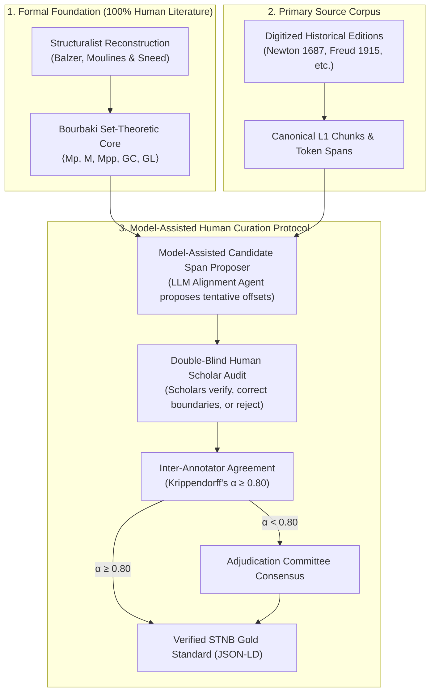

# Structuralist Theory-Net Benchmark (STNB)

The **Structuralist Theory-Net Benchmark (STNB)** is an empirical, human-curated evaluation benchmark designed to
measure the fidelity of automatically generated scientific **Theory Graphs** (Level 4 Evaluation) in **Episteme**.

Standard natural language processing benchmarks (e.g., SciERC, CoNLL-2003) evaluate local factual triples, while
argument mining benchmarks (e.g., Arg-Microtexts) capture informal rhetorical moves. STNB evaluates whether an AI system
can extract the higher-order formal architecture of scientific theories: mathematical model classes
($\mathcal{M}_p, \mathcal{M}, \mathcal{M}_{pp}$), invariance constraints ($GC$), specialization trees ordered as
partially ordered sets ($\alpha$), and intertheoretical reduction links ($\rho$).

For the underlying mathematical foundations, Bourbaki structure species, and epistemology,
see [Theory-Nets, Posets & Topologies](../concepts/theory_nets_and_topologies.md)
and [Formal Graph Schema (TheoryNet)](../concepts/formal_graph_model.md).

---

## Benchmark Profile & Data Card

STNB translates over four decades of formal structuralist reconstructions into an empirical benchmark grounded in
historical primary texts.

### Metadata Specification

| Attribute                       | Specification                                                                                                                                |
|:--------------------------------|:---------------------------------------------------------------------------------------------------------------------------------------------|
| **Benchmark Name**              | Structuralist Theory-Net Benchmark (STNB)                                                                                                    |
| **Target Pipeline Level**       | Level 4: Theory Layer / TheoryNet & Epistemic Dynamics                                                                                       |
| **Domains Covered**             | Classical Mechanics, Psychoanalysis, Cognitive Psychology, Structural Psychology, Thermodynamics                                             |
| **Languages**                   | English (EN), German (DE)                                                                                                                    |
| **Curation Protocol**           | Model-Assisted Human Curation (LLM-proposed candidate spans, double-blind scholar verification & adjudication)                               |
| **Primary Tasks**               | Core Law Extraction, Specialization DAG Assembly, $T$-Theoreticity Discrimination, Intertheoretical Reduction, Diachronic Evolution Tracking |
| **Ground-Truth Representation** | JSON-LD Graph Envelope with Token-Level Character Anchors                                                                                    |
| **Evaluation Scaffolding**      | GM-GBS (`scorers/gm_gbs.py`), OEP (`scorers/oep.py`), Epistemic Metrics Suite (`epistemetrics`)                                              |
| **License**                     | Creative Commons Attribution 4.0 International (CC-BY 4.0); Primary historical source texts reside in the Public Domain                      |

### Corpus Breakdown Portfolio

Each benchmark entry pairs a formal structuralist reconstruction from scientific literature with clean, digitized
historical primary texts:

| Theory Reconstruction                        | Domain         | Primary Historical Source Text                                                  | Formal Monograph Reference              | Lang    | Annotated Units (Elements / Laws / Constraints) | Status         |
|:---------------------------------------------|:---------------|:--------------------------------------------------------------------------------|:----------------------------------------|:--------|:------------------------------------------------|:---------------|
| **Classical Particle Mechanics (CPM)**       | Physics        | Newton, *Philosophiae Naturalis Principia Mathematica* (1687)                   | Balzer, Moulines, & Sneed (1987, Ch. 2) | EN / LA | 8 elements, 12 laws, 3 constraints              | Active (Pilot) |
| **Theory of the Unconscious**                | Psychoanalysis | Freud, *Das Unbewußte* (1915); *Jenseits des Lustprinzips* (1920)               | Balzer & Marcou (1989)                  | DE      | 5 elements, 7 laws, 2 constraints               | Curated        |
| **Cognitive Dissonance Theory**              | Psychology     | Festinger, *A Theory of Cognitive Dissonance* (1957)                            | Balzer et al. (1987, Ch. 1)             | EN      | 4 elements, 6 laws, 2 constraints               | Curated        |
| **Structural Psychology**                    | Psychology     | Wundt, *Grundriss der Psychologie* (1896)                                       | Westmeyer (1989)                        | DE      | 6 elements, 9 laws, 4 constraints               | Curated        |
| **Simple Equilibrium Thermodynamics (SETH)** | Physics        | Carathéodory (1909); Giles, *Mathematical Foundations of Thermodynamics* (1964) | Balzer et al. (1987, Ch. 4)             | EN / DE | 7 elements, 11 laws, 5 constraints              | In Preparation |

---

## Target Graph Schema & Representation Contract

The ground truth is serialized as a JSON-LD graph envelope. Each formal node pairs mathematical predicates with strict,
token-level coordinates referencing source document chunks.

### Core Entity & Relational Taxonomy

#### Node Types (Theory Components)

| JSON-LD `@type`             | Formal Symbol              | Pipeline Contract                  | Anchor Status    | Epistemic Role & Formal Definition                                                                                                       |
|:----------------------------|:---------------------------|:-----------------------------------|:-----------------|:-----------------------------------------------------------------------------------------------------------------------------------------|
| `str:TheoryElement`         | $T = \langle K, I \rangle$ | `TheoryElement` / `TheoryNet`      | Structural Node  | Modular theoretical core paired with intended application domains.                                                                       |
| `str:PotentialModel`        | $\mathcal{M}_p$            | `TheoryAtom` (`potential_model`)   | Mandatory Anchor | Conceptual framework, primitive base sets, and function domains specifying what must exist for $T$ to be meaningful.                     |
| `str:ActualModel`           | $\mathcal{M}$              | `TheoryAtom` (`actual_model`)      | Mandatory Anchor | Substantive physical laws, governing differential equations, and axiomatic empirical principles satisfying $T$.                          |
| `str:PartialPotentialModel` | $\mathcal{M}_{pp}$         | `TheoryAtom` (`partial_potential`) | Mandatory Anchor | $T$-non-theoretical empirical base obtained by cutting off all terms whose measurement presupposes $T$.                                  |
| `str:Constraint`            | $GC$                       | `TheoryAtom` (`constraint`)        | Mandatory Anchor | Cross-model invariance conditions demanding identical values for intrinsic properties (e.g., mass, charge) across distinct applications. |
| `str:Paradigm`              | $I_0$                      | `TheoryAtom` (`paradigm`)          | Mandatory Anchor | Historically anchored prototype applications and standard experimental setups ($I_0 \subseteq I \subseteq \mathcal{M}_{pp}$).            |

#### Relational Edge Types (Theory-Net Topology)

| JSON-LD Property            | Formal Symbol | Source $\to$ Target                               | Topological Property  | Epistemic Function & Example                                                                                                            |
|:----------------------------|:--------------|:--------------------------------------------------|:----------------------|:----------------------------------------------------------------------------------------------------------------------------------------|
| `str:specializes`           | $\alpha$      | `TheoryElement` $\to$ `TheoryElement`             | Strict Poset (DAG)    | Vertical hierarchical refinement inheriting parent models while adding restricted laws (e.g., General CPM $\to$ Hookean Oscillator).    |
| `str:reducesTo`             | $\rho$        | `TheoryElement` $\to$ `TheoryElement`             | Directed Acyclic Edge | Intertheoretical reduction and conceptual derivation connecting distinct theories (e.g., Collision Mechanics $\to$ Particle Mechanics). |
| `str:hasConstraint`         | $C$           | `TheoryElement` $\to$ `Constraint`                | Bipartite Association | Links global invariance constraints to participating theory elements.                                                                   |
| `str:presupposes`           | $\pi$         | `TheoryElement` $\to$ `TheoryElement`             | Pre-theoreticity Edge | Conceptual or measurement dependency specifying which external theory provides the operational determination of non-theoretical terms.  |
| `str:empiricallyEquivalent` | $\varepsilon$ | `TheoryElement` $\leftrightarrow$ `TheoryElement` | Symmetric Equivalence | Structural equivalence between alternate theoretical formulations (e.g., Newtonian Mechanics $\leftrightarrow$ Lagrangian Mechanics).   |

### Text-Anchor Contract & JSON-LD Envelope

Every empirical node contains a `Episteme:textAnchor` object establishing direct character offsets into the source document:

```json
{
  "@context": {
    "str": "https://structuralism.org/ontology#",
    "Episteme": "https://grund.ai/schema#",
    "rdfs": "http://www.w3.org/2000/01/rdf-schema#",
    "specializes": {
      "@id": "str:specializes",
      "@type": "@id"
    },
    "textAnchor": "Episteme:textAnchor"
  },
  "@graph": [
    {
      "@id": "str:T_CPM_Base",
      "@type": "TheoryElement",
      "rdfs:label": "Basic CPM Element",
      "str:hasActualModel": "str:M_CPM_Newton2"
    },
    {
      "@id": "str:M_CPM_Newton2",
      "@type": "ActualModel",
      "rdfs:label": "M(CPM) - Newton's Second Law",
      "str:formalAxiom": "forall p in P, t in T: m(p) * d2/dt2(s(p,t)) = sum_i f(p, t, i)",
      "Episteme:textAnchor": {
        "sourceDocId": "newton_principia_1687",
        "chunkId": "chunk_principia_law_02",
        "charStart": 0,
        "charEnd": 168,
        "verbatimQuote": "The alteration of motion is ever proportional to the motive force impressed; and is made in the direction of the right line in which that force is impressed."
      }
    }
  ]
}
```

The complete machine-readable specification and sample graph for Classical Particle Mechanics is maintained in [
`packages/episteme-pipeline/evaluation/data/stnb_cpm_pilot.jsonld`](packages/episteme-pipeline/evaluation/data/stnb_cpm_pilot.jsonld).

---

## Curation & Ground-Truth Operationalization Methodology

A core methodological challenge in benchmarking automated theory extraction is the **Text-Alignment Gap**: formal
structuralist reconstructions are published as abstract Bourbaki set-theoretic axiomatizations, whereas extraction
models process historical natural-language literature.

STNB operationalizes this translation through a **Model-Assisted Human Curation (Human-in-the-Loop)** protocol that
pairs the mathematical authority of published reconstructions with rigorous human verification of textual anchors:



### Model-Assisted Human Curation Protocol

To scale span alignment across hundreds of pages of archaic Latin and early modern scientific prose without compromising
mathematical rigor, STNB separates structural truth from textual grounding:

1. **Formal Grounding (Human-Authored):** The theoretical definitions, axioms, constraints, and specialization
   hierarchies originate strictly from published, peer-reviewed structuralist reconstructions (Balzer, Moulines, &
   Sneed, 1987; Westmeyer, 1989; Balzer & Marcou, 1989). No synthetic or LLM-generated theory definitions serve as
   ground truth.
2. **Model-Assisted Candidate Span Proposal:** An LLM alignment agent scans raw primary source text chunks, using the
   formal Bourbaki predicates as retrieval targets to propose candidate character spans (`charStart`, `charEnd`,
   verbatim quote) as alignment drafts.
3. **Double-Blind Human Scholar Audit:** Two domain scholars independently review every proposed candidate against the
   unabridged historical text. Annotators:
	* **Verify Faithfulness:** Ensure the candidate span genuinely asserts the targeted formal axiom or empirical
	  constraint.
	* **Refine Boundaries:** Adjust token boundaries to capture complete syntactic clauses and definitions while
	  trimming extraneous rhetorical passages.
	* **Retrieve Omissions:** Manually extract and annotate missing axioms or constraint statements that the proposal
	  model omitted.
	* **Reject Spurious Spans:** Prune hallucinations or misclassified empirical descriptions.
4. **Quality Control & Agreement:** Inter-annotator agreement on span boundaries and component types is calculated using
   token-level **Krippendorff's $\alpha$** ($\alpha \ge 0.80$ required for acceptance). Borderline cases
   ($0.67 \le \alpha < 0.80$) are resolved by an expert adjudication committee.
5. **Contamination Guardrails:** The model family used for candidate span proposing is explicitly recorded in provenance
   manifests and strictly partitioned from the models evaluated on STNB to avoid data leakage and self-referential bias.

### Operationalization Rules for Structuralist Primitives

Domain annotators map mathematical structures to textual spans according to five unambiguous criteria:

1. **Potential Models ($\mathcal{M}_p$):** Spans introducing primitive vocabulary, dimensional parameters, base sets
   (e.g., particles, time intervals), and operational definitions.
2. **Actual Models ($\mathcal{M}$):** Spans stating substantive physical laws, functional constraints, equations of
   motion, or universal conservation axioms.
3. **Partial Potential Models ($\mathcal{M}_{pp}$):** Spans describing empirical observation setups, kinematic
   positions, or raw data from which theoretical terms (e.g., mass, force, psychic energy) are strictly excluded.
4. **Global Constraints ($GC$):** Passages asserting cross-system invariance (e.g., Newton's Rule III asserting the
   constancy of mass across distinct bodies and trials).
5. **Paradigmatic Applications ($I_0$):** Passages describing prototype physical systems (e.g., planetary orbits,
   harmonic springs) that serve as historical exemplars.

### Span Granularity & Boundary Rules

* **Syntactic Boundary:** Annotations must encompass complete syntactic clauses or proposition sentences. Sub-sentential
  fragments are permitted only when an axiom is embedded in rhetorical discourse.
* **Equations & Glosses:** When a governing equation is accompanied by explanatory natural language, both the formula
  and its definitional gloss are bound into a single `Episteme:textAnchor`.

---

## Benchmark Task Suite

STNB evaluates automated scientific discovery systems across five standardized tasks:

### Task 1: Core Law & Axiom Identification

* **Task Definition:** Identify substantive governing laws and primitive conceptual vocabularies from raw, unannotated
  scientific text chunks without confusing empirical laws with mere observational descriptions.
* **Input:** Unannotated sequence of canonical [
  `L1Chunk`](packages/episteme-pipeline/episteme_pipeline/contracts/domain.py#L56-L65)
  instances.
* **Target Output:** Extracted [
  `TheoryAtom`](packages/episteme-pipeline/episteme_pipeline/contracts/domain.py#L187-L200)
  records labeled with epistemic status (`actual_model` vs. `potential_model`).
* **Evaluation Metrics:** Soft Precision, Soft Recall, and GM-GBS ($\tau = 0.95$); OEP Hallucination Rate ($HR$) and
  Omission Rate ($OR$).

### Task 2: Specialization Hierarchy DAG Construction

* **Task Definition:** Given extracted physical or empirical laws, assemble them into a Directed Acyclic Graph (DAG)
  theory-tree rooted at fundamental law $T_0$, correctly ordering specialized variants.
* **Input:** Set of validated `TheoryElement` nodes.
* **Target Output:** Directed graph of `specializes` ($\alpha$) relations.
* **Evaluation Metrics:** DAG Property Verification (cycle-free), Root Element Conformity ($B (TN) = \{T_0\}$),
  Hierarchical Conformity, and edge alignment F1.

### Task 3: $T$-Theoreticity Discrimination

* **Task Definition:** Discriminate between non-theoretical terms ($L_E$, belonging to the empirical observational
  base $\mathcal{M}_{pp}$) and theoretical terms ($L_T$, whose measurement presupposes the theory itself).
* **Input:** Extracted vocabulary tokens and propositional predicates.
* **Target Output:** Binary classification ($L_T$ vs. $L_E$).
* **Evaluation Metrics:** Balanced Accuracy and Macro F1 against the formal non-theoretical basis.

### Task 4: Intertheoretical Link Prediction & Reduction

* **Task Definition:** Predict intertheoretical reduction relations ($\rho$) and conceptual imports connecting distinct
  scientific theory-nets (e.g., Classical Collision Mechanics reducing to Classical Particle Mechanics).
* **Input:** Two or more discrete candidate theory-net graphs.
* **Target Output:** Directed inter-net relational edges (`reducesTo`, `presupposes`).
* **Evaluation Metrics:** Relational Precision, Recall, and Link F1 against gold structuralist links.

### Task 5: Diachronic Evolution & Degeneration Tracking

* **Task Definition:** Given chronologically ordered corpora across successive historical editions, track the evolution
  of the theory-tree, measuring whether core axioms remain invariant while peripheral expansions absorb anomalies.
* **Input:** Multi-epoch document collection ($D_{t_0}, D_{t_1}, \dots, D_{t_n}$).
* **Target Output:** Dynamic trajectory graph ($TN_t \to TN_{t+1}$).
* **Evaluation Metrics:** Lakatosian Degeneration Index and Immunization Shift Tracking
  (see [degeneration_index.md](../concepts/theory/metrics/theory_dynamics/degeneration_index.md)).

---

## Native Evaluation Scaffolding & Harness Integration

STNB interfaces directly with Episteme's native evaluation subsystem ([
`docs/research/evaluation_harness.md`](evaluation_harness.md)).

### Benchmark Adapter

The dedicated adapter [
`packages/episteme-pipeline/evaluation/adapters/structuralist.py`](packages/episteme-pipeline/evaluation/adapters/structuralist.py)
normalizes STNB JSON-LD into pipeline input chunks and a gold-standard `nx.DiGraph`:

```python
from pipeline.evaluation.adapters.structuralist import load_structuralist_benchmark

chunks, gold_graph = load_structuralist_benchmark("packages/episteme-pipeline/evaluation/data/stnb_cpm_pilot.jsonld")
```

### Scoring Engine Matrix

| Layer / Metric               | Implementation Component                                                                                                        | Target Evaluated Property                                                                                                |
|:-----------------------------|:--------------------------------------------------------------------------------------------------------------------------------|:-------------------------------------------------------------------------------------------------------------------------|
| **GM-GBS (Graph BERTScore)** | [`scorers/gm_gbs.py`](packages/episteme-pipeline/evaluation/scorers/gm_gbs.py) | Soft semantic alignment on predicted axioms, law definitions, and specialization links ($\tau = 0.95$).                  |
| **OEP (Optimal Edit Paths)** | [`scorers/oep.py`](packages/episteme-pipeline/evaluation/scorers/oep.py)       | Diagnoses **Hallucination Rate ($HR$)** (spurious theoretical claims) vs. **Omission Rate ($OR$)** (missed core axioms). |
| **Epistemic Metrics Suite**  | [`packages/epistemetrics/`](packages/epistemetrics/)                      | Evaluates structural DAG properties, Modesty, Structural Elegance, System Coherence, and Tenability.                     |

### CLI Execution

Evaluation runs are executed deterministically through the harness orchestrator:

```bash
rtk python packages/episteme-pipeline/evaluation/run_eval.py --manifest packages/episteme-pipeline/evaluation/manifests/eval_stnb.yaml
```

---

## Implementation Status & Pilot Roadmap

| Component                          | Status                       | Deliverable & Location                                                                                                                                                                                          |
|:-----------------------------------|:-----------------------------|:----------------------------------------------------------------------------------------------------------------------------------------------------------------------------------------------------------------|
| **Structuralist Graph Taxonomy**   | `Planned`       | Fully aligned with [`docs/concepts/theory_nets_and_topologies.md`](../concepts/theory_nets_and_topologies.md).                                                                                                  |
| **JSON-LD Schema Specification**   | `Planned`       | Formal contract verified in [`packages/episteme-pipeline/evaluation/data/stnb_cpm_pilot.jsonld`](packages/episteme-pipeline/evaluation/data/stnb_cpm_pilot.jsonld). |
| **Structuralist Adapter**          | `Planned`     | [`packages/episteme-pipeline/evaluation/adapters/structuralist.py`](packages/episteme-pipeline/evaluation/adapters/structuralist.py).                               |
| **CPM Pilot Corpus (Principia)**   | `Planned`           | Newton *Principia* Book 1 Axioms and Propositions annotated.                                                                                                                                                    |
| **Scorer Pipeline Integration**    | `Planned`      | Wired into `GraphBERTScoreEvaluator`, `OEPScoreEvaluator`, and `epistemetrics`.                                                                                                                                 |
| **Multi-Theory Inter-Net Harness** | `Planned / Research Track` | Cross-theory registry for automated $T$-theoreticity and reduction link resolution.                                                                                                                             |

---

## References

* **Balzer, W., Moulines, C. U., & Sneed, J. D. (1987).** *An Architectonic for Science: The Structuralist Program*. D.
  Reidel Publishing Company.
* **Balzer, W., & Marcou, P. C. (1989).** "Freud's Conception of the Unconscious: A Structuralist Reconstruction".
  *Philosophy of Science*, 56 (4), 585–607.
* **Balzer, W., & Moulines, C. U. (Eds.). (1996).** *Structuralist Theory of Science: Focal Issues, New Results*. Walter
  de Gruyter.
* **Carathéodory, C. (1909).** "Untersuchungen über die Grundlagen der Thermodynamik". *Mathematische Annalen*, 67 (3),
  355–386.
* **Festinger, L. (1957).** *A Theory of Cognitive Dissonance*. Stanford University Press.
* **Giles, R. (1964).** *Mathematical Foundations of Thermodynamics*. Pergamon Press.
* **Newton, I. (1687).** *Philosophiae Naturalis Principia Mathematica*. Royal Society.
* **Schurz, G. (2014).** *Philosophy of Science: A Unified Approach*. Routledge.
* **Schurz, G. (2024).** *Erkenntnistheorie und Wissenschaftstheorie*. Springer.
* **Sneed, J. D. (1971).** *The Logical Structure of Mathematical Physics*. D. Reidel Publishing Company.
* **Stegmüller, W. (1976).** *The Structure and Dynamics of Theories*. Springer-Verlag.
* **Suppes, P. (1960).** "A Comparison of the Meaning and Uses of Models in Mathematics and the Empirical Sciences".
  *Synthese*, 12 (2), 287–301.
* **Westmeyer, H. (Ed.). (1989).** *Psychological Theories from a Structuralist Point of View*. Springer-Verlag.
