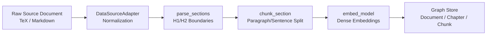

# Phase 1: Data Foundation

## Overview

Phase 1 establishes the empirical substrate for the entire pipeline. It ingests raw source documents, converts them to
normalized representations via format adapters, partitions the text into semantically coherent chunks, computes dense
vector embeddings, and commits an auditable document-chapter-chunk hierarchy with full provenance tracking.

## Purpose

This phase implements **Layer 1 (Empirical Manifold)** of the theory graph architecture, ensuring that all subsequent
entities, relations, and argumentative constructs maintain strict, verifiable provenance to their original textual
sources.

## Theoretical Foundation

See [Pipeline Architecture](../../architecture/pipeline_architecture.md)
and [Formal Graph Schema (TheoryNet)](../../concepts/formal_graph_model.md) for the theoretical background on layered
graph architecture and epistemic purity constraints.

## Components

### Document Parsing & Format Conversion

- **DataSourceAdapter**: Pluggable adapter interface (`DataSourceAdapter(ABC)`) selecting converters based on
  `can_handle(path)`.
- **Supported Adapters**:
    - `TexAdapter`: Ingests LaTeX/TeX sources, invoking Pandoc (`--wrap=none --strip-comments`) with optional
      bibliography injection.
    - `MarkdownAdapter`: Ingests Markdown and plain-text files directly.
- **Section Parsing (`parse_sections`)**: Splits text at H1/H2 header boundaries into `RawSection` structures; content
  preceding the first header is captured as a "Preamble".

### Chunking Strategy

- **Adaptive Rhetorical Chunking (`chunk_section`)**: Chunks sections at paragraph boundaries, falling back to sentence
  tokenization (via NLTK) if a paragraph exceeds `chunk_size`.
- **Token Accounting**: Exact token counts computed using `tiktoken` (`cl100k_base` encoding).
- **Overlap Carry-Forward**: Carries forward trailing sentences to preserve discursive continuity without splitting
  sentences mid-stream.

### Dense Embedding & Graph Ingestion

- **Chunk Embedding**: Concurrent embedding generation via `embed_model.aget_text_embedding()` (with synchronous
  fallback).
- **Idempotent MERGE Writes**: Document, Chapter, and Chunk nodes are upserted using deterministic SHA-256 IDs, making
  re-runs crash-safe and idempotent.

## Workflow

## Implementation Details

- [`pipeline_explanation.md`](pipeline_explanation.md) - Detailed step-by-step implementation walkthrough

## Configuration

Configuration is managed via `Phase1Config` in `pipeline/config.py`:

| Parameter            | Type   | Default | Description                                                      |
|:---------------------|:-------|:--------|:-----------------------------------------------------------------|
| `chunk_size`         | `int`  | `1024`  | Maximum chunk size in tokens.                                    |
| `chunk_overlap`      | `int`  | `128`   | Token overlap between consecutive chunks.                        |
| `provenance_enabled` | `bool` | `True`  | Whether to compute and attach deterministic provenance metadata. |

## Phase Contract

**Inputs:**

- `PipelineInput(source_paths: list[str])`: File paths to raw source documents and optional bibliography files.

**Outputs:**

- Phase 1 `ArtifactCollection` containing `Document` and `Chunk` envelopes.
- Layer 1 graph nodes in Neo4j:
    - `Document` nodes (`id`, `title`, `source_path`, `ingested_at`)
    - `Chapter` nodes (`id`, `title`, `sequence_index`)
    - `Chunk` nodes (`id`, `text`, `embedding`, `source_doc_id`, `chapter_id`, `sequence_index`, `token_count`)
    - `CONTAINS` relationships: `Document -> Chapter`, `Chapter -> Chunk`
    - `NEXT` relationships: `Chunk[i] -> Chunk[i+1]` (`distance: 1`)

**Invariants:**

- Every chunk belongs to exactly one chapter and one document.
- Chunk boundaries never split mid-sentence.
- Node IDs are deterministic SHA-256 hashes of content; re-ingestion produces identical IDs.

## Related

- **Theory**: [Formal Graph Schema (TheoryNet)](../../concepts/formal_graph_model.md) - Layer 1 specification
- **Next Phase**: [Phase 2: Entity Discovery](../2_entity_discovery/)
- **Architecture**: [Pipeline Architecture](../../architecture/pipeline_architecture.md)
