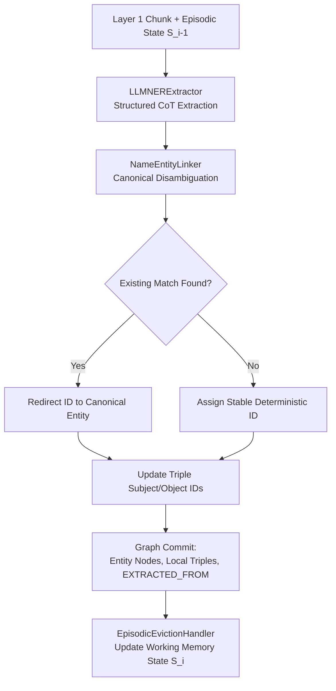

# Phase 2: Entity Discovery

## Overview

Phase 2 extracts named entities, resolves within-chunk coreference, disambiguates entity identities against existing
nodes, and extracts local (within-chunk) semantic triples to construct **Layer 2 (Deterministic Ontology)** of the
theory graph.

## Purpose

This phase populates the knowledge graph with domain-schema-typed entity nodes and local semantic relations, maintaining
rigorous provenance (`EXTRACTED_FROM`) back to Layer 1 chunks.

## Theoretical Foundation

See [Epistemic Grounding & Dense Alignment](../../concepts/dense_alignment.md)
and [Episodic Working Memory](../../concepts/episodic_working_memory.md) for the theoretical foundations:

- Symmetrical Textual Envelopes ($T_n$)
- Dual-Space Dense Alignment & Canonical Disambiguation
- [Episodic Working Memory](../../concepts/episodic_working_memory.md) (RAM-only state machine with Global Structural
  Anchors)
- [ADR 0003](../../adr/0003-coreference-absorbed-into-fusion.md) (Coreference resolution absorbed into prompt + Phase
  3b)

## Components

### 1. NER & Local Relation Extraction

- **Structured Prediction**: Structured LLM decoding (`astructured_predict`) guided by `SchemaConfig` entity and
  relation taxonomies.
- **Reasoning-First Chain-of-Thought**: CoT prompts prime the LLM to identify logical connectives before assigning
  entity labels and triples.
- **Iterative Gleaning**: When `max_gleanings > 0`, the extractor runs an iterative refinement pass with previously
  extracted entities to capture overlooked concepts.
- **Deterministic ID Generation**: `_stable_entity_id(label, name)` generates deterministic SHA-256 hashes
  (`entity_<hash>`), ensuring identical names with identical labels map to the same node ID.

### 2. Episodic Working Memory (RAM-Only Context)

- **Global Structural Anchor (`GlobalStructuralAnchor`)**: Injects Table of Contents (ToC) or section outlines into
  prompts as an immutable global coordinate system.
- **Short-Term Memory State (`WorkingMemoryState`)**: Tracks short-lived variables (`active_entities`,
  `unresolved_references`, `current_argument_branch`) across sequential chunk iterations ($S_{i-1} \to S_i$) entirely in
  RAM (never committed to Neo4j).
- **Boundary-Based Eviction (`EpisodicEvictionHandler`)**: Automatically purges working memory on structural section
  boundaries or semantic triggers.

### 3. Entity Linking & Disambiguation

- **Candidate Disambiguation**: Queries existing graph nodes using name containment and case-insensitive matching
  (`NameEntityLinker`) or bi-encoder vector similarity.
- **Canonical ID Redirection**: Matched entities have their IDs redirected to the canonical node, aggregating
  `source_chunk_ids` onto the canonical entity and updating local triples.
- **Cross-Chunk Deduplication Note**: Cross-chunk entity collision resolution is handled mathematically
  in [Phase 3b: Latent Graph Consolidation](../3b_consolidation/).

## Workflow

## Implementation Details

- [`pipeline_explanation.md`](pipeline_explanation.md) - Step-by-step pipeline execution walkthrough
- [`prompting.md`](prompting.md) - LLM prompt templates and chain-of-thought strategy

## Configuration

Phase 2 behavior is configured via `Phase2Config` in `pipeline/config.py` (model selection is declared in
`ModelConfig`):

| Parameter                             | Type                         | Default        | Description                                                          |
|:--------------------------------------|:-----------------------------|:---------------|:---------------------------------------------------------------------|
| `batch_size`                          | `int`                        | `10`           | Number of chunks processed concurrently during extraction.           |
| `top_k_linking_candidates`            | `int`                        | `10`           | Maximum candidate entities considered during linking.                |
| `linking_confidence_threshold`        | `float`                      | `0.85`         | Minimum confidence score required to redirect to an existing entity. |
| `ner_confidence_threshold`            | `float`                      | `0.0`          | Minimum confidence threshold for entity acceptance.                  |
| `local_relation_confidence_threshold` | `float`                      | `0.0`          | Minimum confidence threshold for local triple acceptance.            |
| `ner_decoding_strategy`               | `StructuredDecodingStrategy` | `NL_TO_FORMAT` | Decoding strategy (`DIRECT`, `NL_TO_FORMAT`, `TRIGGER_TOKEN`).       |
| `max_gleanings`                       | `int`                        | `0`            | Iterative gleaning passes to capture missed entities.                |

## Phase Contract

**Inputs:**

- Layer 1 chunks (from Phase 1 artifact view or `get_unprocessed_chunks("phase2")`).
- `SchemaConfig`: Domain entity types (`node_types`) and relation types (`relation_types`).

**Outputs:**

- Phase 2 `ArtifactCollection` containing extracted entities, local relations, and linking decisions.
- Layer 2 nodes and edges in Neo4j:
    - Entity nodes (`id`, `name`, `description`, `source_chunk_ids`)
    - Local relation edges (`confidence`, `scope: "local"`, `source_chunk_id`)
    - `EXTRACTED_FROM` relationships: Entity $\to$ Chunk (`confidence: 1.0`)
    - `Chunk.phase2_processed = true`

**Invariants:**

- Every entity has a deterministic ID based on its label and canonical name.
- Local relations only connect entities co-occurring in the same chunk.
- Unknown entity or relation labels outside `SchemaConfig` are dropped.

## Related

- **Theory**: [Epistemic Grounding & Dense Alignment](../../concepts/dense_alignment.md)
- **Architecture**: [ADR 0009: Episodic Working Memory](../../adr/0009-sota-dual-memory-episodic-working-memory.md)
- **Next Phase**: [Phase 3: Global Relation Extraction](../3_relation_extraction/)
- **Consolidation**: [Phase 3b: Latent Graph Consolidation](../3b_consolidation/)
