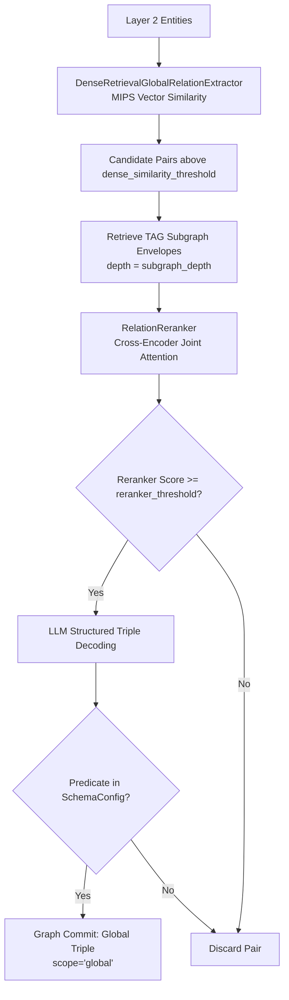

# Phase 3: Global Relation Extraction

## Overview

Phase 3 discovers semantic relationships between entity pairs across different documents and chunks, moving beyond
intra-chunk co-occurrences to establish the global network structure of the theory graph.

## Purpose

While Phase 2 extracts local relations within individual chunks, Phase 3 connects entities across document boundaries.
It identifies conceptual dependencies, historical lineages, and argumentative tensions that span across the corpus.

## Theoretical Foundation

See [Epistemic Grounding & Dense Alignment](../../concepts/dense_alignment.md)
and [ADR 0002](../../adr/0002-tag-reranker-global-relation-extraction.md):

- Global candidate generation via dense MIPS retrieval
- Contextual isomorphism and Text-Attributed Graph (TAG) subgraph envelopes
- Relational reranking using Cross-Encoders
- Constrained LLM relation classification

## Components

### 1. Global Candidate Retrieval (The Prior)

- **Dense MIPS Retrieval**: Computes dense vector similarities between entity embeddings across the entire corpus,
  breaking document and chunk boundaries.
- **Structural Candidate Blocking**: Optionally filters or groups candidates to avoid $O (N^2)$ explosion, capping
  partner candidates at `max_candidates_per_entity_pair`.

### 2. Contextual Subgraph Envelopes

- **TAG Envelope Retrieval**: For each candidate pair $(e_A, e_B)$, queries the graph store for up to `subgraph_depth`
  hops of contextual neighborhood (adjacent chunk nodes and connected entities).
- **Context Synthesis**: Merges and deduplicates envelopes for $e_A$ and $e_B$ into a compact textual representation.

### 3. Cross-Encoder Precision Reranking

- **Joint-Attention Scoring**: Evaluates candidate pairs and their contextual envelopes through `RelationReranker`
  (Cross-Encoder), allowing deep cross-referencing between concept contexts.
- **Threshold Filtering**: Only candidate pairs scoring above `reranker_threshold` proceed to LLM decoding.

### 4. LLM Relation Decoding

- **Constrained Classification**: Structured prediction (`astructured_predict`) against `GlobalRelationOutput`.
- **Schema Validation**: Validates extracted predicates against `SchemaConfig.relation_types` (unknown relations are
  dropped).
- **Graph Commit**: Commits global triples with `scope="global"` and `source_chunk_id=None`.

## Workflow

## Implementation Details

- [`pipeline_explanation.md`](pipeline_explanation.md) - Detailed implementation walkthrough

## Configuration

Configuration is managed via `Phase3Config` in `pipeline/config.py`:

| Parameter                              | Type                         | Default        | Description                                                                  |
|:---------------------------------------|:-----------------------------|:---------------|:-----------------------------------------------------------------------------|
| `batch_size`                           | `int`                        | `50`           | Number of candidate pairs processed per LLM batch.                           |
| `dense_similarity_threshold`           | `float`                      | `0.5`          | Minimum cosine similarity between entity embeddings to form candidate pairs. |
| `reranker_threshold`                   | `float`                      | `0.6`          | Minimum Cross-Encoder score required to pass candidates to LLM decoding.     |
| `global_relation_confidence_threshold` | `float`                      | `0.7`          | Minimum confidence score required for committed global relations.            |
| `max_candidates_per_entity_pair`       | `int`                        | `200`          | Maximum candidate partners permitted per entity hub.                         |
| `subgraph_depth`                       | `int`                        | `2`            | Hops of TAG neighborhood context retrieved per entity envelope.              |
| `global_relation_decoding_strategy`    | `StructuredDecodingStrategy` | `NL_TO_FORMAT` | Structured decoding strategy.                                                |
| `trace_dense_retrieval`                | `bool`                       | `True`         | Whether to emit telemetry events for candidate generation and reranking.     |

## Phase Contract

**Inputs:**

- Layer 2 entities from Phase 2 (from graph store or `Phase2ArtifactsView`).
- `SchemaConfig`: Taxonomy of valid global relation types.

**Outputs:**

- Phase 3 `ArtifactCollection` containing global relation envelopes.
- Global relation edges in Neo4j (`SchemaConfig.relation_types`) with properties:
    - `confidence`: float
    - `scope: "global"`
    - `source_chunk_id: None`

**Invariants:**

- Global relations connect entities with `scope="global"` to distinguish them from Phase 2 within-chunk triples.
- Unrecognized relation types outside `SchemaConfig` are discarded.

## Related

- **Theory**: [Epistemic Grounding & Dense Alignment](../../concepts/dense_alignment.md)
-
**ADR**: [ADR 0002: TAG Reranker Global Relation Extraction](../../adr/0002-tag-reranker-global-relation-extraction.md)
- **Next Phase**: [Phase 3b: Latent Graph Consolidation](../3b_consolidation/)
