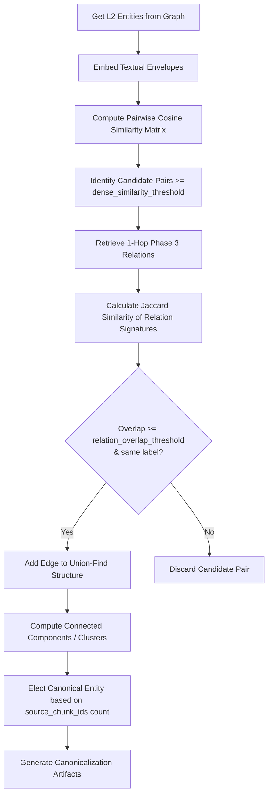

# Phase 3b: Latent Graph Consolidation

## Overview

Phase 3b performs a fast mathematical sweep over the Text-Attributed Graph (TAG) to resolve parallel entity collisions
(aliases/duplicates) created during parallel document ingestion. Unlike generative fusion passes, Phase 3b is a purely
mathematical, non-generative step that does not make LLM calls.

## Purpose

By executing prior to argument mining, Phase 3b consolidates duplicate Layer 2 (L2) entities into single canonical
nodes. This reduces redundancy in the graph and ensures that downstream phases (Phase 4: Entity Maturation, Phase 4b:
Argument Mining, and Phase 5: Alignment & Theory Fusion) operate on clean, deduplicated entity identities.

## Theoretical Foundation

See [Epistemic Grounding & Dense Alignment](../../concepts/dense_alignment.md)
and [ADR 0003](../../adr/0003-coreference-absorbed-into-fusion.md):

- **Latent Topological Invariance**: Using high-dimensional dense vector embeddings to assert that entity aliases map to
  the same conceptual latent coordinate.
- **Structural Relation Overlap**: Verifying topological similarity via Jaccard overlap of each entity's 1-hop relation
  neighborhood.

## Components & Workflow

The consolidation process follows a deterministic flow:

### 1. Vector Similarity Verification

For each Layer 2 entity in the graph, we embed its `textual_envelope` (falling back to `name` if missing) using the
project's embedding model. We compute a pairwise cosine similarity matrix. Only candidate pairs of the same entity label
that meet or exceed the configured `dense_similarity_threshold` are considered.

### 2. Topological Relation Overlap Verification

To prevent false-positive vector merges (e.g. matching two different philosophers mentioned in identical contexts), we
perform a topological check. For each candidate pair, we retrieve their 1-hop Phase 3 relations from the graph. We then
compute the Jaccard similarity index of their relation signatures:

$$J (A, B) = \frac{|Rel (A) \cap Rel (B)|}{|Rel (A) \cup Rel (B)|}$$

Where a relation signature is defined by direction, predicate (relation type), and the ID of the neighboring entity:

- Outgoing: `OUT:predicate:object_id`
- Incoming: `IN:predicate:subject_id`

If the Jaccard similarity is equal to or greater than `relation_overlap_threshold`, the entities are queued for merging.

### 3. Clustering and Canonicalization

Using a **Union-Find** data structure, we find the connected components of matching entity pairs to form clusters of
duplicates. For each cluster:

- We elect a **canonical entity** based on grounding (the entity associated with the largest number of
  `source_chunk_ids`).
- We generate a map from all other duplicate entity IDs in the cluster to the elected canonical entity ID.
- We emit `Canonicalization` artifacts detailing the resolution mapping.

## Implementation Details

- **Runner**: `Phase3bLatentConsolidationRunner` in `pipeline/phases/phase3b_consolidation/__init__.py`
- **Consolidation Sweep Logic**: `LatentGraphConsolidation` in `pipeline/phases/phase3b_consolidation/consolidation.py`
- **Configuration Class**: `Phase3bConfig` in `pipeline/config.py`

## Configuration

The following parameters are configured under `Phase3bConfig` in `pipeline/config.py`:

| Parameter                    | Type    | Default | Description                                                 |
|:-----------------------------|:--------|:--------|:------------------------------------------------------------|
| `enabled`                    | `bool`  | `True`  | Whether to execute the latent consolidation sweep.          |
| `dense_similarity_threshold` | `float` | `0.85`  | Minimum cosine similarity between entity textual envelopes. |
| `relation_overlap_threshold` | `float` | `0.8`   | Minimum Jaccard similarity of 1-hop relation signatures.    |

## Phase Contract

**Inputs:**

- Layer 2 entities and Layer 3 relation edges from the `graph_store`.
- Textual envelopes/names of entities.

**Outputs:**

- `Canonicalization` artifacts indicating which original entity maps to which canonical entity.

**Invariants:**

- Entities with different labels (e.g., `Concept` vs. `Person`) are never merged.
- If both entities have no relations, the Jaccard overlap evaluates to `0.0` (two isolated nodes are not automatically
  merged).
- The elected canonical node is always the one with the maximum count of `source_chunk_ids`.

## Related Sections

- **Concepts**: [Epistemic Grounding & Dense Alignment](../../concepts/dense_alignment.md)
- **Previous Phase**: [Phase 3: Global Relation Extraction](../3_relation_extraction/)
- **Next Phase**: [Phase 4: Entity Maturation](../4_entity_maturation/)
- **Reference**: [Configuration Reference](../../reference/config.md)
