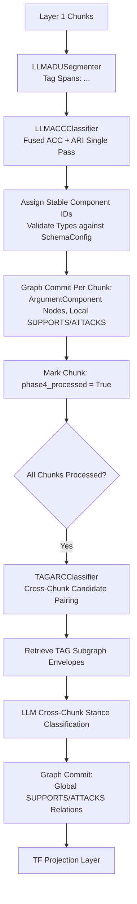

# Phase 4b: Argument Mining

## Overview

Phase 4b extracts argumentative structure from Layer 1 chunks: it segments text into Argumentative Discourse Units
(ADUs), classifies each ADU and its local relations in a fused pass (ACC + ARI), and evaluates global cross-chunk
argument relations (ARC). The resulting structure populates Layer 3 of the knowledge graph with `TheoryAtom`
(`ArgumentComponent`) nodes and `SUPPORTS`/`ATTACKS` edges.

## Purpose

While Phases 2 and 3 build the factual and ontological layers (entities and conceptual relations), Phase 4b builds the
**epistemic justification layer**. It extracts claims, premises, and the dialectical support and attack structures that
ground theoretical hypotheses.

## Theoretical Foundation

See [Formal Graph Schema (TheoryNet)](../../concepts/formal_graph_model.md) and the following ADRs:

- [ADR 0004: ACC Outputs Triples Single Pass](../../adr/0004-acc-outputs-triples-single-pass.md) — Fusing ADU
  classification and local relation identification into a single LLM call.
- [ADR 0007: TF Structural Correspondence](../../adr/0007-tf-structural-correspondence.md) — Mapping argument components
  to Theoriennetz (TF) structures with structural correspondence scores.

## Components

### 1. ADU Segmentation (`LLMADUSegmenter`)

- **Span Demarcation**: Prompts the LLM with chunk text to identify argumentative discourse spans, wrapping them in
  explicit markup tags (e.g. `<AC1>...</AC1>`).
- **Clean Skipping**: If no argumentative content is found in a chunk, it is skipped cleanly.

### 2. Component Classification & Local Relations (`LLMACCClassifier`)

- **Fused Single-Pass Execution (ADR 0004)**: The annotated text and extracted ADU spans are passed to
  `LLMACCClassifier`. The LLM outputs:
    - Per-ADU `component_type`: `CLAIM`, `MAJOR_CLAIM`, `PREMISE`.
    - Local relation triples: `(source_id, relation, target_id, confidence)`.
- **Deterministic Component IDs**:
  `_stable_component_id(chunk_id, ac_tag) = "ac_" + sha256("{chunk_id}:{ac_tag}")[:14]`.

### 3. Cross-Chunk Argument Relation Classification (`TAGARCClassifier`)

- **Global Stance Classification**: After all chunks are processed, cross-chunk candidate pairs are formed between
  components from different chunks.
- **Topological Grounding**: Reuses `GlobalRelationExtractor.get_subgraph_envelope()` to retrieve Text-Attributed Graph
  (TAG) context up to `arc_subgraph_depth` hops.
- **Priority Ranking**: Candidate pairs are prioritized by `SchemaConfig.component_types` order (e.g. evaluating
  high-centrality claim types first) up to `arc_max_candidates_per_component`.

### 4. Theoriennetz (TF) Mapping

- Maps extracted components to `TheoryAtom` nodes (`Partition A` theoretical hypotheses vs. `Partition B` empirical
  observations) and `TheoryRelation` edges.

## Workflow

## Implementation Details

- [`pipeline_explanation.md`](pipeline_explanation.md) - Step-by-step pipeline execution walkthrough

## Configuration

Configuration is managed via `Phase4Config` in `pipeline/config.py`:

| Parameter                          | Type                         | Default        | Description                                                               |
|:-----------------------------------|:-----------------------------|:---------------|:--------------------------------------------------------------------------|
| `batch_size`                       | `int`                        | `10`           | Number of chunks processed concurrently per batch.                        |
| `adu_confidence_threshold`         | `float`                      | `0.0`          | Minimum confidence threshold for ADU segmentation.                        |
| `acc_confidence_threshold`         | `float`                      | `0.0`          | Minimum confidence threshold for local component/relation classification. |
| `arc_confidence_threshold`         | `float`                      | `0.65`         | Minimum confidence threshold for cross-chunk ARC relations.               |
| `arc_subgraph_depth`               | `int`                        | `2`            | TAG envelope hop depth retrieved for cross-chunk stance evaluation.       |
| `arc_max_candidates_per_component` | `int`                        | `10`           | Maximum cross-chunk candidate pairs evaluated per component.              |
| `arc_use_priority_rank`            | `bool`                       | `False`        | Whether to prioritize pairing by component type hierarchy.                |
| `acc_decoding_strategy`            | `StructuredDecodingStrategy` | `NL_TO_FORMAT` | Decoding strategy for ACC classification.                                 |
| `arc_decoding_strategy`            | `StructuredDecodingStrategy` | `NL_TO_FORMAT` | Decoding strategy for ARC classification.                                 |

## Phase Contract

**Inputs:**

- `Phase3ArtifactsView` (acts as dependency gate).
- Unprocessed chunks from graph store via `get_unprocessed_chunks("phase4")`.

**Outputs:**

- Phase 4 `ArtifactCollection` containing `TheoryAtom` and `TheoryRelation` envelopes.
- Layer 3 nodes and edges in Neo4j:
    - `ArgumentComponent` nodes (`id`, `text`, `component_type`, `source_chunk_id`)
    - `SUPPORTS` / `ATTACKS` relation edges (`confidence`, `source: "local" | "global"`)
    - `EXTRACTED_FROM` edges: ArgumentComponent $\to$ Chunk
    - `Chunk.phase4_processed = true`

**Invariants:**

- Every argument component has a stable deterministic ID scoped to its chunk and tag.
- Local relations only connect components within the same chunk.
- Cross-chunk ARC relations connect components from different chunks.
- Unknown component types or relation types outside `SchemaConfig` are discarded.

## Related

- **Theory**: [Formal Graph Schema (TheoryNet)](../../concepts/formal_graph_model.md)
-
**ADRs**: [ADR 0004 (ACC Single Pass)](../../adr/0004-acc-outputs-triples-single-pass.md), [ADR 0007 (TF Representation)](../../adr/0007-tf-structural-correspondence.md)
- **Previous Phase**: [Phase 4: Entity Maturation](../4_entity_maturation/)
- **Next Phase**: [Phase 5: Alignment & Theory Fusion](../5_inter_document_argument_web/)
