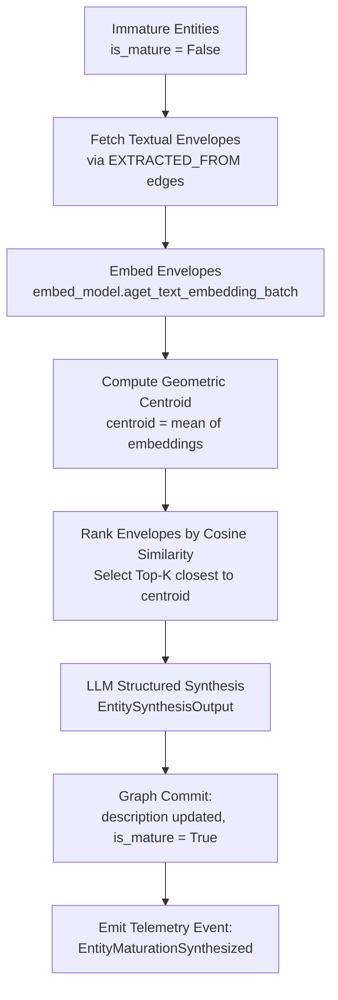

# Phase 4: Entity Maturation (Batch Epistemic Synthesis)

## Overview

Phase 4 implements the **Two-Stage Entity Maturation Protocol** to prevent epistemic drift during continuous entity
discovery. In Phase 2, entities are discovered and linked with high throughput, using their first mention for
description (deterministic genesis). In Phase 4, the pipeline performs batch epistemic synthesis: it retrieves all
textual envelopes across all mentions, computes their geometric centroid in latent embedding space, selects the most
representative envelopes, and prompts the LLM to synthesize a canonical, stable description.

## Purpose

Continuous extraction in a knowledge graph introduces the risk of "epistemic drift": updating an entity's description
with every new mention alters its coordinates in the vector database, invalidates prior embeddings, destabilizes
alignment mathematics, and is computationally expensive.

To preserve **topological invariance**, the two-stage protocol:

1. **Stage 1 (Discovery — Phase 2)**: Performs fast, deterministic extraction and similarity linking.
2. **Stage 2 (Maturation — Phase 4)**: Stabilizes entity descriptions in a batch process before argument mining begins.

## Workflow

## Implementation Details

- [`pipeline_explanation.md`](pipeline_explanation.md) - Detailed step-by-step implementation walkthrough
- **Runner**: `Phase4EntityMaturationRunner` in `pipeline/phases/phase4_entity_maturation/__init__.py`
- **Configuration**: `Phase4EntityMaturationConfig` in `pipeline/config.py`

## Configuration

Configuration is managed via `Phase4EntityMaturationConfig` in `pipeline/config.py`:

| Parameter                            | Type                         | Default                   | Description                                                                         |
|:-------------------------------------|:-----------------------------|:--------------------------|:------------------------------------------------------------------------------------|
| `maturation_top_k`                   | `int`                        | `5`                       | Number of representative envelopes closest to the centroid to select for synthesis. |
| `batch_size`                         | `int`                        | `10`                      | Number of entities processed concurrently per LLM batch.                            |
| `entity_synthesis_decoding_strategy` | `StructuredDecodingStrategy` | `DIRECT`                  | Decoding strategy for structured description synthesis.                             |
| `entity_synthesis_prompts`           | `StructuredPromptBundle`     | `ENTITY_SYNTHESIS_PROMPT` | Prompt bundle used for canonical description synthesis.                             |

## Phase Contract

**Inputs:**

- `Phase3ArtifactsView` (acts as dependency gate confirming Phase 3 completion).
- Layer 2 entities and their mention context envelopes (`get_entity_envelopes`) from the graph store.

**Outputs:**

- `ArtifactCollection` containing updated `LinkedEntityArtifact` envelopes with `method="Phase4EntityMaturationRunner"`.
- Graph store updates:
    - Updated entity nodes in Neo4j with synthesized `description` and `is_mature = True`.

**Invariants:**

- Entities that have already been matured (`is_mature = True`) are skipped on re-run.
- If an entity has no textual envelopes, it is marked mature with its existing description to avoid infinite
  re-processing.
- Descriptions are synthesized only from the top-$K$ envelopes closest to the geometric centroid.

## Related

- **Theory**: [Epistemic Grounding & Dense Alignment](../../concepts/dense_alignment.md)
- **Previous Phase**: [Phase 3b: Latent Graph Consolidation](../3b_consolidation/)
- **Next Phase**: [Phase 4b: Argument Mining](../4_argument_mining/)
