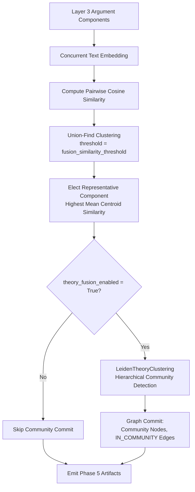

# Phase 5: Alignment & Theory Fusion

## Overview

Phase 5 groups semantically equivalent argument components across documents and performs theory-level graph clustering.
It operates on the extracted Layer 3 argument structures to assemble the cross-document argument web and discover
theoretical communities.

## Purpose

While Phase 4b extracts argument components within documents and connects pairs across chunks, Phase 5 performs
macro-level synthesis: it clusters similar claims across distinct authors and texts, elects representative key points,
and applies hierarchical community detection to detect theoretical paradigms.

## Theoretical Foundation

See [Formal Graph Schema (TheoryNet)](../../concepts/formal_graph_model.md)
and [ADR 0005: Two-Pass Fusion Strategy](../../adr/0005-two-pass-fusion-strategy.md):

- Argument component clustering via dense vector cosine similarity
- Representative argument election for Key Point Analysis
- Hierarchical Leiden community detection over the global Theory Graph

## Components

### 1. Argument Component Clustering

- **Batch Embedding**: Argument component texts are embedded concurrently via `embed_model.aget_text_embedding_batch()`.
- **Cosine Similarity Matrix**: Normalised dot product matrix is computed over all component pairs.
- **Union-Find Clustering**: Component pairs exceeding `fusion_similarity_threshold` (default: 0.85) are merged into
  clusters.
- **Representative Election**: The component with the highest mean cosine similarity to peers is elected as the cluster
  representative.

### 2. Theory-Level Fusion & Community Detection

- **Leiden Graph Clustering (`LeidenTheoryClustering`)**: Builds a global graph of entities, argument components, and
  relations.
- **Modularity Optimization**: Applies hierarchical Leiden community detection to discover cohesive theoretical
  sub-networks.
- **Graph Updates**: Writes `Community` nodes and `IN_COMMUNITY` edges back to the graph store when
  `theory_fusion_enabled = True`.

## Workflow

## Implementation Details

- [`pipeline_explanation.md`](pipeline_explanation.md) - Detailed step-by-step implementation walkthrough

## Configuration

Configuration is managed via `Phase5Config` in `pipeline/config.py`:

| Parameter                     | Type    | Default          | Description                                                      |
|:------------------------------|:--------|:-----------------|:-----------------------------------------------------------------|
| `argument_clustering_enabled` | `bool`  | `True`           | Whether to cluster semantically equivalent argument components.  |
| `theory_fusion_enabled`       | `bool`  | `False`          | Whether to execute hierarchical Leiden community detection.      |
| `fusion_similarity_threshold` | `float` | `0.85`           | Minimum cosine similarity required to merge argument components. |
| `cluster_layer`               | `str`   | `"theory_atoms"` | Layer to cluster (`"theory_atoms"`, `"l2_entities"`, `"both"`).  |

## Phase Contract

**Inputs:**

- `Phase4ArtifactsView`: Cumulative collection of `TheoryAtom` and `TheoryRelation` artifacts.

**Outputs:**

- Phase 5 `ArtifactCollection` containing cluster envelopes and fusion decisions.
- Graph updates (when enabled):
    - `Community` nodes
    - `IN_COMMUNITY` relationships: `TheoryAtom / Entity -> Community`

**Invariants:**

- Clusters must have a minimum size of 2 components.
- The elected representative component is strictly the member with highest mean similarity to cluster peers.

## Related

- **Theory**: [Formal Graph Schema (TheoryNet)](../../concepts/formal_graph_model.md)
- **Previous Phase**: [Phase 4b: Argument Mining](../4_argument_mining/)
- **Next Phase**: [Phase 6: TheoryNet Projection](../6_theorynet/)
