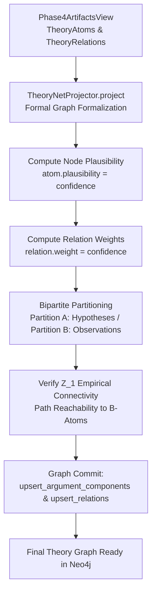

# Phase 6: TheoryNet Projection

## Overview

Phase 6 formalizes the mined argumentation and conceptual graph into a mathematically rigorous **TheoryNet**
($\rho, \alpha$). It evaluates argument acceptability, assigns node plausibility and edge weights, and verifies
empirical content bounds through bipartite partition analysis ($A$-atoms vs. $B$-atoms).

## Purpose

While earlier phases extract textual discourse units and local/global relations, Phase 6 performs the formal
epistemological projection:

1. Translates extracted argument components into formal theory atoms ($\rho$) with assigned plausibility scores.
2. Projects relations into weighted dialectical edges ($\alpha$).
3. Asserts the structuralist empirical content condition: ensuring theoretical hypotheses ($A$-partition) connect
   meaningfully to empirical observations ($B$-partition).

## Theoretical Foundation

See [Formal Graph Schema (TheoryNet)](../../concepts/formal_graph_model.md)
and [Theory-Nets, Posets & Topologies](../../concepts/theory_nets_and_topologies.md):

- Formal representation: $T = \langle \mathcal{A}, \mathcal{R}, \rho, \alpha \rangle$
- Bipartite partitioning: Theoretical Hypotheses ($A$-atoms) vs. Empirical Observations ($B$-atoms)
- Empirical content criteria ($Z_1$ connectivity)
- Gradual semantics and Quaternary Bipolar Argumentation Frameworks (QBAF)

## Components

### 1. TheoryNet Projector (`TheoryNetProjector`)

- Projects the cumulative `Phase4ArtifactsView` into a formal `TheoryNet` domain contract.
- Maps component classifications to formal theoretical partitions:
    - **Partition A (Theoretical Core)**: `THEORETICAL_HYPOTHESIS`, `AXIOM`, `LAW`.
    - **Partition B (Empirical Grounding)**: `EMPIRICAL_STATEMENT`, `OBSERVATION_UNIT`.

### 2. Plausibility & Edge Weight Formalization

- **Node Plausibility**: Initializes `atom.plausibility` from extraction confidence (defaulting to 1.0 when unweighted).
- **Edge Weights**: Populates `relation.weight` from relation confidence scores, maintaining scope annotations
  (`"local"` vs. `"global"`).

### 3. Empirical Content & $Z_1$ Connectivity Verification

- Builds an adjacency projection over the theoretical partition ($A$-atoms).
- Identifies $Z_1$-connected components: theoretical atoms directly connected to empirical $B$-atoms or reachable
  through connected $A$-hypotheses.
- Computes empirical content coverage and verifies that theoretical constructs maintain grounding in the empirical
  manifold.

## Workflow

## Implementation Details

- [`pipeline_explanation.md`](pipeline_explanation.md) - Detailed step-by-step implementation walkthrough
- **Runner**: `Phase6Runner` in `pipeline/phases/phase6_theorynet/__init__.py`
- **Projector**: `TheoryNetProjector` in `pipeline/projection/theorynet_projector.py`
- **Configuration**: `Phase6Config` in `pipeline/config.py`

## Configuration

Configuration is managed via `Phase6Config` in `pipeline/config.py`:

| Parameter | Type   | Default | Description                                              |
|:----------|:-------|:--------|:---------------------------------------------------------|
| `enabled` | `bool` | `True`  | Whether to execute the formal TheoryNet projection pass. |

## Phase Contract

**Inputs:**

- `Phase4ArtifactsView`: Cumulative collection of `TheoryAtom` and `TheoryRelation` artifacts across the pipeline run.

**Outputs:**

- `ArtifactCollection` containing formal TheoryNet artifacts.
- Neo4j graph updates:
    - Updated `ArgumentComponent` / `TheoryAtom` nodes with `.plausibility`.
    - Updated `TheoryRelation` edges with `.weight`.

**Invariants:**

- Plausibility and edge weights are bounded in $[0.0, 1.0]$.
- Every $A$-atom's empirical grounding is verifiable via $Z_1$ paths.

## Related

- **Theory**: [Formal Graph Schema (TheoryNet)](../../concepts/formal_graph_model.md)
- **Previous Phase**: [Phase 5: Alignment & Theory Fusion](../5_inter_document_argument_web/)
- **Post-Processing**: [Theoretical Enrichment & Tenability Evaluation](../post_processing/theoretical_enrichment.md)
