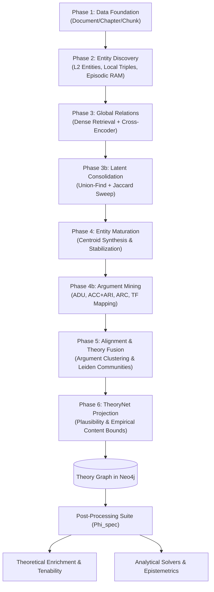

# Pipeline Implementation Workflow

This section documents how theoretical and epistemological concepts are implemented in the Python pipeline code.

---

## Pipeline Execution Phases

The Episteme pipeline executes eight sequential phases, each building deterministically on the outputs of preceding
phases:

### [Phase 1: Data Foundation](1_data_foundation/)

**Purpose**: Source document ingestion, format conversion (TeX, Markdown), and deterministic chunking with full
provenance tracking.  
**Theoretical Basis**: Layer 1 (Empirical Manifold)  
**Key Concepts**: Structural chunking (ToC/Header-aware), exact tokenization, stable content hashing, `Document` $\to$
`Chapter` $\to$ `Chunk` graph hierarchy.

### [Phase 2: Entity Discovery](2_entity_discovery/)

**Purpose**: Named entity recognition, within-chunk local coreference resolution, entity linking, and episodic working
memory.  
**Theoretical Basis**: Layer 2 (Deterministic Ontology)  
**Key Concepts**: Textual envelopes ($T_n$), Table-of-Contents structural anchors, RAM-only state machine with boundary
eviction resets, deterministic entity IDs.

### [Phase 3: Global Relation Extraction](3_relation_extraction/)

**Purpose**: Cross-document semantic relationship identification.  
**Theoretical Basis**: Global relations in Heterogeneous Information Networks (HIN)  
**Key Concepts**: Dense candidate retrieval (MIPS bi-encoder), cross-encoder relational reranking, constrained LLM
triple decoding, TAG subgraph envelopes.

### [Phase 3b: Latent Graph Consolidation](3b_consolidation/)

**Purpose**: Non-generative mathematical sweep over dense vectors and 1-hop relation signatures to resolve parallel
entity duplicates.  
**Theoretical Basis**: Latent topological invariance  
**Key Concepts**: Pairwise cosine similarity matrix, Jaccard relation-overlap verification, Union-Find clustering,
canonical entity election.

### [Phase 4: Entity Maturation (Batch Synthesis)](4_entity_maturation/)

**Purpose**: Canonical entity description synthesis and epistemic drift mitigation.  
**Theoretical Basis**: Stage 2 Maturation / Topological Invariance / Description Versioning  
**Key Concepts**: Mention envelope retrieval (`EXTRACTED_FROM`), geometric centroid calculation in latent space, Top-K
representative selection, LLM-based description fusion.

### [Phase 4b: Argument Mining](4_argument_mining/)

**Purpose**: Argumentative discourse unit (ADU) segmentation, classification (ACC), local relation extraction,
cross-chunk stance classification (ARC), and Theoriennetz (TF) mapping.  
**Theoretical Basis**: Computational Argumentation & Epistemic Justification (ADR 0004, ADR 0007)  
**Key Concepts**: Claim/Premise extraction, single-pass ACC+ARI classification, TAG-based ARC cross-chunk relations,
structural correspondence.

### [Phase 5: Alignment & Theory Fusion](5_inter_document_argument_web/)

**Purpose**: Cross-document argument component clustering and theory-level community detection.  
**Theoretical Basis**: Theory graph fusion (ADR 0005)  
**Key Concepts**: Cosine similarity clustering of argument components, representative election for Key Point Analysis,
hierarchical Leiden community detection.

### [Phase 6: TheoryNet Projection](6_theorynet/)

**Purpose**: Formal TheoryNet projection, argument acceptability, and empirical content / $Z_1$ connectivity
verification.  
**Theoretical Basis**: Formal TheoryNet ($\rho, \alpha$) & Quaternary Bipolar Argumentation Frameworks (QBAF)  
**Key Concepts**: Plausibility mapping, relation confidence/weight propagation, bipartite empirical-theoretical
partitioning ($A$-atoms vs. $B$-atoms).

---

## Post-Processing & Analytical Evaluation

Post-processing modules execute after the core sequential phases (Phases 1–6) to evaluate, enrich, and validate the
constructed graph without breaking domain independence:

### [Post-Processing System](post_processing/index.md)

**Purpose**: Decoupled lifecycle orchestration, cumulative artifact aggregation, and pluggable runner interface.  
**Theoretical Basis**: Metatheoretical separation of domain-agnostic extraction ($\Phi_{\text{gen}}$) from specific
analytical evaluation ($\Phi_{\text{spec}}$) (ADR 0015).  
**Key Concepts**: `PhaseRunner` protocol, `ArtifactCollection` cumulative filtering, dual persistence (artifacts +
Neo4j), event telemetry.

### [Theoretical Enrichment & Tenability Evaluation](post_processing/theoretical_enrichment.md)

**Purpose**: Structuralist model enrichment ($\Phi_{\text{spec}}$) and continuous tenability optimization
($TS_{\text{local}}, TS_{\text{edge}}$).  
**Theoretical Basis**: Structuralist Metatheory of Science
([Stegmüller, 1976]; [Balzer et al., 1987]; [Schurz, 2024]).  
**Key Concepts**: Bourbaki uniformities, admissible blurs ($\mathcal{A}$), AST-based safe core laws ($M$), dynamic
theory induction, anomaly detection.

---

## Architecture Overview

---

## Event System & Observability

The pipeline uses an event-driven architecture for telemetry and monitoring:

- [Event System & Telemetry](../observability/events.md) - Event definitions and usage
- [Langfuse Integration](../observability/langfuse.md) - Real-time LLM tracing and token monitoring

## Configuration

All phases are configured through `pipeline/config.py`. See:

- [Configuration Guide](../getting_started/configuration.md) - Setup and environment configuration
- [Customizing Configuration](../how_to/customize_config.md) - Advanced phase overrides and custom prompts

---

## Related Documentation

- **Theory**: [Concepts](../concepts/) - Mathematical and epistemological foundations
- **API**: [Reference](../reference/) - Technical API documentation and contracts
- **Decisions**: [ADRs](../adr/) - Architectural Decision Records
