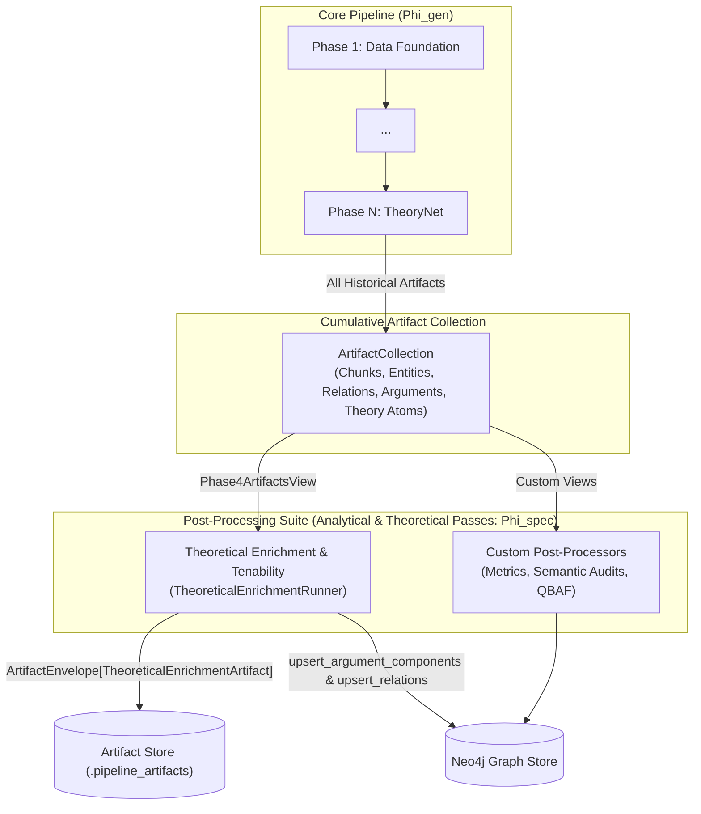
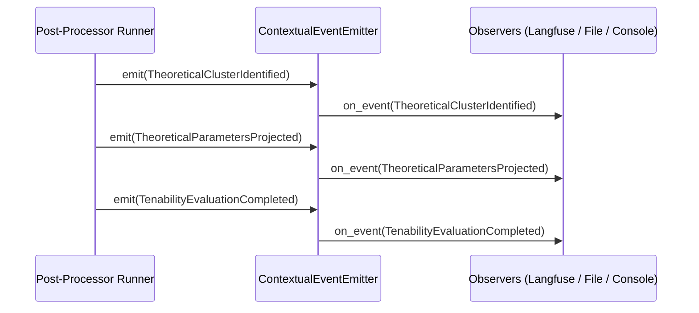

# Post-Processing System Architecture

## Overview

The Episteme pipeline separates **structural graph construction** (Phases 1–6) from **analytical evaluation and theoretical enrichment** (post-processing). 

While Phases 1–6 ingest texts, discover entities, extract relations, consolidate duplicates, mine argument units, and assemble the cross-document argument web in a strictly domain-agnostic manner, **post-processors** execute specialized, analytical, or theory-specific passes on the resulting graph.



---

## Architectural Rationale: Why Decoupled from Sequential Ordinals?

As formalized in [ADR 0015](../../adr/0015-theoretical-enrichment-and-tenability-evaluation.md), post-processing passes are intentionally decoupled from the rigid sequential numbering (`Phase 1` through `Phase 6`):

1. **Domain-Agnostic Core Invariance**: Hardcoding domain-specific parameters or theory lenses into extraction prompts causes type collisions in multi-theoretical texts and inflates LLM prompt tokens. Core phases produce clean, uncommitted epistemic primitives (`ObservationUnit`, `EmpiricalStatement`, `TheoreticalHypothesis`).
2. **Pluggable & Optional Execution**: Not every pipeline run requires theoretical enrichment, tenability optimization, or metric recalculation. Hardcoding post-processing as "Phase 7" or "Phase 8" forces artificial linear ordering and breaks if a pass is omitted or customized.
3. **Multi-Pass Analytical Extensibility**: Researchers can run multiple distinct analytical suites (e.g., structural tenability solvers, Bayesian epistemic metrics, counterfactual simulations) over the same extracted graph without mutating the upstream phase execution graph.

---

## The Post-Processor Contract (`PhaseRunner`)

All post-processors implement the generic `PhaseRunner[ViewT]` protocol defined in `pipeline.protocols.phase_runner`:

```python
from typing import Protocol, TypeVar
from pipeline.artifacts.execution import ArtifactCollection, ArtifactExecutionContext

ViewT = TypeVar("ViewT")

class PhaseRunner(Protocol[ViewT]):
    name: str
    phase_key: str
    input_view: type[ViewT]

    async def run(
        self, input: ViewT, context: ArtifactExecutionContext
    ) -> ArtifactCollection:
        ...
```

### Contract Elements

| Attribute / Method | Type | Description |
| :--- | :--- | :--- |
| `name` | `str` | Human-readable name displayed in logs, manifests, and run reports (e.g. `"Theoretical Enrichment & Tenability Evaluation"`). |
| `phase_key` | `str` | Machine-readable identifier used to resolve configuration blocks in `PipelineConfig` and trace phase records in `RunManifest` (e.g. `"theoretical_enrichment"`). |
| `input_view` | `type[ViewT]` | A typed artifact view class with a `from_collection(collection: ArtifactCollection) -> ViewT` factory method. |
| `run(input, context)` | `async (ViewT, ArtifactExecutionContext) -> ArtifactCollection` | The asynchronous execution logic consuming the filtered input view and returning newly generated `ArtifactEnvelope` instances. |

---

## Cumulative Artifact Propagation & Typed Views

When the pipeline executes via `Pipeline._execute()`, artifacts accumulate chronologically in an `ArtifactCollection`:

1. Each phase receives the complete cumulative collection of artifacts produced by all prior phases.
2. The pipeline inspects the runner's `input_view` attribute and calls `input_view.from_collection(previous)`.
3. The post-processor receives a strongly-typed, filtered view containing only the specific domain objects it cares about.

### Standard Views for Post-Processing

* **`Phase4ArtifactsView`** (`pipeline.artifacts.execution`): Filters `THEORY_ATOM` and `THEORY_RELATION` artifacts across the entire pipeline run, reconstructing `TheoryAtom` and `TheoryRelation` domain objects. Used by `TheoreticalEnrichmentRunner`.
* **`TheoreticalEnrichmentArtifactsView`**: Filters `THEORETICAL_ENRICHMENT` artifacts to inspect computed tenability scores, admissible blurs, and parameter values.
* **Custom Views**: Developers can define arbitrary views by implementing `from_collection(cls, collection: ArtifactCollection)`.

---

## Pipeline Integration & Orchestration

Post-processors can be attached to the pipeline through three primary mechanisms:

### 1. Declarative Configuration (Recommended for Built-Ins)

Built-in post-processors like Theoretical Enrichment can be enabled directly in `PipelineConfig`:

```python
from pipeline.config import PipelineConfig

config = PipelineConfig()
config.theoretical_enrichment.enabled = True
config.theoretical_enrichment.max_theories = 3
```

When building a pipeline via `Pipeline.for_task(...)`, `TheoreticalEnrichmentRunner` is automatically constructed and appended if `config.theoretical_enrichment.enabled` is `True`.

### 2. Programmatic Registration (`Pipeline.for_task`)

Custom post-processors can be passed directly via the `post_processors` parameter:

```python
from pipeline.pipeline import Pipeline
from my_module import EpistemicConsistencyAuditor

auditor = EpistemicConsistencyAuditor()

pipeline = Pipeline.for_task(
    task="knowledge_graph",
    llm=llm,
    config=config,
    graph_reader=graph_reader,
    projection_graph=projection_graph,
    checkpoint_store=checkpoint_store,
    relation_reranker=reranker,
    post_processors=[auditor],
)
```

### 3. Low-Level Pipeline Composition

When manually constructing a `Pipeline` instance:

```python
pipeline = Pipeline(
    phases=[
        phase1_runner,
        phase2_runner,
        phase3_runner,
        phase3b_runner,
        phase4_maturation_runner,
        phase4_argument_runner,
        phase5_fusion_runner,
        phase6_theorynet_runner,
        my_post_processor,
    ],
    config=config,
    graph_reader=graph_reader,
    projection_graph=projection_graph,
    checkpoint_store=checkpoint_store,
)
```

---

## Dual Persistence Architecture

Post-processors support dual persistence:

1. **Artifact Store (`.pipeline_artifacts/`)**: The runner returns an `ArtifactCollection` containing typed `ArtifactEnvelope[T]` instances with complete provenance (source run ID, phase name, timestamp, method). These are serialized to disk as JSON artifacts if `persist_{phase_key}_artifacts` is enabled in `ExecutionConfig`.
2. **Neo4j Property Graph (`ProjectionGraph`)**: Post-processors with graph backend access (e.g. `TheoreticalEnrichmentRunner`) perform batch upserts (`upsert_argument_components`, `upsert_relations`) to enrich existing graph nodes and edges with theoretical parameters, tenability attributes, and anomaly flags.

---

## Observability & Telemetry

Post-processors hook into the centralized `EventEmitter` via `pipeline.events.context.get_event_emitter()`.



All domain events inherit from `BaseEvent` and automatically carry:
- `run_id`: Stable identifier for the active execution run.
- `phase`: Name of the emitting phase or post-processor.
- `timestamp`: ISO-8601 UTC timestamp.
- Custom structured telemetry payloads.

---

## Developer Guide: Implementing a Custom Post-Processor

Below is a complete template for creating a custom post-processor that inspects extracted argument components and computes custom epistemic metrics:

```python
from dataclasses import dataclass
from uuid import uuid4
from pipeline.artifacts.execution import (
    ArtifactCollection,
    ArtifactExecutionContext,
    Phase4ArtifactsView,
)
from pipeline.artifacts.models import (
    ArtifactEnvelope,
    ArtifactKind,
    ArtifactProvenance,
    BaseArtifactPayload,
)
from pipeline.events.context import get_event_emitter
from pipeline.events.models import BaseEvent
from pipeline.protocols.phase_runner import PhaseRunner


# 1. Define telemetry events
class EpistemicAuditCompleted(BaseEvent):
    atom_count: int
    mean_plausibility: float


# 2. Define custom artifact payload
class EpistemicAuditArtifact(BaseArtifactPayload):
    audit_id: str
    total_atoms: int
    mean_plausibility: float


# 3. Implement the PhaseRunner
class EpistemicAuditRunner(PhaseRunner[Phase4ArtifactsView]):
    name = "Epistemic Consistency Audit"
    phase_key = "epistemic_audit"
    input_view = Phase4ArtifactsView

    async def run(
        self, input: Phase4ArtifactsView, context: ArtifactExecutionContext
    ) -> ArtifactCollection:
        atoms = input.theory_atoms
        if not atoms:
            return ArtifactCollection([])

        mean_plausibility = sum(a.plausibility for a in atoms) / len(atoms)

        # Emit telemetry event
        get_event_emitter().emit(
            EpistemicAuditCompleted(
                run_id=context.run_id,
                phase=self.name,
                atom_count=len(atoms),
                mean_plausibility=mean_plausibility,
            )
        )

        # Create typed artifact envelope
        payload = EpistemicAuditArtifact(
            audit_id=f"audit-{uuid4()}",
            total_atoms=len(atoms),
            mean_plausibility=mean_plausibility,
        )
        envelope = ArtifactEnvelope[EpistemicAuditArtifact](
            artifact_id=payload.audit_id,
            kind=ArtifactKind.THEORETICAL_ENRICHMENT,
            run_id=context.run_id,
            phase_name=self.name,
            method="epistemic_audit",
            payload=payload,
            provenance=ArtifactProvenance(),
        )

        return ArtifactCollection([envelope])
```

---

## Related Documentation

- **Post-Processor**: [Theoretical Enrichment & Tenability Evaluation](theoretical_enrichment.md)
- **ADR**: [ADR 0015: Theoretical Enrichment & Tenability Evaluation](../../adr/0015-theoretical-enrichment-and-tenability-evaluation.md)
- **Concepts**: [Pipeline Architecture](../../architecture/pipeline_architecture.md)
- **Reference**: [Theoretical Enrichment API Reference](../../reference/theoretical_enrichment.md)
- **Observability**: [Event System & Telemetry](../../observability/events.md)
