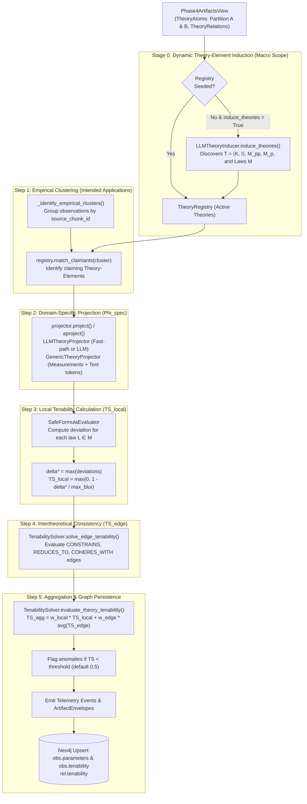

# Theoretical Enrichment & Tenability Evaluation Post-Processor

## Overview

The **Theoretical Enrichment and Tenability Evaluation** post-processor (`TheoreticalEnrichmentRunner`) bridges the
domain-agnostic structural theory graph ($\Phi_{\text{gen}}$) produced by Phases 1–6 with formal structuralist
metatheory of science ([Stegmüller, 1976]; [Balzer et al., 1987]; [Schurz, 2024]).

It projects empirical observation clusters into theory-specific parametric spaces ($\Phi_{\text{spec}}$) and calculates
continuous tenability optimization scores ($TS_{\text{local}}$, $TS_{\text{edge}}$) using admissible blurs over uniform
topological spaces.

---

## Alignment with ADR 0015 & Code Implementation

This implementation realizes the architectural decisions laid out
in [ADR 0015](../../adr/0015-theoretical-enrichment-and-tenability-evaluation.md), with several key engineering
refinements:

| ADR 0015 Design Aspect                                         | Code Implementation Detail                  | Rationale & Architectural Nuance                                                                                                                                                                                                                                |
|:---------------------------------------------------------------|:--------------------------------------------|:----------------------------------------------------------------------------------------------------------------------------------------------------------------------------------------------------------------------------------------------------------------|
| **Pipeline Scope** (ADR mentions Phases 1–4/1–5)               | Executes after **Phases 1–6**               | The core pipeline evolved to include 6 distinct phases (Foundation, Entity Discovery, Global Relations, Consolidation, Entity Maturation, Argument Mining, Alignment Fusion, TheoryNet). Theoretical Enrichment operates on the complete graph.                 |
| **Input View** (`Phase4ArtifactsView`)                         | `PhaseRunner[Phase4ArtifactsView]`          | `Phase4ArtifactsView` filters `THEORY_ATOM` and `THEORY_RELATION` artifacts across the cumulative artifact collection, capturing atoms and relations created in Phase 4 and refined through Phases 5 and 6.                                                     |
| **Theory Lenses** (ADR used Neurology/Psychoanalysis examples) | **100% Domain-Agnostic Generic Extraction** | ADR 0015 used neurology and psychoanalysis strictly as examples. In the codebase, all hardcoded domain projectors have been eliminated. Extraction is performed dynamically via `LLMTheoryProjector` (with measurement fast-path) and `GenericTheoryProjector`. |
| **Empirical Clustering**                                       | Grouped by `source_chunk_id`                | In `runner._identify_empirical_clusters()`, observation units sharing a source chunk are partitioned into an `EmpiricalCluster` representing a localized Intended Application ($I_k \subseteq M_{pp}$).                                                         |
| **Claimant Matching**                                          | `TheoryRegistry.match_claimants()`          | Multi-criteria heuristic: matches cluster measurements against `required_dimensions`, checks text for theory name/keywords, or inspects explicit claimant hypothesis IDs. Defaults to all theories if unassigned.                                               |
| **Core Law Evaluation**                                        | `SafeFormulaEvaluator`                      | AST-based symbolic expression evaluator supporting `abs`, `min`, `max`, `sqrt`, and basic arithmetic without invoking Python's unsafe `eval()`.                                                                                                                 |
| **Persistence**                                                | Dual Persistence                            | Emits `TheoreticalEnrichmentArtifact` envelopes and directly calls `graph_store.upsert_argument_components` and `graph_store.upsert_relations` to update Neo4j.                                                                                                 |

---

## Detailed Execution Workflow



---

### Step-by-Step Breakdown

#### Stage 0: Dynamic Theory-Element Induction

If the `TheoryRegistry` is empty and `config.induce_theories=True`, `LLMTheoryInducer` inspects the macro graph:

1. Partitions atoms into theoretical hypotheses (Partition $A$) and empirical observations (Partition $B$).
2. Prompts the LLM with `TheoryInductionOutput` schema to discover active theory elements without hardcoded domain
   knowledge.
3. Extracts required empirical dimensions ($M_{pp}$), latent parameters ($M_p$), and symbolic constraint expressions
   ($M$).
4. Registers induced theories into `TheoryRegistry`.

#### Step 1: Empirical Cluster Mapping

* Groups observation atoms sharing a `source_chunk_id` into an `EmpiricalCluster`.
* Queries `TheoryRegistry.match_claimants(cluster)` to determine which theories claim the cluster as an Intended
  Application.
* Emits `TheoreticalClusterIdentified` event.

#### Step 2: Domain-Specific Projection ($\Phi_{\text{spec}}$)

* Evaluates each cluster through each claiming theory's lens using `TheoryProjector`:
    * **Measurement Fast-Path**: If structured measurements (`obs.measurements`) directly match parameter names or
      required dimensions, parameters are computed instantly without LLM calls.
    * **LLM Projection (`LLMTheoryProjector`)**: Prompts the LLM to estimate latent parameters $M_p \in [0.0, 1.0]$
      based on cluster observations, measurements, and core laws.
    * **Generic Fallback (`GenericTheoryProjector`)**: Extracts parameter values by matching parameter tokens and
      numeric regex indicators in observation text.
* Emits `TheoreticalParametersProjected` event.

#### Step 3: Local Tenability Calculation ($TS_{\text{local}}$)

* Evaluates each core law $L \in M$ against projected parameters via `SafeFormulaEvaluator`.
* Computes deviation $\delta = \text{error} \ge 0.0$ and finds tightest blur $\delta^* = \max (\delta_i)$.
* Derives local tenability score $TS_{\text{local}} \in [0.0, 1.0]$.
* If $TS_{\text{local}} < \text{threshold}$, records local anomaly.

#### Step 4: Global & Intertheoretical Consistency ($TS_{\text{edge}}$)

* Iterates through cluster relation edges (`CONSTRAINS`, `REDUCES_TO`, `COHERES_WITH`).
* Compares projected parameters of source and target nodes to compute constraint blur $\delta_C$.
* Calculates edge tenability $TS_{\text{edge}} = \max (0.0, 1.0 - \delta_C)$.
* If $TS_{\text{edge}} < \text{threshold}$, emits `TenabilityAnomalyDetected`.

#### Step 5: Aggregation & Graph Persistence

* Aggregates local and edge tenability into `TenabilityResult`:

$$TS_{\text{agg}} = w_{\text{local}} \cdot TS_{\text{local}} + w_{\text{edge}} \cdot \overline{TS}_{\text{edge}}$$

* Emits `TenabilityEvaluationCompleted` event.
* Updates `TheoreticalHypothesis` nodes in the cluster with projected parameters and tenability attributes.
* Updates relation edges with `tenability = ts_edge`.
* Emits `ArtifactEnvelope[TheoreticalEnrichmentArtifact]` containing complete optimization metrics.
* Persists enriched nodes and edges directly into Neo4j via `graph_store.upsert_argument_components()` and
  `graph_store.upsert_relations()`.

---

## Domain Telemetry Events

The post-processor emits four standardized events via `pipeline.events`:

```python
from pipeline.post_processing.theoretical_enrichment.events import (
    TheoreticalClusterIdentified,
    TheoreticalParametersProjected,
    TenabilityAnomalyDetected,
    TenabilityEvaluationCompleted,
)
```

| Event                            | Attributes                                                                    | Trigger                                                                           |
|:---------------------------------|:------------------------------------------------------------------------------|:----------------------------------------------------------------------------------|
| `TheoreticalClusterIdentified`   | `cluster_id`, `observation_count`, `claimant_theories`                        | When an empirical cluster is assembled and mapped to claiming theories.           |
| `TheoreticalParametersProjected` | `cluster_id`, `theory_id`, `parameters`                                       | When theoretical parameters ($M_p$) are projected for a cluster.                  |
| `TenabilityAnomalyDetected`      | `element_id`, `theory_id`, `score`, `reason`                                  | When a hypothesis or constraint edge fails the tenability threshold ($TS < 0.5$). |
| `TenabilityEvaluationCompleted`  | `theory_id`, `local_score`, `aggregated_score`, `is_tenable`, `tightest_blur` | When local and edge evaluations conclude for a Theory-Element.                    |

---

## Configuration Reference

Post-processing behavior is configured via `TheoreticalEnrichmentConfig` under `pipeline_config.theoretical_enrichment`:

| Parameter              | Type                             | Default  | Description                                                                         |
|:-----------------------|:---------------------------------|:---------|:------------------------------------------------------------------------------------|
| `enabled`              | `bool`                           | `True`   | Whether to execute the theoretical enrichment post-processor.                       |
| `induce_theories`      | `bool`                           | `True`   | Whether to dynamically induce Theory-Elements via LLM if registry is unseeded.      |
| `max_theories`         | `int`                            | `5`      | Maximum number of Theory-Elements to induce from graph.                             |
| `tenability_threshold` | `float`                          | `0.5`    | Threshold below which nodes or edges are flagged as untenable anomalies.            |
| `weight_local`         | `float`                          | `0.5`    | Relative weight of local law adherence ($TS_{\text{local}}$) in aggregated score.   |
| `weight_edge`          | `float`                          | `0.5`    | Relative weight of constraint consistency ($TS_{\text{edge}}$) in aggregated score. |
| `decoding_strategy`    | `StructuredDecodingStrategy`     | `DIRECT` | LLM structured decoding strategy (`DIRECT`, `JSON_SCHEMA`, etc.).                   |
| `induction_prompts`    | `StructuredPromptBundle \| None` | `None`   | Custom prompt bundle overriding default theory induction prompt.                    |
| `projection_prompts`   | `StructuredPromptBundle \| None` | `None`   | Custom prompt bundle overriding default cluster projection prompt.                  |

---

## Phase Contract

### Inputs

* **`Phase4ArtifactsView`**:
    * `theory_atoms: list[TheoryAtom]`: Extracted observation units, empirical statements, and theoretical hypotheses.
    * `theory_relations: list[TheoryRelation]`: Inter-component relations (`EXPLAINS`, `SUPPORTS`, `CONSTRAINS`,
      `REDUCES_TO`).

### Outputs

* **`ArtifactCollection`**: Contains `TheoreticalEnrichmentArtifact` envelopes with:
    * `cluster_id`, `theory_id`
    * `projected_parameters: dict[str, float]`
    * `local_tenability: float`, `edge_tenabilities: dict[str, float]`, `aggregated_tenability: float`
    * `admissible_blur_delta: float`, `is_tenable: bool`, `anomalies: list[str]`
* **Graph Store (Neo4j)**:
    * Updated `TheoreticalHypothesis` nodes with `.parameters` and `.tenability`.
    * Updated `TheoryRelation` edges with `.tenability`.

### Invariants

* Mathematical tenability scores $TS \in [0.0, 1.0]$.
* Blur values $\delta^* \ge 0.0$.
* Safe formula evaluation never invokes Python `eval()`.
* Missing parameters fallback gracefully to `0.5` without failing pipeline execution.

---

## Programmatic Usage Example

While dynamic LLM induction is enabled by default, custom theories can be registered explicitly:

```python
from pipeline.post_processing.theoretical_enrichment import (
    TheoreticalEnrichmentRunner,
    TheoryElementDefinition,
    TheoryLaw,
    TheoryRegistry,
)

# 1. Define a core mathematical law (AST evaluated)
law = TheoryLaw(
    law_id="conservation_law",
    description="Conservation of energy parameter",
    formula_expression="abs(KineticEnergy + PotentialEnergy - TotalEnergy)",
    involved_parameters=["KineticEnergy", "PotentialEnergy", "TotalEnergy"],
)

# 2. Define the Theory-Element
mechanics = TheoryElementDefinition(
    theory_id="classical_mechanics",
    name="Classical Mechanics",
    required_dimensions=["velocity", "height", "mass"],
    parameter_names=["KineticEnergy", "PotentialEnergy", "TotalEnergy"],
    laws=[law],
    max_admissible_blur=1.0,
)

# 3. Initialize registry and runner
registry = TheoryRegistry(seed_theories=[mechanics])
runner = TheoreticalEnrichmentRunner(registry=registry)
```

---

## Related Documentation

- **Architecture Overview**: [Post-Processing System Architecture](index.md)
- **ADR**: [ADR 0015: Theoretical Enrichment & Tenability Evaluation](../../adr/0015-theoretical-enrichment-and-tenability-evaluation.md)
- **Concepts**: [Epistemic Coherence: Tenability](../../concepts/theory/metrics/epistemic_coherence/tenability.md)
- **Reference**: [Theoretical Enrichment API Reference](../../reference/theoretical_enrichment.md)
- **Code**: `packages/episteme-pipeline/episteme_pipeline/post_processing/theoretical_enrichment/`
