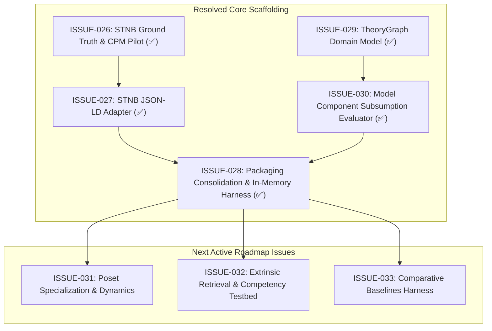

# STNB Evaluation Capabilities & Readiness Registry

This issue cluster contains the structured engineering backlog, bug reports, and architectural specifications required to make **Episteme** capable of running meaningful, benchmark-grade evaluations against the **Structuralist Theory-Net Benchmark (STNB)** ([`docs/research/structuralist_theory_benchmark.md`](../../docs/research/structuralist_theory_benchmark.md)).

All issues in this directory are tightly coupled and must be resolved together to unblock Level 4 Theory Graph evaluation and capability verification.

---

## Issue Cluster Index

| Issue ID | Title | Component(s) | Roadmap Horizon | Priority | Status |
| :--- | :--- | :--- | :--- | :--- | :--- |
| [**ISSUE-031**](ISSUE-031-specialization-poset-and-epistemic-dynamics.md) | Specialization Poset Hierarchies ($\alpha$) & Theoretical Dynamics Verification | `epistemetrics` (`epistemic/`), `episteme-pipeline` | Horizon 1 & 2 | High | `Open` |
| [**ISSUE-032**](ISSUE-032-extrinsic-retrieval-attribute-fix-and-competency-testbed.md) | Extrinsic Retrieval Scorer Attribute Crash & STNB Competency Testbed | `episteme-pipeline` (`episteme_pipeline/evaluation/`) | Horizon 1 | High | `Open` |
| [**ISSUE-033**](ISSUE-033-comparative-baselines-zero-shot-naive-rag.md) | Comparative Baseline Harness for STNB (Zero-Shot LLM, Naive KG, Text RAG) | `episteme-pipeline` (`episteme_pipeline/evaluation/baselines/`) | Horizon 2 | High | `Open` |

---

## Resolved Issues

- **`ISSUE-026`**: STNB Ground-Truth Data Absence & Missing CPM Pilot Corpus (`Resolved`).
  - Created unabridged historical primary text corpus [`newton_principia_1687.txt`](../../packages/episteme-pipeline/episteme_pipeline/evaluation/data/newton_principia_1687.txt) and Bourbaki structuralist ground-truth specification [`stnb_cpm_pilot.jsonld`](../../packages/episteme-pipeline/episteme_pipeline/evaluation/data/stnb_cpm_pilot.jsonld) with 19 nodes and 100% exact character-offset matching against corpus definitions and laws.
- **`ISSUE-027`**: STNB JSON-LD Adapter Schema Inconsistencies & Edge Decoding Bugs (`Resolved`).
  - Implemented dual edge attributes (`label` and `relation`), array target normalization `_as_list()`, resilient multi-namespace text anchor parsing (`Episteme:textAnchor`, `glp:textAnchor`, `textAnchor`), full coverage across all 9 structuralist edge types, and normalization of specialization poset orientation from root to sub-theory ($T_0 \to T_1$).
- **`ISSUE-028`**: Evaluation Packaging Consolidation & In-Memory TheoryNet Execution (`Resolved`).
  - Consolidated evaluation code into `episteme_pipeline.evaluation` (`benchmarks/`, `scorers/`, `harness.py`, `pipelines.py`), removed legacy un-packaged `evaluation/` directory and eliminated `sys.path` hacks.
  - Implemented `InMemoryGraphStore` and `EvaluationHarness.evaluate_in_memory` enabling pure in-memory execution without Neo4j or network dependencies.
- **`ISSUE-029`**: Missing `TheoryGraph` Domain Architecture & Broken Contract in `epistemetrics` (`Resolved`).
  - Implemented `TheoryGraph`, `NodeType`, `EpistemicStatus`, `RelationType`, `TheoryNode`, `TheoryEdge`, and `analyze_theory_graph`.
- **`ISSUE-030`**: Comprehensive Intrinsic Evaluation: Model Component Decomposition & Full Property Subsumption (`Resolved`).
  - Implemented `evaluate_model_components` verifying $K = \langle \mathcal{M}_p, \mathcal{M}, \mathcal{M}_{pp}, GC, GL \rangle$ and $I_0$, calculating $MCC$, $AOR$ (Zero Omission), $PFS$, and $AG_{\text{IoU}}$ character-span IoU.

---

## Dependency & Execution Graph

