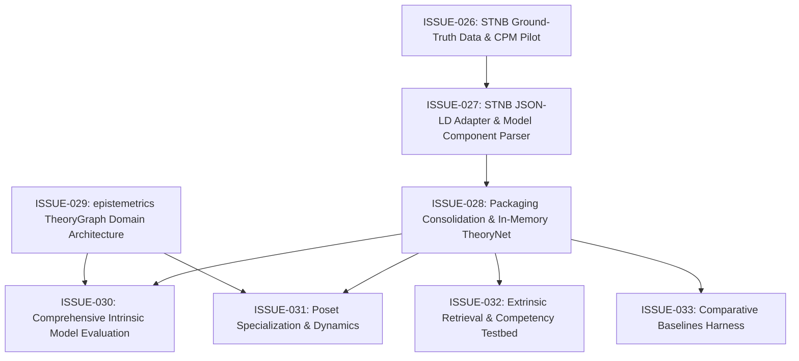

# STNB Evaluation Capabilities & Readiness Registry

This issue cluster contains the structured engineering backlog, bug reports, and architectural specifications required to make **Episteme** capable of running meaningful, benchmark-grade evaluations against the **Structuralist Theory-Net Benchmark (STNB)** ([`docs/research/structuralist_theory_benchmark.md`](../../docs/research/structuralist_theory_benchmark.md)).

All issues in this directory are tightly coupled and must be resolved together to unblock Level 4 Theory Graph evaluation and capability verification.

---

## Issue Cluster Index

| Issue ID | Title | Component(s) | Roadmap Horizon | Priority | Status |
| :--- | :--- | :--- | :--- | :--- | :--- |
| [**ISSUE-026**](ISSUE-026-stnb-ground-truth-data-and-cpm-pilot.md) | STNB Ground-Truth Data Absence & Missing CPM Pilot Corpus | `episteme-pipeline` (`episteme_pipeline/evaluation/data/`) | Horizon 1 | Critical / Blocker | `Open` |
| [**ISSUE-027**](ISSUE-027-stnb-jsonld-adapter-and-edge-decoding.md) | STNB JSON-LD Adapter Schema Inconsistencies & Edge Decoding Bugs | `episteme-pipeline` (`episteme_pipeline/evaluation/benchmarks/`) | Horizon 1 | Critical / Blocker | `Open` |
| [**ISSUE-028**](ISSUE-028-evaluation-orchestrator-theorynet-execution.md) | Evaluation Packaging Consolidation & In-Memory TheoryNet Execution | `episteme-pipeline` (`episteme_pipeline/evaluation/`) | Horizon 1 | Critical / Blocker | `Open` |
| [**ISSUE-029**](ISSUE-029-epistemetrics-theorygraph-domain-architecture.md) | Missing `TheoryGraph` Domain Architecture & Broken Contract in `epistemetrics` | `epistemetrics`, `episteme-pipeline` | Horizon 1 | Critical / Blocker | `Open` |
| [**ISSUE-030**](ISSUE-030-intrinsic-model-component-and-property-evaluation.md) | Comprehensive Intrinsic Evaluation: Model Component Decomposition & Full Property Subsumption | `epistemetrics` (`epistemic/`), `episteme-pipeline` | Horizon 1 | Critical / Blocker | `Open` |
| [**ISSUE-031**](ISSUE-031-specialization-poset-and-epistemic-dynamics.md) | Specialization Poset Hierarchies ($\alpha$) & Theoretical Dynamics Verification | `epistemetrics` (`epistemic/`), `episteme-pipeline` | Horizon 1 & 2 | High | `Open` |
| [**ISSUE-032**](ISSUE-032-extrinsic-retrieval-attribute-fix-and-competency-testbed.md) | Extrinsic Retrieval Scorer Attribute Crash & STNB Competency Testbed | `episteme-pipeline` (`episteme_pipeline/evaluation/`) | Horizon 1 | High | `Open` |
| [**ISSUE-033**](ISSUE-033-comparative-baselines-zero-shot-naive-rag.md) | Comparative Baseline Harness for STNB (Zero-Shot LLM, Naive KG, Text RAG) | `episteme-pipeline` (`episteme_pipeline/evaluation/baselines/`) | Horizon 2 | High | `Open` |

---

## Dependency & Execution Graph

